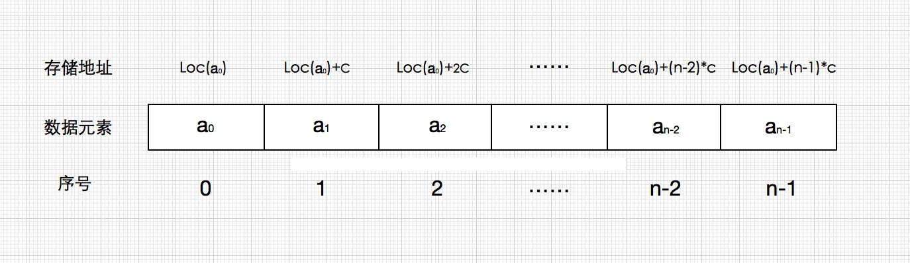

## 一、概述
:::tip 定义
线性表的顺序存储结构称之为顺序表(Sequential List),它使用一维数组依次存放从a0到an-1的数据元素(a0,a1,…,an-1)，将ai(0< i <> n-1)存放在数组的第i个元素，使得ai与其前驱ai-1及后继ai+1的存储位置相邻，因此数据元素在内存的物理存储次序反映了线性表数据元素之间的逻辑次序。
:::
顺序表的物理结构是利用数组来实现的，数组是可以存储具有相同数据类型的元素集合。当创建数组时，计算机操作系统会为该数组分配一块连续的内存块，这也就意味着数组中的每个存储单元的地址都是连续的。因此只要知道数组的起始内存地址就可以通过对地址的计算得到第n-1个存储单元的内存地址



为了访问一个数组的元素，该元素的内存地址需要计算其距离数据数组基地址的偏移量，即用乘法计算偏移量然后加上基地址，就可以获得数组中某个元素的内存地址。其中c代表的是元素数据类型的存储空间大小，而序号则为数组的下标索引。整个过程需要一次乘法和一次加法运算，因为这两个操作的执行时间是常数时间，所以我们可以认为数组访问操作能再常数时间内完成，即时间复杂度为T(1)。

## 二、实现
顺序表的实现底层是使用数组，那么我们可以使用一个Object数据来存储元素（万物皆对象，java是不允许[泛型](../../java/javase/generics)数组的，参考[Java“禁止”泛型数组](https://www.cnblogs.com/lsgxeva/p/10231538.html)）

### 2.1 新增
思路：
1. 数组大小够不够？
2. 是在数组尾部添加？还是中间位置添加
3. 中间位置添加先找出该位置，然后移动或者复制后面的数组，再添加数据
4. size++;
java 源码
```java
public void add(int index, E element) {
  //是否越界
    rangeCheckForAdd(index);
    //modCount跟迭代器的快速失败机制有关
    modCount++;
    final int s;
    Object[] elementData;
    //如果当前size等于数据长度
    if ((s = size) == (elementData = this.elementData).length)
        //grow扩容数组
        elementData = grow();
    //当前位置元素后移
    System.arraycopy(elementData, index,
                      elementData, index + 1,
                      s - index);
    elementData[index] = element;
    size = s + 1;
}
```
grow()方法如下
```java
/**
  * Increases the capacity to ensure that it can hold at least the
  * number of elements specified by the minimum capacity argument.
  *
  * @param minCapacity the desired minimum capacity
  * @throws OutOfMemoryError if minCapacity is less than zero
  */
private Object[] grow(int minCapacity) {
    return elementData = Arrays.copyOf(elementData,
                                        newCapacity(minCapacity));
}

private Object[] grow() {
    return grow(size + 1);
}

/**
  * Returns a capacity at least as large as the given minimum capacity.
  * Returns the current capacity increased by 50% if that suffices.
  * Will not return a capacity greater than MAX_ARRAY_SIZE unless
  * the given minimum capacity is greater than MAX_ARRAY_SIZE.
  *
  * @param minCapacity the desired minimum capacity
  * @throws OutOfMemoryError if minCapacity is less than zero
  */
private int newCapacity(int minCapacity) {
    // overflow-conscious code
    int oldCapacity = elementData.length;
    //当前容量带符号右移一位，也即是*2^N,整理起来就是新容量为n+n/2=(3/2)*n
    int newCapacity = oldCapacity + (oldCapacity >> 1);
    //为什么会小于0？java中的int为-2^32 ~ 2^32，当数大到2^32时再加一就会变成-2^32，这是由于二进制加法运算首位为符号标识符，0为正数，1为负数 
    if (newCapacity - minCapacity <= 0) {
        if (elementData == DEFAULTCAPACITY_EMPTY_ELEMENTDATA)
            return Math.max(DEFAULT_CAPACITY, minCapacity);
        if (minCapacity < 0) // overflow
            throw new OutOfMemoryError();
        return minCapacity;
    }
    return (newCapacity - MAX_ARRAY_SIZE <= 0)
        ? newCapacity
        : hugeCapacity(minCapacity);
}

private static int hugeCapacity(int minCapacity) {
    if (minCapacity < 0) // overflow
        throw new OutOfMemoryError();
    return (minCapacity > MAX_ARRAY_SIZE)
        ? Integer.MAX_VALUE
        : MAX_ARRAY_SIZE;
}
```

### 2.2 修改  
```java
/**
* Replaces the element at the specified position in this list with
* the specified element.
*
* @param index index of the element to replace
* @param element element to be stored at the specified position
* @return the element previously at the specified position
* @throws IndexOutOfBoundsException {@inheritDoc}
*/
public E set(int index, E element) {
  Objects.checkIndex(index, size);
  E oldValue = elementData(index);
  elementData[index] = element;
  return oldValue;
}
```
### 2.3 删除
```java
/**
* Private remove method that skips bounds checking and does not
* return the value removed.
*/
private void fastRemove(Object[] es, int i) {
  modCount++;
  final int newSize;
  if ((newSize = size - 1) > i)
      System.arraycopy(es, i + 1, es, i, newSize - i);
  es[size = newSize] = null;
}
```
### 2.4 查询
```java
/**
* Returns the element at the specified position in this list.
*
* @param  index index of the element to return
* @return the element at the specified position in this list
* @throws IndexOutOfBoundsException {@inheritDoc}
*/
public E get(int index) {
  Objects.checkIndex(index, size);
  return elementData(index);
}
```
:::details 展开
```java
public class MyArrayList<E> implements List<E> {

    private Object[] elements;

    private int size;

    private final int MAX_SIZE = Integer.MAX_VALUE-8;

    private final int INIT_SIZE = 16;
    //默认空数组
    private final Object[] DEFAULT_EMPTY_ELE = new Object[INIT_SIZE];


    public MyArrayList(int initSize){
        elements = new Object[initSize];
    }

    public MyArrayList(){
        //this(INIT_SIZE);//Cannot reference 'MyArrayList.INIT_SIZE' before supertype constructor has been called
        //说明：
        elements = DEFAULT_EMPTY_ELE;
    }

    @Override
    public int size() {
        return size;
    }

    @Override
    public boolean isEmpty() {
        return size==0;
    }

    private void ensureCapacity(int index){
        if(index>=elements.length){
            System.arraycopy(elements,0,elements,0,elements.length+(elements.length>>1));
        }
        if(index<0){
            throw new IndexOutOfBoundsException();
        }

    }

    @Override
    public boolean add(E e) {
        ensureCapacity(size+1);
        elements[size++] = e;
        return true;
    }

    public boolean add(E e, int index){
        ensureCapacity(index);
        if(index>size){
            throw new IllegalArgumentException();
        }
        System.arraycopy(elements,index-1,elements,index,size-index);
        elements[index-1]=e;
        size++;
        return true;
    }


    @Override
    public E remove(int index) {
        ensureCapacity(index);
        if(index>size){
            throw new IllegalArgumentException();
        }
        E element = (E) elements[index-1];
        System.arraycopy(elements,index,elements,index-1,size-index);
        return element;
    }


    @Override
    public boolean set(int index, E e) {
        //ensureCapacity(index);
        if(index>size){
            throw new IllegalArgumentException();
        }
        elements[index-1]=e;
        return true;
    }

    @Override
    public E get(int index) {
        if(index>size){
            throw new IllegalArgumentException();
        }
        return (E)elements[index-1];
    }


}
```
:::