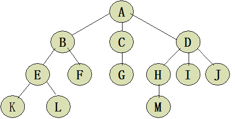

## 树的定义
树是n(n≥0)个节点的有限集T，并且当n＞0时满足下列条件：
1. 有且仅有一个特定的称为根(Root)的节点
2. 当n＞1时，其余结点可以划分为m(m＞0)个互不相交的有限集T1、T2 、…、Tm，每个集Ti(1≤i≤m)均为树，且称为树T的子树(SubTree)。  
特别地，不含任何结点(即n＝0)的树，称为**空树**。

## 基本术语
术语|解释
-|-
**结点**|存储数据元素和指向子树的链接，由数据元素和构造数据元素之间关系的引用组成。
**孩子结点**|树中一个结点的子树的根结点称为这个结点的孩子结点，如图中的A的孩子结点有B、C、D
**双亲结点**|树中某个结点有孩子结点(即该结点的度不为0)，该结点称为它孩子结点的双亲结点，也叫前驱结点。双亲结点和孩子结点是相互的，如图1中，A的孩子结点是B、C、D，B、C、D的双亲结点是A。
**兄弟结点**|具有相同双亲结点(即同一个前驱)的结点称为兄弟结点，如图中B、B、D为兄弟结点。
**结点的度**|结点所有子树的个数称为该结点的度，如图A的度为3，B的度为2.
**树的度**|树中所有结点的度的最大值称为树的度，如图的度为3.
**叶子结点**|度为0的结点称为叶子结点，也叫终端结点。如图1的K、L、F、G、M、I、J
**分支结点**|度不为0的结点称为分支结点，也叫非终端结点。如图1的A、B、C、D、E、H
**结点的层次**|从根结点到树中某结点所经路径的分支数称为该结点的层次。根结点的层次一般为1(也可以自己定义为0)，这样，其它结点的层次是其双亲结点的层次加1.
**树的深度**|树中所有结点的层次的最大值称为该树的深度(也就是最下面那个结点的层次)。
**有序树和无序树**|树中任意一个结点的各子树按从左到右是有序的，称为有序树，否则称为无序树。
**数据元素**|具有相同特性的数据元素的集合。
**结构关系**|树中数据元素间的结构关系由树的定义确定。

## 基本操作
树的主要操作有：
- （1）创建树IntTree(&T)  创建1个空树T。  
- （2）销毁树DestroyTree(&T)  
- （3）构造树CreatTree(&T，deinition)
- （4）置空树ClearTree(&T) 将树T置为空树。
- （5）判空树TreeEmpty(T)
- （6）求树的深度TreeDepth(T)
- （7）获得树根Root(T)
- （8）获取结点Value(T，cur_e，&e)
        将树中结点cur_e存入e单元中。
- （9）数据赋值Assign(T，cur_e，value)
        将结点value，赋值于树T的结点cur_e中。
- （10）获得双亲Parent(T，cur_e)
        返回树T中结点cur_e的双亲结点。
- （11）获得最左孩子LeftChild(T，cur_e)
        返回树T中结点cur_e的最左孩子。
- （12）获得右兄弟RightSibling(T，cur_e)
       返回树T中结点cur_e的右兄弟。
- （13）插入子树InsertChild(&T，&p，i，c)
     将树c插入到树T中p指向结点的第i个子树之前。
- （14）删除子树DeleteChild(&T，&p，i)
     删除树T中p指向结点的第i个子树。
- （15）遍历树TraverseTree(T，visit())