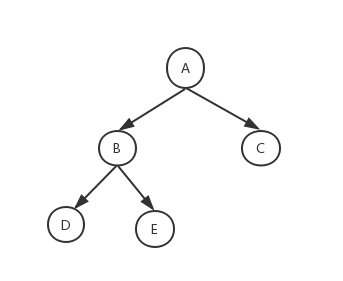
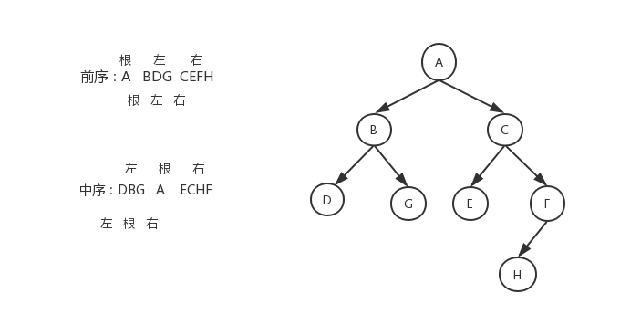
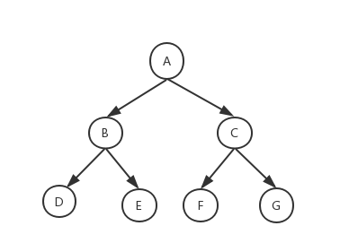
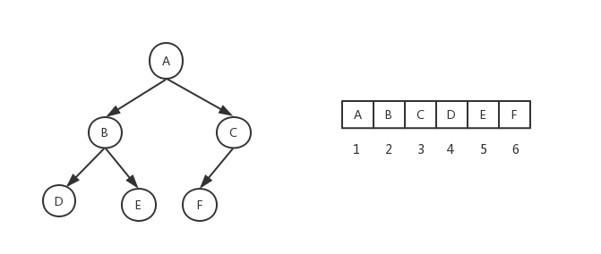

## 一、二叉树
二叉树是每个节点最多拥有两个子节点，左子树和右子树是有顺序的不能任意颠倒。

## 二、二叉树的遍历

前序遍历（前根遍历）：根——>左——>右

中序遍历（中根遍历）：左——>根——>右

后序遍历（后根遍历）：左——>右——>根

已知前序和中序，求后序问题，  前序 ABDGCEFH    中序 DGBAECHF

解法：根据前序、中序综合判断画出树的节点图，然后再写后序遍历：DGBEHFCA

（前序和中序的子树也满足前序或中序的规则）

二叉树的深度优先遍历（DFS）与广度优先遍历（BFS）

DFS深度优先遍历：从根节点出发，沿着左子树方向进行纵向遍历，直到找到叶子节点为止。然后回溯到前一个节点，进行右子树节点的遍历，直到遍历完所有可达节点为止。利用数据结构“栈”，父节点入栈，父节点出栈，先右子节点入栈，后左子节点入栈。递归遍历全部节点。

DFS:ABDGCEFH

 

BFS广度优先遍历：从根节点出发，在横向遍历二叉树层段节点的基础上纵向遍历二叉树的层次。利用数据结构“队列”，父节点入队，父节点出队列，先左子节点入队，后右子节点入队。递归遍历全部节点。

BFS：ABCDGEFH

## 三、满二叉树 
高度为h，由2^h-1个节点构成的二叉树称为满二叉树。  

## 四、完全二叉树
完全二叉树是由满二叉树而引出来的，若设二叉树的深度为h，除第 h 层外，其它各层 (1～h-1) 的结点数都达到最大个数(即1~h-1层为一个满二叉树)，第 h 层所有的结点都连续集中在最左边，这就是完全二叉树。

堆一般都是用完全二叉树来实现的。

