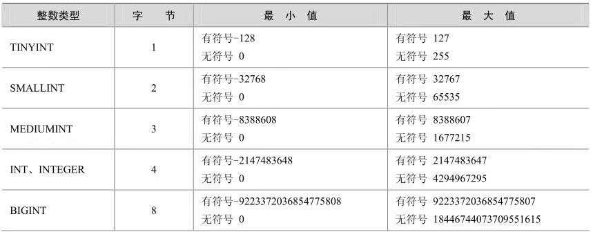
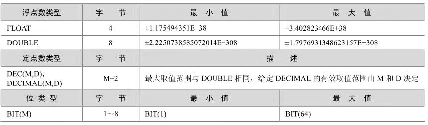
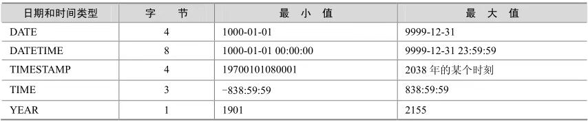
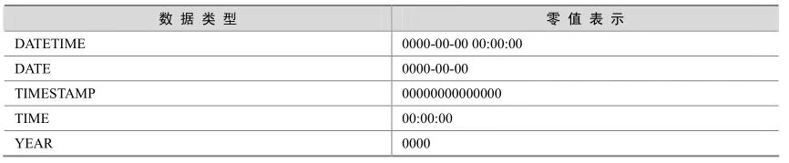
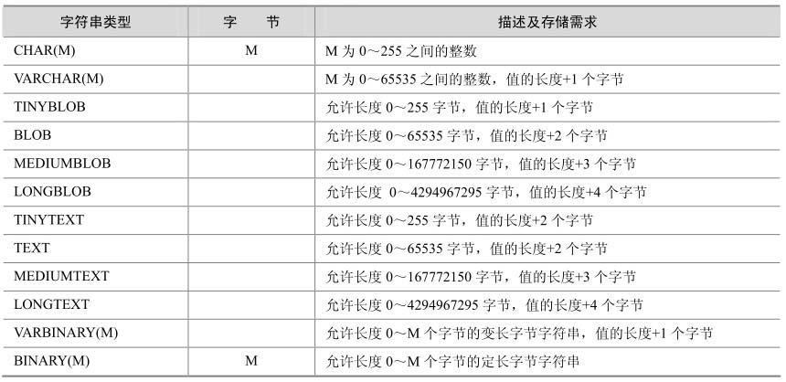

每一个常量、变量和参数都有数据类型，它用来指定一定的存储格式、约束和有效范围。MySQL提供了多种数据类型，主要包括数值型、字符串类型、日期和时间类型。不同的MySQL版本支持的数据类型可能会稍有不同，用户可以通过查询相应版本的帮助文件来获得具体信息

## 数值类型
MySQL 支持所有标准 SQL 中的数值类型，其中包括严格数值类型（ INTEGER、SMALLINT、DECIMAL和NUMERIC），以及近似数值数据类型（FLOAT、REAL和DOUBLE PRECISION），并在此基础上做了扩展。扩展后增加了TINYINT、MEDIUMINT和BIGINT这3种长度不同的整型，并增加了BIT类型，用来存放位数据。下面列出了MySQL 5.0中支持的所有数值类型，其中INT是INTEGER的同名词，DEC是DECIMAL的同名词。

<center>



</center>

<center>



</center>

### 整数类型
在整数类型中，按照取值范围和存储方式不同，分为**tinyint、smallint、mediumint、int和bigint**这 5个类型。如果超出类型范围的操作，会发生“Out ofrange”错误提示。为了避免此类问题发生，在选择数据类型时要根据应用的实际情况确定其取值范围，最后根据确定的结果慎重选择数据类型。

对于整型数据，MySQL还支持在类型名称后面的小括号内指定显示宽度，例如int(5)表示当数值宽度小于5位的时候在数字前面填满宽度，如果不显示指定宽度则默认为int(11)。一般配合zerofill使用，顾名思义，zerofill就是用“0”填充的意思，也就是在数字位数不够的空间用字符“0”填满。以下几个例子分别描述了填充前后的区别。

```sql
create table t1 (
    id1 int not null  primary key,
    id2 int(5) not null
);

desc t1;
insert into t1 values(1,2);

select * from t1;

alter table t1 modify id1 int zerofill;

alter table t1 modify id2 int(5) zerofill;

select * from t1;
```

设置了宽度限制后，如果插入大于宽度限制的值，不会对插入的数据有任何影响，还是按照类型的实际精度进行保存，这时，宽度格式实际已经没有意义，左边不会再填充任何的“0”字符。

所有的整数类型都有一个可选属性**UNSIGNED**（无符号），如果需要在字段里面保存非负数或者需要较大的上限值时，可以用此选项，它的取值范围是正常值的下限取0，上限取原值的2倍，例如，tinyint有符号范围是-128～+127，而无符号范围是0～255。如果一个列指定为zerofill，则MySQL自动为该列添加UNSIGNED属性。

另外，整数类型还有一个属性：**AUTO_INCREMENT**。在需要产生唯一标识符或顺序值时，可利用此属性，这个属性只用于整数类型。AUTO_INCREMENT值一般从1开始，每行增加1。在插入NULL到一个AUTO_INCREMENT列时，MySQL插入一个比该列中当前最大值大1 的值。一个表中最多只能有一个AUTO_INCREMENT列。对于任何想要使用AUTO_INCREMENT的列，应该定义为NOT NULL，并定义为PRIMARY KEY或定义为UNIQUE键。

---
### 浮点数和定点数

对于小数的表示，MySQL 分为两种方式：浮点数和定点数。浮点数包括 float（单精度）和double（双精度），而定点数则只有decimal一种表示。定点数在MySQL内部以字符串形式存放，比浮点数更精确，适合用来表示货币等精度高的数据。

浮点数和定点数都可以用类型名称后加“(M,D)”的方式来进行表示，“(M,D)”表示该值一共显示M位数字（整数位+小数位），其中D位位于小数点后面，M和D又称为精度和标度。例如，定义为float(7,4)的一个列可以显示为-999.9999。MySQL保存值时进行四舍五入，因此如果在 float(7,4)列内插入 999.00009，近似结果是 999.0001。值得注意的是，浮点数后面跟“(M,D)”的用法是非标准用法，如果要用于数据库的迁移，则最好不要这么使用。float和double在不指定精度时，默认会按照实际的精度（由实际的硬件和操作系统决定）来显示，而decimal在不指定精度时，默认的整数位为10，默认的小数位为0。

```sql
create table t2 (
    id1 float(5,2) default null,
    id2 double(5,2) default null,
    id3 decimal(5,2) default null
);

insert into t2 values(1.235,2.136,2.473),(1.872,4.566,2.356);

select * from t2;
```
此时发现，虽然数据都插入进去，但是系统出现了一个 Warning，报告 id3 被截断。


浮点数如果不写精度和标度，则会按照实际精度值显示，如果有精度和标度，则会自动将四舍五入后的结果插入，系统不会报错；定点数如果不写精度和标度，则按照默认值decimal(10,0)来进行操作，并且如果数据超越了精度和标度值，系统则会报错。

---

### BIT类型
对于BIT（位）类型，用于存放位字段值，BIT(M)可以用来存放多位二进制数，M范围从1～64，如果不写则默认为1位。对于位字段，直接使用SELECT命令将不会看到结果，可以用`bin()`（显示为二进制格式）或者`hex()`（显示为十六进制格式）函数进行读取。
```sql
create table t3(
    id1 bit(1) null
);

insert into t3 values (1);

select * from t3;
select bin(id1),hex(id1) from t3;
```

可以发现，直接 select *的结果为TRUE,改用 bin()和 hex()函数结果可以正常显示为二进制数字和十六进制数字。数据插入 bit 类型字段时，首先转换为二进制，如果位数允许，将成功插入；如果位数小于实际定义的位数，则插入失败.

```sql
alter table t3 modify id1 bit(2);

insert into t3 values (2);
```

将ID定义修改为bit(2)后，重新插入，插入成功

## 日期时间类型

<center>



</center>

这些数据类型的主要区别如下：

- 如果要用来表示年月日，通常用DATE来表示。
- 如果要用来表示年月日时分秒，通常用DATETIME表示。
- 如果只用来表示时分秒，通常用TIME来表示。
- 如果需要经常插入或者更新日期为当前系统时间，则通常使用TIMESTAMP来表示。TIMESTAMP值返回后显示为“YYYY-MM-DD HH:MM:SS”格式的字符串，显示宽度固定为19个字符。如果想要获得数字值，应在TIMESTAMP 列添加“+0”。
- 如果只是表示年份，可以用YEAR来表示，它比DATE占用更少的空间。YEAR有2位或4位格式的年。默认是4位格式。在4位格式中，允许的值是1901～2155和0000。在2位格式中，允许的值是70～69，表示从1970～2069年。MySQL以YYYY格式显示YEAR值（从5.5.27开始，2位格式的year已经不被支持）


每种日期时间类型都有一个有效值范围，如果超出这个范围，在默认的SQLMode下，系统会进行错误提示，并将以零值来进行存储。

<center>



</center>

```sql
create table t4(
    d date ,
    t time,
    dt datetime,
    ts timestamp,
    y year
);

insert into t4 values(now(),now(),now(),now(),now());

select * from t4;
```

TIMESTAMP 和 DATETIME 的表示方法非常类似，区别主要有以下几点。
- TIMESTAMP支持的时间范围较小，其取值范围从19700101080001到2038年的某个时间，而DATETIME是从 1000-01-01 00:00:00到 9999-12-31 23:59:59，范围更大。
- TIMESTAMP 的插入和查询都受当地时区的影响，更能反映出实际的日期。而DATETIME则只能反映出插入时当地的时区，其他时区的人查看数据必然会有误差的。


YYYY-MM-DD HH:MM:SS或YY-MM-DD HH:MM:SS格式的字符串。允许“不严格”语法，即任何标点符都可以用做日期部分或时间部分之间的间隔符。例如，“98-12-31 11:30:45”、“98.12.31 11+30+45”、“98/12/31 11*30*45”和“98@12@31 11^30^45”是等价的。对于包括日期部分间隔符的字符串值，如果日和月的值小于 10 ，不需要指定两位数。“1979-6-9”与“1979-06-09”是相同的。同样，对于包括时间部分间隔符的字符串值，如果时、分和秒的值小于10，不需要指定两位数。“1979-10-30 1:2:3”与“1979-10-30 01:02:03”相同。YYYYMMDDHHMMSS 或 YYMMDDHHMMSS 格式的没有间隔符的字符串，假定字符串对于日期类型是有意义的。例如，“19970523091528”和“970523091528”被解释为“1997-05-23 09:15:28”，但“971122129015”是不合法的（它有一个没有意义的分钟部分），将变为“0000-00-0000:00:00”。

YYYYMMDDHHMMSS或YYMMDDHHMMSS格式的数字，假定数字对于日期类型是有意义的。例如，19830905132800和830905132800被解释为“1983-09-05 13:28:00”。数字值应为6、8、12或者14位长。如果一个数值是8位或14位长，则假定为YYYYMMDD或YYYYMMDD HHMMSS 格式，前 4 位数表示年。如果数字是 6 位或 12 位长，则假定为 YYMMDD 或YYMMDDHHMMSS格式，前2位数表示年。其他数字被解释为仿佛用零填充到了最近的长度。

```sql
insert into t4 values(20210129,142745,210128143307,now(),21);
```

## 字符串类型
MySQL包括了CHAR、VARCHAR、BINARY、VARBINARY、BLOB、TEXT、ENUM和SET等多种字符串类型。

<center>



</center>

### CHAR和VARCHAR
CHAR和VARCHAR很类似，都用来保存MySQL中较短的字符串。二者的主要区别在于存储方式的不同：CHAR列的长度固定为创建表时声明的长度，长度可以为从0～255的任何值；而VARCHAR列中的值为可变长字符串，长度可以指定 65535（MySQL 5.0.3版本以后）之间的值。
```sql
create table t5(
    id1 varchar(4),
    id2 char(4)
);

insert into t5 values('ab','ab');

select length(id1),length(id2) from t5;
```

### BINARY和VARBINARY类型
BINARY和VARBINARY类似于CHAR和VARCHAR，不同的是它们包含二进制字符串而不包含非二进制字符串。
```sql
create table t6(
    c binary(3),
    vb varbinary(3)
);

insert into t6 values ('ab','av');

select hex(c),vb from t6;
```

### ENUM类型
枚举类型，它的值范围需要在创建表时通过枚举方式显式指定，对1～255个成员的枚举需要1个字节存储；对于255～65535个成员，需要2个字节存储。最多允许有65535个成员。

```sql
create table t7(
    e enum('A','f','d')
);

insert into t7 value ('f');
insert into t7 value ('a');

select * from t7;
```

### SET类型
SET和ENUM类型非常类似，也是一个字符串对象，里面可以包含0～64个成员。根据成员的不同，存储上也有所不同。

SET和ENUM类型非常类似，也是一个字符串对象，里面可以包含0～64个成员。根据成员的不同，存储上也有所不同。

1～8成员的集合，占1个字节。  
9～16成员的集合，占2个字节。  
17～24成员的集合，占3个字节。  
25～32成员的集合，占4个字节。  
33～64成员的集合，占8个字节。  

SET 和 ENUM 除了存储之外，最主要的区别在于 SET 类型一次可以选取多个成员，而ENUM则只能选一个。