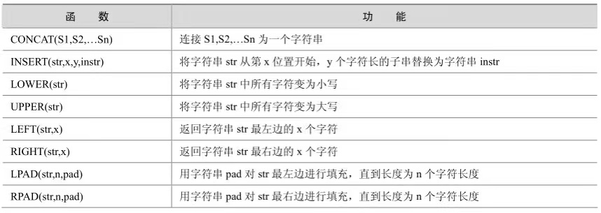
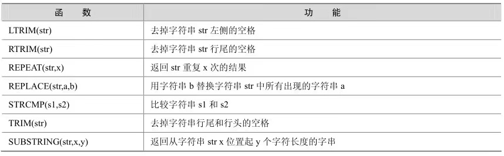
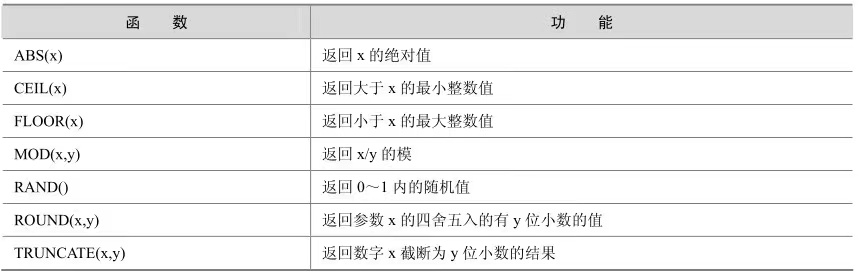
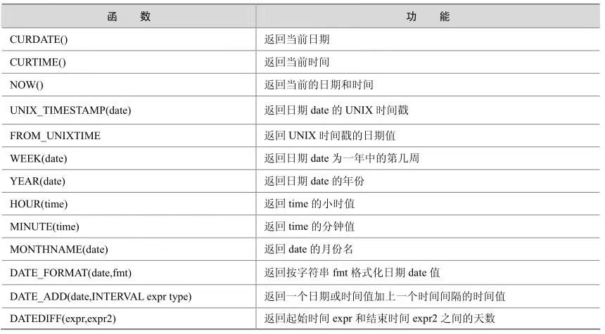
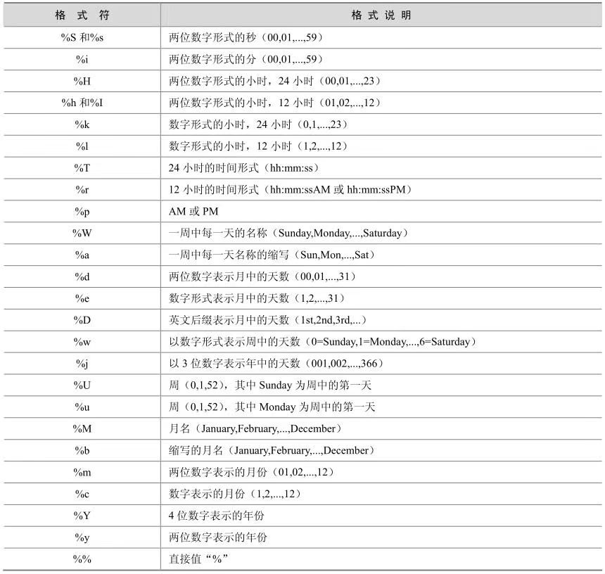
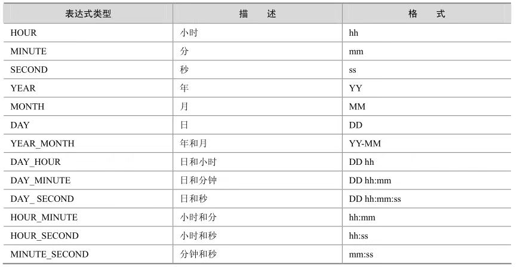
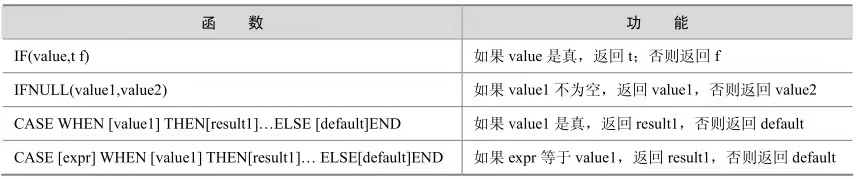
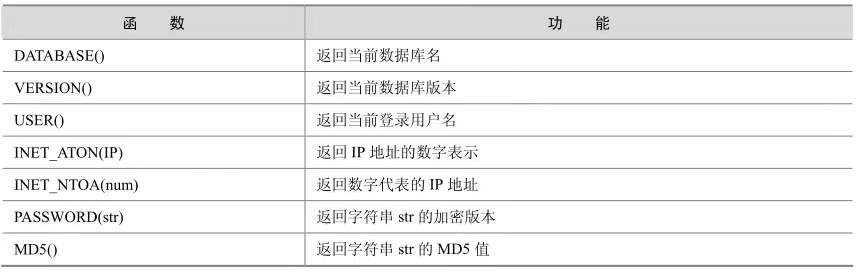

## 字符串函数


<center>



</center>


<center>



</center>

```sql
select concat('abc','def');#abcdef
select concat('abc',null);#null
select insert('ing',1,2,'lr');#lrg
select lower('ABC');#abc
select upper('abc');#ABC
select left('abc',1);#a
select right('abc',1);#c
select lpad('abc',4,'d');#dabc
select lpad('abc',5,'dddd');#ddabc
select rpad('abc',4,'d');#abcd
select strcmp('a','b');#1
select strcmp('b','b');#0
select strcmp('b','c');#-1
```

- cancat(str,str) 合并两个字符串，当有一个字符串为null时，返回null
- INSERT(str,x,y,instr)函数：将字符串str从第x位置开始，y个字符长的子串替换为字符串instr。
- LOWER(str)和UPPER(str)函数：把字符串转换成小写或大写。
- LEFT(str,x)和RIGHT(str,x)函数：分别返回字符串最左边的x个字符和最右边的x个字符。如果第二个参数是NULL，那么将不返回任何字符串。
- LPAD(str,n,pad)和RPAD(str,n,pad)函数：用字符串pad对str最左边和最右边进行填充，直到长度为n个字符长度。
- LTRIM(str)和RTRIM(str)函数：去掉字符串str左侧和右侧空格。
- LTRIM(str)和RTRIM(str)函数：去掉字符串str左侧和右侧空格。
- REPLACE(str,a,b)函数：用字符串b替换字符串str中所有出现的字符串a。
- STRCMP(s1,s2)函数：比较字符串s1和s2的ASCII码值的大小。
- TRIM(str)函数：去掉目标字符串的开头和结尾的空格。
- SUBSTRING(str,x,y)函数：返回从字符串str中的第x位置起y个字符长度的字串。

## 数值函数

<center>



</center>

- ABS(x)函数：返回x的绝对值。
- CEIL(x)函数：返回大于x的最小整数。
- FLOOR(x)函数：返回小于x的最大整数，和CEIL的用法刚好相反。
- MOD(x,y)函数：返回x/y的模。
- RAND()函数：返回0～1内的随机值。
- ROUND(x,y)函数：返回参数x的四舍五入的有y位小数的值。
- TRUNCATE(x,y)函数：返回数字x截断为y位小数的结果。

## 日期和时间函数

<center>



</center>

- CURDATE()函数：返回当前日期，只包含年月日。
- CURTIME()函数：返回当前时间，只包含时分秒。
- NOW()函数：返回当前的日期和时间，年月日时分秒全都包含。
- UNIX_TIMESTAMP(date)函数：返回日期date的UNIX时间戳。
- FROM_UNIXTIME(unixtime)函数：返回 UNIXTIME 时间戳的日期值，和UNIX_TIMESTAMP(date)互为逆操作。
- WEEK(DATE)和 YEAR(DATE)函数：前者返回所给的日期是一年中的第几周，后者返回所给的日期是哪一年。
- HOUR(time)和MINUTE(time)函数：前者返回所给时间的小时，后者返回所给时间的分钟。
- MONTHNAME(date)函数：返回date的英文月份名称。
- DATE_FORMAT(date,fmt)函数：按字符串 fmt 格式化日期 date 值，此函数能够按指定的格式显示日期，

<center>



</center>

- DATE_ADD(date,INTERVAL expr type)函数：返回与所给日期date相差INTERVAL时间段的日期。其中INTERVAL是间隔类型关键字，expr是一个表达式，这个表达式对应后面的类型， type是间隔类型，MySQL提供了13种间隔类型

<center>



</center>

## 流程函数

<center>



</center>

## 其他常用函数

<center>



</center>