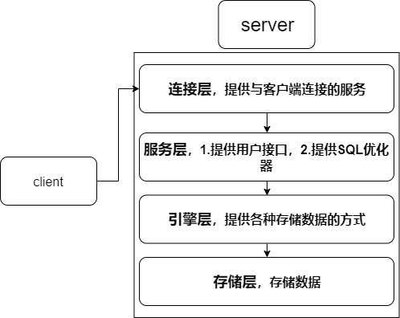
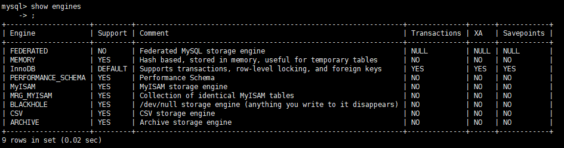

## 一、mysql分层
MySQL服务端分为几个层如下：

<center>



</center>

### 1.1 连接层
提供与客户端连接的服务。
当客户端发出一个请求后（如增删改查的SQL语句），首先到达该层，将服务器与客户端建立连接。

### 1.2 服务层
服务层分两个作用：

- 提供各种用户使用的接口。 如select、insert等
- 提供SQL优化器（MySQL Query Optimizer）。 SQL优化器是MySQL服务层自带的一个服务，它会自动优化用户写得不是最优的SQL，使其达到优化的效果。但由于优化器毕竟只是优化器，有时候会将用户自定义的优化方案给更改掉，从而使用户自己的优化方案失效，这一点需要注意。
### 1.3 引擎层

引擎层提供各种数据存储的方式。MySQL的存储引擎有很多，比较常用的比如有InnoDB, MyISAM。

InnoDB与MyISAM的区别为：

- InnoDB 事务优先，所以适合高并发操作，使用的是行锁
- MyISAM 性能优先，适合查询多的场景，使用的是表锁

### 1.4 存储层

最终的数据存储在存储层。

## 二、存储引擎

查询数据库支持引擎：`show engines;`

<center>



</center>

指定数据库对象的引擎，比如某张表需要使用某引擎
```sql
create table tb(
    id int auto_increment,
    name varchar(32)
) ENGINE = MyISAM AUTO_INCREMENT=1 DEFAULT CHARSET=utf-8
```


