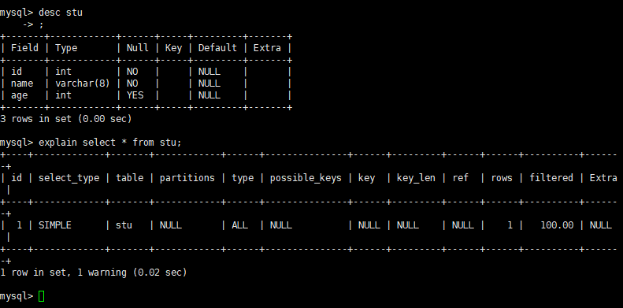
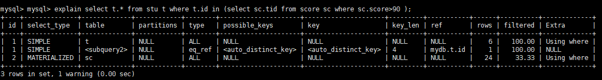
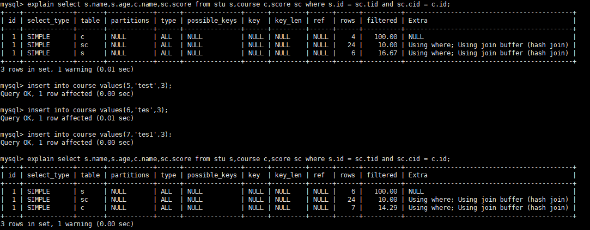

## 一，SQL优化
sql需要优化是因为在执行sql语句可能出现：性能低、执行时间长、等待时间长、SQL语句繁杂（连接查询）、索引失效、服务器参数不合理（缓冲、线程数等）

### 1.1 SQL执行
- 编写过程：  
`select ... from ... join ...on ...where ... group by... having ... order by ... limit ...`
- 解析过程：
`from... on ... join ... where ... group by ... having ... select ... order by ... limit ...`

这里可以参考连接[步步深入：MySQL架构总览->查询执行流程->SQL解析顺序](https://www.cnblogs.com/annsshadow/p/5037667.html)

### 1.2 索引
sql优化主要是在优化索引，索引是帮助MYSQL高效查询数据的数据结构。
索引一般情况下是树形结构（B+树(默认)，Hash树等），所以索引本身数据很大，可以存放在内存和硬盘中（通常放在硬盘中）
1. 并不是所有的情况都适用索引：少量数据、频繁更新的字段、很少使用的数据
2. 索引会增加查询效率，但是会降低增删改的效率

### 1.3 索引分类
索引分为单值索引、唯一索引、复合索引
- **单值索引**：没有任何限制  
```sql
--查询索引
show index from table_name;

-- 创建索引
create INDEX index_name on table_name(column_name);
alter table table_name add index on column_name;

-- 删除索引
drop index index_name on table_name;
```

- **唯一索引**： 索引列的值必须唯一，但允许有空值。如果是组合索引，则列值的组合必须唯一。
```sql
---创建索引
create unique index index_name on table_name(column_name);
alter table table_name add unique index on column_name;

-- 删除索引
drop index index_name on table_name;
```

还有**主键索引**：一种特殊的唯一索引，一个表只能有一个主键，不允许有空值。一般是在建表的时候设置主键同时默认创建主键索引
```sql
CREATE TABLE `table` (
    `id` int(11) NOT NULL AUTO_INCREMENT ,
    `title` char(255) NOT NULL ,
    PRIMARY KEY (`id`)
);
```

- **复合索引**:指多个字段上创建的索引，只有在查询条件中使用了创建索引时的第一个字段，索引才会被使用。使用组合索引时遵循最左前缀集合
```sql
ALTER TABLE `table` ADD INDEX name_city_age (column_name,column_name2,column_name3); 
```

:::tip 全文索引
主要用来查找文本中的关键字，而不是直接与索引中的值相比较。fulltext索引跟其它索引大不相同，它更像是一个搜索引擎，而不是简单的where语句的参数匹配。fulltext索引配合match against操作使用，而不是一般的where语句加like。它可以在create table，alter table ，create index使用，不过目前只有char、varchar，text 列上可以创建全文索引。值得一提的是，在数据量较大时候，现将数据放入一个没有全局索引的表中，然后再用CREATE index创建fulltext索引，要比先为一张表建立fulltext然后再将数据写入的速度快很多。


```sql
-- 创建表的适合添加全文索引
CREATE TABLE `table` (
    `id` int(11) NOT NULL AUTO_INCREMENT ,
    `title` char(255) CHARACTER NOT NULL ,
    `content` text CHARACTER NULL ,
    `time` int(10) NULL DEFAULT NULL ,
    PRIMARY KEY (`id`),
    FULLTEXT (content)
);
-- 修改表结构添加全文索引

ALTER TABLE article ADD FULLTEXT index_content(content)
-- 直接创建索引

CREATE FULLTEXT INDEX index_content ON article(content)
```
:::

## 二、SQL性能分析
使用`explain + sql语句`分析sql语句性能。

<center>



</center>

其中 explain 各参数解释如下：
- id： 编号
- select_type：查询类型
- table: 表
- partitions：分区中的记录将被查询相匹配。显示此列仅在使用分区关键字。该值为NULL对于非分区表。 （8.0 新增）
- type: 类型
- possible_keys :可能使用的索引
- key：真正使用的索引
- key_len:实际使用的索引长度
- ref: 表之间的引用
- filtered： 过滤 （8.0 新增）
- rows: 通过索引查询到的数据量
- extra： 额外的信息 


:::details 性能分析准备
```sql
-- 建表语句
create table stu( id int(4) not null, name varchar(8) not null , age int(2)  ) default charset=utf8;
create table tea( id int(4) not null, name varchar(8) not null , age int(2)  ) default charset=utf8;
create table course( id int(4) not null, name varchar(8) not null, tid int(4) not null) default charset=utf8;
create table score(cid int(4) not null, score int(3) ,tid int(4) not null) default charset=utf8;

-- 插入数据
insert into stu values(1,'zs',16);
insert into stu values(2,'ls',16);
insert into stu values(3,'w5',17);
insert into stu values(4,'lin6',16);
insert into stu values(5,'mafei',17);
insert into stu values(6,'honger',16);

insert into tea values(1,'zhng',25);
insert into tea values(2,'li',28);
insert into tea values(3,'da',35);
insert into tea values(4,'ma',69);

insert into course values(1,'math',1);
insert into course values(2,'chn',2);
insert into course values(3,'eng',3);
insert into course values(4,'yjm',4);

insert into score values(1,86,1);
insert into score values(1,32,2);
insert into score values(1,89,3);
insert into score values(1,23,4);
insert into score values(1,66,5);
insert into score values(1,78,6);
insert into score values(2,86,1);
insert into score values(2,26,2);
insert into score values(2,96,3);
insert into score values(2,46,4);
insert into score values(2,35,5);
insert into score values(2,77,6);
insert into score values(3,42,1);
insert into score values(3,75,2);
insert into score values(3,71,3);
insert into score values(3,67,4);
insert into score values(3,56,5);
insert into score values(3,89,6);
insert into score values(4,17,1);
insert into score values(4,67,2);
insert into score values(4,10,3);
insert into score values(4,97,4);
insert into score values(4,27,5);
insert into score values(4,87,6);
```
:::

### 2.1 id

ID 值相同，从上往下执行顺序执行，ID值不同，从大到小执行

为了生成不同ID的情况，使用子查询可以看到从ID的执行情况  
`explain select t.* from stu t where t.id in (select sc.tid from score sc where sc.score>90 );`

<center>



</center>

由于查询中包含子查询，子查询必定优先与主查询，ID也就比主查询要大

在相同ID的情况下，执行顺序根据表数据改变而改变
`explain select s.name,s.age,c.name,sc.score from stu s,course c,score sc where s.id = sc.tid and sc.cid = c.id;`

<center>



</center>

从上图可以看到，在course表中添加三条数据后，执行顺序并不一样，这是由于连表查询使用**笛卡尔积**的原因

首先，第一次查询时，第二步查询的是score表，因为这个表存在其余两个表的连接关系，所以无论如何第二步都会执行score表的操作；  
然后，就是第一步和第三步的区别，当我们执行第一次查询时，前两步查询使用笛卡尔积（4* 24） 明显相比与 （6* 24）的要小，程序在执行时必定先执行最优的选择；  
最后，就是第二次查询和第一次查询的区别，当course表数据增加时，在保证查询有效顺序的情况下，程序优先使用最优的笛卡尔积(6*24)先执行。


### 2.2 select_type

select_type |	JSON Name |	Meaning
-|-|-
SIMPLE|	None	|简单查询(不适用union和子查询的)
PRIMARY|	None|	最外层的查询
UNION|	None|	UNION中的第二个或者后面的SELECT语句
DEPENDENT UNION	|dependent (true)	|UNION中的第二个或者后面的SELECT语句,依赖于外部查询
UNION RESULT|	union_result|	UNION结果
SUBQUERY	|None	|子查询中的第一个SELECT语句
DEPENDENT SUBQUERY|	dependent (true)|	子查询中的第一个SELECT语句，依赖于外部查询
DERIVED|	None	|派生表的SELECT(FROM子句的子查询)
MATERIALIZED	|materialized_from_subquery|	物化子查询
UNCACHEABLE SUBQUERY|	cacheable (false)	|对于该结果不能被缓存，必须重新评估外部查询的每一行子查询
UNCACHEABLE UNION|	cacheable (false)	|UNION中的第二个或者后面的SELECT语句属于不可缓存子查询 (see UNCACHEABLE SUBQUERY)
