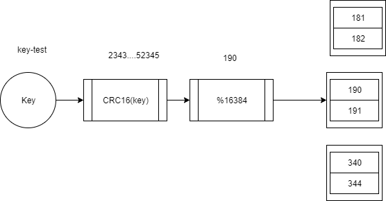

## 简介
集群是redis在2.8之后提供的新特性，为了解决单个redis服务性能瓶颈而应运而生。

集群就是使用网络将若干台计算机并联起来，并提供统一的管理方式，使其对外呈现单机的服务效果

这样可以分散单台服务器的访问压力，实现负载均衡，分散单台服务器的存储压力，实现高拓展性，也可以降低单台服务器宕机带来的业务灾难

## 架构设计
### 数据存储设计
- 通过算法设计，使用CRC16计算key得出值后取16384的模后，得出key应该存储的位置
- 将所有的存储空间计划切割成16384份，每台主机保存一部分，每份代表的是一个存储空间，不是一个key的保存空间
- 按照key的计算结果放到对用的存储空间

### 集群内部通讯设计

集群是没有主从的概念的，每个节点都会互联。每个节点都会存储每个节点的存储槽。

如果当前读写指令连接一个节点，如果刚好这个key的存储为当前节点，则刚好命中，直接返回。如果不在当前节点，会使用当前节点存储的槽信息连接对应的节点。

## 集群搭建

配置：
`cluster-enabled yes|no` 是否开启集群
`cluster-config-file <path>` 集群配置文件
`cluster-node-time millis` 集群超时时间，超时就下线 

`./redis-trib.rb create --replicas 1 <ip>:<port>`

