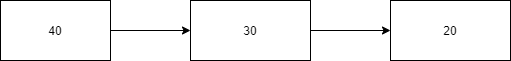

## 前言
Redis支持五种数据类型：string（字符串），hash（哈希），list（列表），set（集合）及zset(sorted set：有序集合)。

## 一、String
string 是 redis 最基本的类型，你可以理解成与 Memcached 一模一样的类型，一个 key 对应一个 value。
string 类型是二进制安全的。意思是 redis 的 string 可以包含任何数据。比如jpg图片或者序列化的对象。
string 类型是 Redis 最基本的数据类型，string 类型的值最大能存储 **512MB**。
### 基本操作
```shell
> set a 1000 #设值
OK
> get a #获取值
1000
> mset b 2000 c 3000 d 4000 #多指令设置
OK
> mget a b c d #多指令获取
1000
2000
3000
4000
> strlen a #string长度
4
> append a 3000 #尾部追加
8
> get a
10003000
```

由上面可以看出，string最常用的基本操作有`set、get、mset、mget、strlen、append`
:::tip
mset与set、mget与get，这两种，一种mget(multiple) 表示多指令操作，另外一种表示单指令操作，如果使用方式可能的话尽量使用多指令操作，减少网络IO与降低Redis负载
:::

### 拓展操作


1.  在大型企业级应用中，分表操作是基本操作，使用多张表存储同一类型数据，但是对应的主键id必须保证统一性，不能重复。Oracle数据库具有sequence设定，可以解决该问题，但是MySQL数据库并不具有类似机制。
这时候就可以使用String的设置数值操作
```shell
> incr id #自增1
1
> incr id
2
> incr id
3
> incrby id 5 #自增5
8
> incrby id 5
13
> incrbyfloat id 5.3 #自增5.3
18.3
> incrbyfloat id 5.3
23.6

```
`incr 、incrby、 incrbyfloat`等，当然，也可以减少指定范围的值
```shell
> decr id #自减1
1
> decrby id 5 #自增5
-4
```
`decr 、decrby` 如果key的值不是数字的话，增加和减少操作会报错
```shell
> set a 13dff
OK
> incr a
ERR value is not an integer or out of range
```
---
2.  在很多时候我们的应用需要对接外部的比如微信或者其他系统，这个时候就会用到他们系统给的token，但这个token是有时效的，比如两个小时过期，这时候就可以用到我们的redis的设置key过期时间
```shell
> setex a 3000 helloexpire #设置键的过期时间，单位为秒
OK
> get a
helloexpire
> ttl a #获取键的过期时间
2956
> ttl a
2953
> expire a 60 #设置键的过期时间 单位秒
1
> ttl a
57
```
有两种方式设置key的过期时间`setex、expire`,使用`ttl`查看键的过期时间。

:::tip
表示运行结果是否成功
0->false 失败
1->true 成功

key的设置约定
通常使用   表名:主键名:主键值:字段名 如：order: id :341341234:name 
:::

命令|描述
-|-
SET key value |设置指定 key 的值
GET key | 获取指定 key 的值。
GETRANGE key start end|返回 key 中字符串值的子字符
GETSET key value|将给定 key 的值设为 value ，并返回 key 的旧值(old value)。
GETBIT key offset|对 key 所储存的字符串值，获取指定偏移量上的位(bit)。
MGET key1 [key2..]|获取所有(一个或多个)给定 key 的值。
SETBIT key offset value|对 key 所储存的字符串值，设置或清除指定偏移量上的位(bit)。
SETEX key seconds value|将值 value 关联到 key ，并将 key 的过期时间设为 seconds (以秒为单位)。
SETNX key value|只有在 key 不存在时设置 key 的值。
SETRANGE key offset value|用 value 参数覆写给定 key 所储存的字符串值，从偏移量 offset 开始。
STRLEN key|返回 key 所储存的字符串值的长度。
MSET key value [key value ...]|同时设置一个或多个 key-value 对。
MSETNX key value [key value ...]|同时设置一个或多个 key-value 对，当且仅当所有给定 key 都不存在。
PSETEX key milliseconds value|这个命令和 SETEX 命令相似，但它以毫秒为单位设置 key 的生存时间，而不是像 SETEX 命令那样，以秒为单位。
INCR key|将 key 中储存的数字值增一。
INCRBY key increment|将 key 所储存的值加上给定的增量值（increment） 。
INCRBYFLOAT key increment|将 key 所储存的值加上给定的浮点增量值（increment） 。
DECR key|将 key 中储存的数字值减一。
DECRBY key decrement|key 所储存的值减去给定的减量值（decrement） 。
APPEND key value|如果 key 已经存在并且是一个字符串， APPEND 命令将指定的 value 追加到该 key 原来值（value）的末尾。

## 二、Hash
Redis hash 是一个 string 类型的 field（字段） 和 value（值） 的映射表，hash 特别适合用于存储对象。
Redis hash对一系列的数据进行编组，方便管理，一个储存控件保存多个键值对数据
### 基本操作
hash的基本操作和string类似
```shell
> hset user name 张三 age 12 nickname pig phone 10086 #添加、修改数据
4
> hget user name #获取数据某字段
张三
> hgetall user #获取数据所有字段
name
张三
age
12
nickname
pig
phone
10086
> hdel user nickname #删除数据某个字段
1
> hgetall user 
name
张三
age
12
phone
10086
> hmset user name 李四 age 16 phone 10001 nickname dog #添加修改多个数据
OK
> hmget user name age #获取多个数据
李四
16
> hlen user #获取哈希表中字段的数量
4
> hexists user name #获取哈希表中是否存在指定的字段
1
> hexists user password 
0
> hkeys user #获取哈希表中所有字段名
name
age
phone
nickname
> hvals user #获取哈希表中所有字段值
李四
16
10001
dog
> hincrby user age 1 #设置指定字段数字自增或增加指定范围的值
17
> hincrbyfloat user age 2.5 #设置指定字段数字自增或增加指定范围的值
19.5

```
:::warning 
- hash类型下的value只能存储字符串，不允许存储其他数据类型，不存在嵌套现象。如果数据未获取到，对应的值未空(nil)
- 每个hash可以存储2^32-1个键值对
- hash类型十分贴切对象的数据存储形式，并且可以灵活添加删除对象属性。但是hsah设计初衷不是为了存储大量对象而设计的，切记不可滥用，更不可以将hash作为对象列表使用
- hgetall 操作可以获取全部属性，但是如果内部field过多，便利整体数据效率就会很低，有可能成为数据访问瓶颈
:::
### 拓展操作
电商网站购物车设计与实现，为什么可以使用hash呢？我们分析一下，一个购物车页面可以存在多种物品，但是每个用户的购物车里面的东西是不一样的，所以可以将用户id作为key，将购物车每个物品的id作为field，那么field值就商品数量，这样就能很巧妙的使用hash。
比如，当用户增加或减少购买某物品数量，那么就可以使用 `hincrby`指令,获取某个物品数量使用`hget`操作，删除物品可以使用`hdel`，全选可以使用`hgetall`操作，物品类别总量可以使用`hlen`操作
```shell
> hset 0002 g1 1 g2 3 g5 1 g6 2
4
> hincrby 0002 g1 1
2
> hdel 0002 g2
1
> hgetall 0002
g1
2
g5
1
g6
2
```
但是存在问题是字段只有id的话还是要到数据库去查询这些数据，那用不用redis并没有太大区别

这时候我们可以将购物车中每个物品的记录保存成两条数据
- 物品id:nums 保存购买数量
- 物品id：info 保存购物车中显示的信息（文字描述、图片、价格等）格式为json格式
```shell
> hset 001 g2:nums 3 g2:info {text,address,info}
2
> hgetall 001
g2:nums
3
g2:info
{text,address,info}
```
但是这样又会出现问题，当别的用户购买一样的物品，那么存储的物品信息就冗余了，造成空间浪费，那么其实我们就可以将物品信息保存一个hash
```shell
> hset g2 text 高贵优雅耗子尾汁 address http://www.baidu.com info 69岁老同志旗舰店
3
> hgetall g2
text
高贵优雅耗子尾汁
address
http://www.baidu.com
info
69岁老同志旗舰店
> hset 01 g2 1 g3 1 g5 1
3
> hgetall 01
g2
1
g3
1
g5
1
```

特别注意`hsetnx key field value` 当field不存在时，才能设置该值，如果存在field并且有值时，将会设置失败。

2.  第二种情况时商家推出某些物品抢购，数量有限的情况比如apple旗舰店推出三款手机iphone11售100台每台20元，iphone12售50台每台21元，iphone13售20台每台22元
这时候就可以存储appleid作为key，物品id作为field，还有多少台作为field值
```shell
> hset apple iphone11 100 iphone12 50 iphone 20
3
> hincrby apple iphone11 -1
99
```
但是实际过程中可能会出现超卖的问题，这里不做讨论，将在后面继续

命令|描述
-|-
HDEL key field1 [field2]|删除一个或多个哈希表字段
HEXISTS key field|查看哈希表 key 中，指定的字段是否存在。
HGET key field|获取存储在哈希表中指定字段的值。
HGETALL key|获取在哈希表中指定 key 的所有字段和值
HINCRBY key field increment|为哈希表 key 中的指定字段的整数值加上增量 increment 。
HINCRBYFLOAT key field increment|为哈希表 key 中的指定字段的浮点数值加上增量 increment 。
HKEYS key|获取所有哈希表中的字段
HLEN key|获取哈希表中字段的数量
HMGET key field1 [field2]|获取所有给定字段的值
HMSET key field1 value1 [field2 value2 ]|同时将多个 field-value (域-值)对设置到哈希表 key 中。
HSET key field value|将哈希表 key 中的字段 field 的值设为 value 。
HSETNX key field value|只有在字段 field 不存在时，设置哈希表字段的值。
HVALS key|获取哈希表中所有值。
HSCAN key cursor [MATCH pattern] [COUNT count]|迭代哈希表中的键值对。

## 三、List
Redis列表是简单的字符串列表，按照插入顺序排序。你可以添加一个元素到列表的头部（左边）或者尾部（右边）
底层使用双向链表存储结构实现
### 基本操作
```shell
> lpush list1 20 30 40  #左进
3
> llen list1
3
> rpush list1 50 60 #右进
5
> lrange list1 0 -1 #查看所有元素
40
30
20
50
60
> lindex list1 2 #查找list第二个元素的值
20
> lpop list1 #左出
40
> rpop list1 #右出
60
```
由于list是一个双向链表，所以在左边push时，那么它的链表形式就会如下所示

<center>



</center>

所以在lrange的时候就以顺序读编程40-30-20。特别的，想要查看list所有数据使用`lrange key 0 -1`类似python的数组获取

### 拓展操作
1. 实现朋友圈点赞功能，朋友圈在日常生活中接触很多，一个朋友的朋友圈点赞和取消点赞也是常见的操作，如果使用redis实现的话，用list是不错的一种选择，
首先，将用户的id作为key，点赞的用户id做为list的值，那用什么杨的方式push进去呢？点赞是有顺序的，按照比较舒服的思路，使用rpush比较容易懂。

```shell
> rpush lbwnb 101 pdd dsm 002 005 008
6
> lrange lbwnb 0 -1
101
pdd
dsm
002
005
008
> rpop lbwnb
008
> rpush lbwnb 008
6
> lrange lbwnb 0 -1
101
pdd
dsm
002
005
008
> lpop lbwnb
101
> lrem lbwnb 1 005
1
> lrange lbwnb 0 -1
pdd
dsm
002
008

```
如果是list第一个元素和最后一个元素可以使用lpop和rpop，但是如果删除list中某个元素，那么就需要使用lrem命令。


2. 实现微博关注列表，关注列表是从最近关注的往下显示的，那么可以使用list的lpush和lrange配合，使用用户id作为key，关注用户的id作为list元素
```shell
> lpush 0002 0001 0003 0004 006
4
> lrange 0002 0 -1
006
0004
0003
0001
```
这种实现还是比较简易的真正实现还有其他问题。

:::warning 注意事项
- list中保存的数据都是string类型的，数组总容量是有限的。
- list具有索引的概念，但是操作数据时通常以队列的形式入队出队，或者以栈的形式入栈出栈操作
- 获取全部数据操作结局索引设置为-1 `lrange key 0 -1`
- list可以对数据进行分页操作，通常第一页信息来自于list，第2页及更多信息通过数据库形式加载
:::

命令|描述
-|-
BLPOP key1 [key2 ] timeout|移出并获取列表的第一个元素， 如果列表没有元素会阻塞列表直到等待超时或发现可弹出元素为止。
BRPOP key1 [key2 ] timeout|移出并获取列表的最后一个元素， 如果列表没有元素会阻塞列表直到等待超时或发现可弹出元素为止。
BRPOPLPUSH source destination timeout|从列表中弹出一个值，将弹出的元素插入到另外一个列表中并返回它； 如果列表没有元素会阻塞列表直到等待超时或发现可弹出元素为止。
LINDEX key index|通过索引获取列表中的元素
LINSERT key BEFORE|AFTER pivot value|在列表的元素前或者后插入元素
LLEN key|获取列表长度
LPOP key|移出并获取列表的第一个元素
LPUSH key value1 [value2]|将一个或多个值插入到列表头部
LPUSHX key value|将一个值插入到已存在的列表头部
LRANGE key start stop|获取列表指定范围内的元素
LREM key count value|移除列表元素
LSET key index value|通过索引设置列表元素的值
LTRIM key start stop|对一个列表进行修剪(trim)，就是说，让列表只保留指定区间内的元素，不在指定区间之内的元素都将被删除。
RPOP key|移除列表的最后一个元素，返回值为移除的元素。
RPOPLPUSH source destination|移除列表的最后一个元素，并将该元素添加到另一个列表并返回
RPUSH key value1 [value2]|在列表中添加一个或多个值
RPUSHX key value|为已存在的列表添加值

## 四、Set
集合成员是唯一的，这就意味着集合中不能出现重复的数据。

Redis 中集合是通过哈希表或者ziplist实现的，所以添加，删除，查找的复杂度都是 O(1)。
### 基本操作
```shell
> sadd set1 001 001 002 002 003 003 #添加数据，重复数据不会添加
3
> smembers set1 #获取所有数据
003
002
001
> srem set1 002 #删除数据
1
> smembers set1
003
001
```

### 拓展操作
1.  在用户使用今日头条时会设置3个爱好的内容，但是后期为了增加用户的活跃度，兴趣点，增加用户的留存度。可以使用set获取推荐内容的随机几个数据
```shell
> smembers news
1
2
3
4
5
6
> srandmember news 1 #取出随机一个数据
6
> srandmember news 2 #取出随机两个数据
6
2
> spop news #取出随机一个数据并从集合中删除
3

```
2.  求两个集合的交并差集，常用于qq共同好友，微博共同关注等。
```shell
> sadd news2 2 5 9 
3
> sinter news news2 #求交集
2
5
> sunion news news2 #求并集
1
2
4
5
6
9
> sdiff news news2 #求差集
1
4
6
> sinterstore news1 news news2 #求交集并将结果存储到news1中
2
> smembers news1
2
5
> sunionstore news1 news news2 #求并集并将结果存储到news1中
6
> smembers news1
1
2
4
5
6
9
> sdiffstore news1 news news2 #求差集并将结果存储到news1中
3
> smembers news1
1
4
6
> smove news1 news2 1 #将指定数据1从集合news1中移动到news2中
1
> smembers news2
1
2
5
9
```

3. 公司对网站做推广，统计网站PV（访问量）、UV（独立访客）、IP（独立IP）
- PV：网站被访问次数，可通过刷新页面提高访问量
- UV:网站被不同用户访问次数，可通过cookie统计访问量，相同用户切换IP地址，UV不变
- IP：网站被不同IP地址访问的总次数，可通过访问IP地址统计量计算
```shell
> sadd ips 1.1.1.1
1
> sadd ips 1.1.1.2
1
> smembers ips
1.1.1.2
1.1.1.1
```


:::wanring 注意事项
- set类型不允许数据重复，如果添加的数据在set中已经存在，那么将只保留一份
- set虽然与hash的存储结构相同，但是无法启动hash中存储值空间
:::
命令|描述
-|-
SADD key member1 [member2]|向集合添加一个或多个成员
SCARD key|获取集合的成员数
SDIFF key1 [key2]|返回第一个集合与其他集合之间的差异。
SDIFFSTORE destination key1 [key2]|返回给定所有集合的差集并存储在 destination 中
SINTER key1 [key2]|返回给定所有集合的交集
SINTERSTORE destination key1 [key2]|返回给定所有集合的交集并存储在 destination 中
SISMEMBER key member|判断 member 元素是否是集合 key 的成员
SMEMBERS key|返回集合中的所有成员
SMOVE source destination member|将 member 元素从 source 集合移动到 destination 集合
SPOP key|移除并返回集合中的一个随机元素
SRANDMEMBER key [count]|返回集合中一个或多个随机数
SREM key member1 [member2]|移除集合中一个或多个成员
SUNION key1 [key2]|返回所有给定集合的并集
SUNIONSTORE destination key1 [key2]|所有给定集合的并集存储在 destination 集合中
SSCAN key cursor [MATCH pattern] [COUNT count]|迭代集合中的元素

## 五、SortedSet
Redis 有序集合和集合一样也是 string 类型元素的集合,且不允许重复的成员。

不同的是每个元素都会关联一个 double 类型的分数。redis 正是通过分数来为集合中的成员进行从小到大的排序。

有序集合的成员是唯一的,但分数(score)却可以重复。

集合是通过哈希表实现的，所以添加，删除，查找的复杂度都是 O(1)。 集合中最大的成员数为 232 - 1 (4294967295, 每个集合可存储40多亿个成员)。
### 基本操作
### 拓展操作


命令|描述
-|-
ZADD key score1 member1 [score2 member2]|向有序集合添加一个或多个成员，或者更新已存在成员的分数
ZCARD key|获取有序集合的成员数
ZCOUNT key min max|计算在有序集合中指定区间分数的成员数
ZINCRBY key increment member|有序集合中对指定成员的分数加上增量 increment
ZINTERSTORE destination numkeys key [key ...]|计算给定的一个或多个有序集的交集并将结果集存储在新的有序集合 destination 中
ZLEXCOUNT key min max|在有序集合中计算指定字典区间内成员数量
ZRANGE key start stop [WITHSCORES]|通过索引区间返回有序集合指定区间内的成员
ZRANGEBYLEX key min max [LIMIT offset count]|通过字典区间返回有序集合的成员
ZRANGEBYSCORE key min max [WITHSCORES] [LIMIT]|通过分数返回有序集合指定区间内的成员
ZRANK key member|返回有序集合中指定成员的索引
ZREM key member [member ...]|移除有序集合中的一个或多个成员
ZREMRANGEBYLEX key min max|移除有序集合中给定的字典区间的所有成员
ZREMRANGEBYRANK key start stop|移除有序集合中给定的排名区间的所有成员
ZREMRANGEBYSCORE key min max|移除有序集合中给定的分数区间的所有成员
ZREVRANGE key start stop [WITHSCORES]|返回有序集中指定区间内的成员，通过索引，分数从高到低
ZREVRANGEBYSCORE key max min [WITHSCORES]|返回有序集中指定分数区间内的成员，分数从高到低排序
ZREVRANK key member|返回有序集合中指定成员的排名，有序集成员按分数值递减(从大到小)排序
ZSCORE key member|返回有序集中，成员的分数值
ZUNIONSTORE destination numkeys key [key ...]|计算给定的一个或多个有序集的并集，并存储在新的 key 中
ZSCAN key cursor [MATCH pattern] [COUNT count]|迭代有序集合中的元素（包括元素成员和元素分值）