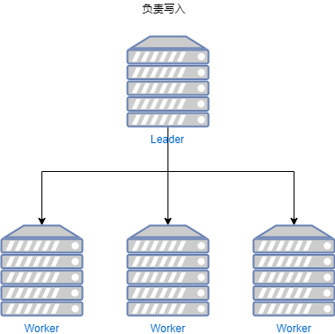
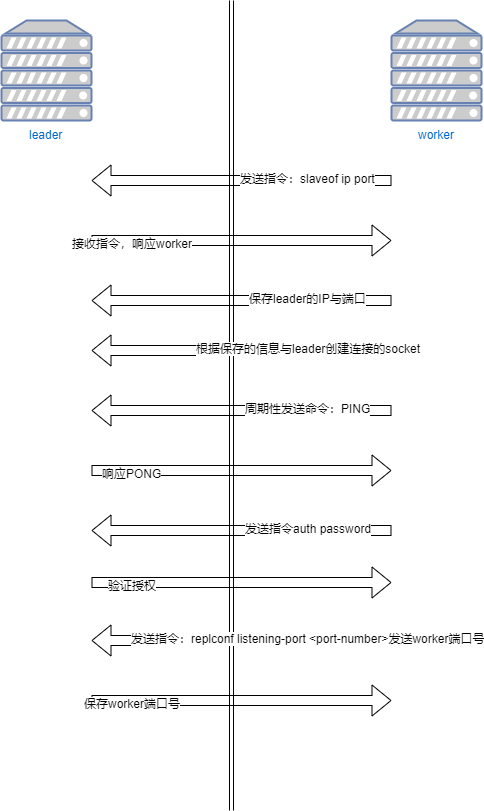
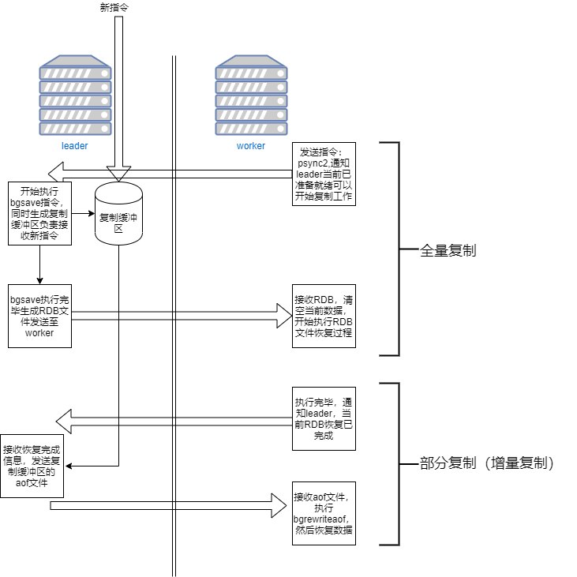
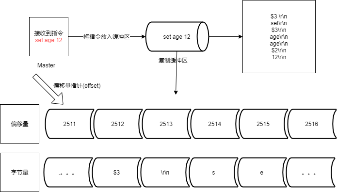
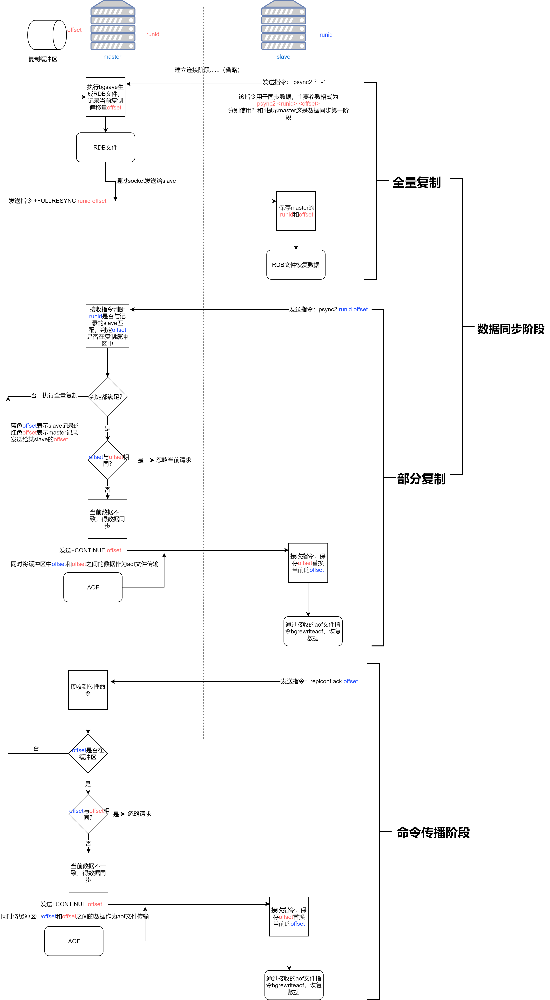

## 简介
单机redis的风险与问题
1. 机器故障，如硬盘故障或系统崩溃，造成数据丢失，很有可能对业务造成灾难性的打击
2. 容量瓶颈，内存不足的情况是很常发生的

:::tip
为了避免单点redis服务器故障，准备多台服务器，互相连通。将数据复制多个副本保存到不同的服务器上，连接到一起，并保证数据是同步的。即使有其中一台服务器宕机，其他服务器依然可以提供服务，实现redis高可用，同时实现数据冗余备份。
:::

<center>



</center>

以上就是主从复制的连接方案，有master负责收据数据，然后同步到slave，由slave提供读取数据的服务，并且一个slave只能对应一个master

但是以上方式还会有问题，一个slave宕机，对整体集群的影响不大，但是如果master宕机了，那集群就不能对外提供写数据的服务，这时候集群会从slave中推选除一个master，用来收集数据。这样就能提供高可用的服务了

## 作用
- 读写分离：master写，slave读，提高服务器的读写能力
- 负载均衡：基于主从结构，配合读写分离，由slave分担master负载，并根据需求的变化，改变slave的数量，通过多个从节点分担数据读取负载，提高redis服务并发量与数据吞吐量
- 故障恢复：当master出现问题，由slave提供服务，实现快速的故障恢复
- 数据冗余：实现数据热备份，是持久化之外的另一种数据冗余方式


## 工作流程

主从复制过程可以分为3个阶段：  
### 1.建立连接阶段（由slave连接master）
建立slave到master的连接，使master能够识别slave，并保存slave端口号

<center>



</center>


以上就是连接的步骤。

主从连接的操作由如下几种：

1. 客户端发送命令  
`slaveof <masterip> <masterport>`
如果master配置密码的话则需要使用命令 
`config set masterauth password`
2. 服务器启动参数  
`redis-server --slaveof <masterport>`

3. 服务器配置  
`slaveof <masterip> <masterport>`  
配置文件配置  
`masterauth password`

当然，还有很多方式，比如docker，docker-compose和k8s等
由于测试的时候使用两个虚拟机docker测试，使用docker-compose 启动，修改command命令即可

- 主从断开连接  
`slaveof no one`


slave系统信息
```shell
# Replication
role:slave
master_host:192.168.83.16
master_port:6379
master_link_status:up
master_last_io_seconds_ago:9
master_sync_in_progress:0
slave_repl_offset:70
slave_priority:100
slave_read_only:1
connected_slaves:0
master_replid:55e97ffcc89f1610164d2d7fac0d96a08a30c635
master_replid2:0000000000000000000000000000000000000000
master_repl_offset:70
second_repl_offset:-1
repl_backlog_active:1
repl_backlog_size:1048576
repl_backlog_first_byte_offset:1
repl_backlog_histlen:70
```

master系统信息
```shell
# Replication
role:master
connected_slaves:1
slave0:ip=192.168.83.15,port=6379,state=online,offset=112,lag=0
master_replid:55e97ffcc89f1610164d2d7fac0d96a08a30c635
master_replid2:0000000000000000000000000000000000000000
master_repl_offset:112
second_repl_offset:-1
repl_backlog_active:1
repl_backlog_size:1048576
repl_backlog_first_byte_offset:1
repl_backlog_histlen:112
```
当slave中的信息role为slave且master_link_status:up说明通信成功


### 2.数据同步阶段
slave通过指令请求数据，master接收指令后执行`bgsave`，但是此时会出现一个问题，就是接收到新的set指令，这样rdb的数据是没有当前新数据的，为了解决这个问题，master在第一个slave连接的时候会在执行`bgsave`指令同时创建一个命令缓冲区。然后将生成的rdb文件通过连接阶段的socket发送到slave。slave接收到RDB文件后，清空当前数据并执行RDB文件的恢复过程。这个过程叫做全量复制。

全量复制完成后，slave发送命令告知masterRDB恢复已经完成，master接收到后发送复制缓冲区的aof文件，并记录当前发送的aof指令的数量，保证数据完整性。slave接收到文件后执行bgrewriteaof恢复数据，这个阶段叫做部分复制（增量复制）


<center>



</center>

```shell
1:M 02 Dec 2020 21:39:48.058 * Full resync requested by replica 192.168.83.15:6379 #slave请求同步数据
1:M 02 Dec 2020 21:39:48.058 * Replication backlog created, my new replication IDs are '55e97ffcc89f1610164d2d7fac0d96a08a30c635' and '0000000000000000000000000000000000000000'
1:M 02 Dec 2020 21:39:48.058 * Starting BGSAVE for SYNC with target: disk 
1:M 02 Dec 2020 21:39:48.062 * Background saving started by pid 16 #开始bgsave
16:C 02 Dec 2020 21:39:48.083 * DB saved on disk 
16:C 02 Dec 2020 21:39:48.085 * RDB: 4 MB of memory used by copy-on-write
1:M 02 Dec 2020 21:39:48.144 * Background saving terminated with success #bgsave完成
1:M 02 Dec 2020 21:39:48.145 * Synchronization with replica 192.168.83.15:6379 succeeded #同步完成
```

:::warning master注意
1. 如果master数据量巨大，数据同步阶段应避开流量高峰期，避免造成master阻塞，影响业务正常执行
2. 复制缓冲区大小设置不合理，会导致数据溢出。如进行全量复制周期太长，进行部分复制时发现数据已经存在丢失的情况，必须进行第二次全量复制，致使slave陷入死循环状态。
3. master单机内存占用主机内存的比例不应过大，建议使用50%-70%，留下部分内存用于执行bgsave命令和创建复制缓冲区
:::

设置复制缓冲区配置文件为：  
`repl-backlog-size 1mb`


:::warning slave注意
1. 为避免slave进行全量复制、部分复制时服务器响应阻塞或数据不同步，建议关闭此期间的对外服务
2. 如果多个slave同时对master请求数据同步，master发送的RDB文件增多，会对带宽造成巨大冲击，造成master带宽不足，因此数据同步需要根据业务实际需求适量错峰
3. slave过多时，建议调整拓扑结构，由一主多从结构变为树状结构，中间的节点即是master，也是slave。注意使用树状结构时，由于层级深度，导致深度越高的slave与最顶层的master之间的数据同步延迟较大，数据一致性变差，应该谨慎选择
:::

设置slave在复制阶段关闭对外服务：  
`slave-serve-stable-data yes|no`
### 3.命令传播阶段
当master数据库状态被修改后，导致主从服务器数据库状态不一致，此时需要让主从数据同步到一致的状态，同步状态的动作就称为命令传播。

master将接收到的数据命令发送给slave，slave接收到命令后执行

如果命令传播阶段出现了断网现象
情况|方案
-|-
网络闪断闪连|忽略
短时间网络中断|部分复制
长时间网络中断|全量复制

部分复制在上面的同步阶段其实简略了一些内容，在这里将进行补充。部分复制最主要的核心内容有： **Redis服务器运行id、主服务器的复制缓冲区、主从服务器的复制偏移量**。

- 服务器运行ID(runid)  
服务器运行ID是每一个redis服务运行的身份识别码，一台服务器多次运行将生成不同的ID。用于redis服务器之间的身份识别。
- 复制缓冲区  
在主从结构中，master通过指令传播的方式去同步slave的数据。但是如果在某一时刻，在传输过程中，有一台slave网络发生故障，没有接收到master发送的命令，那将会造成数据和其他slave不一致的情况。数据缓冲区最主要的功能就是解决这个问题。

复制缓冲区，又成为复制积压缓冲区，是一个先进先出的队列，用于存储服务器执行过的命令，每次传播命令，master都会将复制缓冲区的传播的命令记录下来。

<center>



</center>

如下：
1. 接收到指令后，master将指令放入复制缓冲区，复制缓冲区将指令转换成AOF文件格式后存入
2. 以Bitmaps类似的存储结构作为队列存储，特别注意的是，如果缓冲区的大小不够存储新进入的指令，将会将队尾的数据出队，造成数据丢失的问题，这样又会进行全量复制，占用资源性能。
3. 队列中每个单位都包含偏移量和字节量，偏移量作为指令存储的位置，字节量存储AOF优化后的指令单个字节。

- 主从服务器偏移量(offset)
描述复制缓冲区中的指令字节位置。master中的offset：记录发送给所有slave的指令字节对应的位置（多个） slave中的offset：记录slave接收master发送过来的指令字节对应的位置（一个）
主要用于在主从结构中，当slave断线后，恢复数据。

当客户端存储的offset和master中存储的offset发现不对应的时候，就会将缺失部分的数据发送给slave

那什么时候去发送需要同步数据的指令呢？

### 心跳检测
这个就要涉及到**心跳检测**的问题：  
当进入命令传播阶段，master与slave间需要进行信息交换，使用心跳机制进行维护，实现双方连接保持在线。

master心跳：指令PING，由配置`repl-ping-salve-period`决定，默认10秒，由`info replication中lag判断`
```shell
> info replication
# Replication
role:master
connected_slaves:1
slave0:ip=192.168.83.15,port=6379,state=online,offset=84,lag=1
master_replid:1b7aabb98518506530a737cb81bd526766be5815
master_replid2:0000000000000000000000000000000000000000
master_repl_offset:84
second_repl_offset:-1
repl_backlog_active:1
repl_backlog_size:1048576
repl_backlog_first_byte_offset:1
repl_backlog_histlen:84
```
当lag为0或1是为正常，表示最后一次连接时间间隔。主要用于判断slave是否在线

slave心跳：指令REPLCONF ACK \[offset] 周期为1秒，用于汇报给master当前slave的复制偏移量，获取罪行数据变更指令，也可以判断master是否还在线。

数据同步和命令传播阶段的详细整体流程如下：

<center>



</center>

## 常见问题 

### 1.频繁的全量复制
伴随着系统的运行，master的数据量越来越大，一旦master重启，runid将会发生变化，导致全部的slave都发生全量复制操作。
redis内部优化调整方案：  
1. master内部创建master_repid变量，使用runid相同的策略生成，长度为41位，并发送给所有slave
2. 在master关闭时执行`shutdown save`，进行RDB持久化，将runid和offset保存到RDB文件中，通过`redis-check-rdb <rdb-file-name>`命令可以查看RDB文件中的信息
```shell
root@40fab0fe84af:/data# redis-check-rdb dump.rdb
[offset 0] Checking RDB file dump.rdb
[offset 26] AUX FIELD redis-ver = '6.0.9'
[offset 40] AUX FIELD redis-bits = '64'
[offset 52] AUX FIELD ctime = '1607415669'
[offset 67] AUX FIELD used-mem = '1936048'
[offset 85] AUX FIELD repl-stream-db = '0'
[offset 135] AUX FIELD repl-id = '1b7aabb98518506530a737cb81bd526766be5815'
[offset 150] AUX FIELD repl-offset = '0'
[offset 166] AUX FIELD aof-preamble = '0'
[offset 168] Selecting DB ID 0
[offset 592] Checksum OK
[offset 592] \o/ RDB looks OK! \o/
[info] 11 keys read
[info] 0 expires
[info] 0 already expired
```
其中的repl-id和repl-offset就是记录的当前runid和offset
3. master重启后加载RDB文件恢复数据，将repl-id和repl-offset加载到内存中。

由于master保存了runid，所以所有slave认为还是之前的master


还有一种情况是，slave网络中断，由于master复制缓冲区过于小，重新上线的slave中的offset越界，触发全量复制。这个时候要重新修改缓冲区大小`repl-backlog-size`

### 2.频繁的网络中断
masterCPU占用过高或者slave频繁断开

当slave每秒发送REPLCONF ACK指令时，突然接收到了慢查询（keys *，hgetall等）会占用大量的CPU性能，这时候master每秒调用复制定时函数replicationCron()，发现这个slave长时间没有响应，然后就一直调用。会占用master的资源和连接。所以要设置合理的超时时间，确认是否释放slave。`repl-timeout` 默认为60秒，超过60秒没响应，释放slave

### 3.数据不一致
由于网络信息不同步，发送数据有延迟，多个slave获取相同的数据可能不同步。可以优化主从间的网络环境，通常放置在一个机房部署，使用云服务器时要注意机房地区。还可以监控主从节点延迟（通过offset）判断，如果slave延迟大，暂时屏蔽程序对该slave的数据访问`slave-serve-stale-data yser|no` 开启后仅会响应info、slaveof等少数命令

:::tip 总结
- 三个阶段 连接阶段-数据同步阶段-命令传播阶段
- 三个核心 runid、复制缓冲区、offset
- 心跳机制
:::