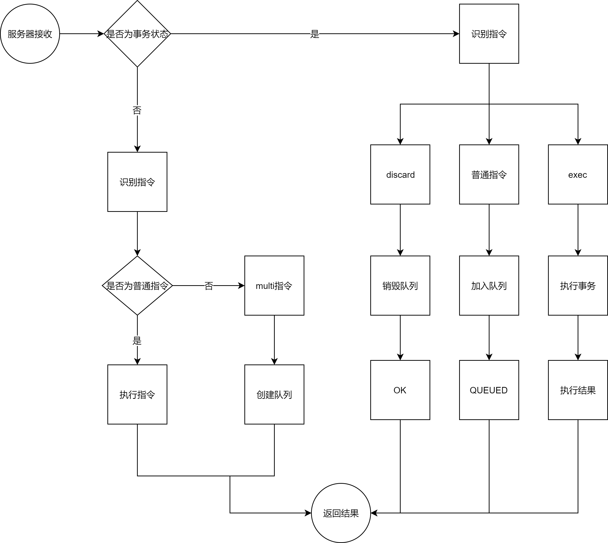

## 简介
当redis在执行指令的过程中，多条连续执行的指令被干扰，打断，插队。

redis事务就是一个命令的执行队列，将一系列预定义的命令包装成一个整体。当执行时，一次性按照添加顺序一次执行，中间不会被打断或者干扰。
## 事务的基本操作
- 开启事务 `multi`  
设定事务的开启位置，此指令执行后，后续的所有指令均加入到事务中
- 执行事务 `exec`  
设定事务的结束位置，同时执行事务，与muti成对出现，成对使用

```shell
> multi
OK
> set name 12
QUEUED
> set name 13
QUEUED
> lpush age 12
QUEUED
> incr age
QUEUED
> exec
OK
OK
1
> lrange age 0 -1
12

```

:::tip
加入事务的命令展示进入到任务队列中，并没有立即执行，只有执行exec命令才开始执行
:::

当在事务定义过程中出现问题，可以使用`discard`取消事务，终止当前事务，发生在muti之后，exec之前


redis事务整体流程图如下：

<center>



</center>


:::warning 注意
在定义事务过程中，命令**格式输入错误**会将整体事务中所有命令均不执行，包括语法正确的命令。   
在定义事务过程中，**命令执行出现错误**（比如：list进行incr操作）那么事务中能够正常运行的命令会执行，运行错误的命令不会被执行  
（特别特别要注意的是已执行完毕的命令对应的数据不会自动回滚，需要程序员在代码中实现回滚）
:::

## 锁
基于特定条件的事务执行用锁控制
对key添加监视锁，在执行exec前如果key发生了变化，终止执行事务

`watch key1 [key2 ...]`

取消对所有key的监视

`unwatch`

```shell
###########1watch 在multi内
> multi
OK
> watch name
QUEUED
> set age 123
QUEUED
> exec #执行之前另一个客户端修改了name的值
OK
> get name
111
###########1watch 在multi外
> watch name
OK
> multi
OK
> set age 111
QUEUED
> exec #执行之前另一个客户端修改了name的值
null
> get  name
12

```
由以上第二部的multi操作可以看出，当watch的值发生改变，那么执行exec指令的时候将会返回null

:::warning 注意
watch 操作应该在事务之前执行，如果放在事务里面，那么watch的键值如果发生改变也不会影响
（测试版本为6.0.6）如果为5.0之前的版本将会报错 :ERR WATCH inside MULTI is not allowed
:::

通常事务和锁的操作都应用与基于状态控制的批量任务执行

但是为了在热卖情况下发生超卖的这种问题：
- 使用watch监控一个key有没有改变时不能解决问题的，因为此时需要监控key的具体数值是否发生改变。
- redis是单线程的，但是多个客户端对同一数据同时进行操作，该怎么避免key的值同时被修改？

## 分布式锁
基于特定条件的事务执行，分布式锁
使用setnx 设置一个公共锁

`setnx lock-key value`

利用setnx命令的返回值特征，**有值则返回设置失败，无值则返回设置成功**
- 对于返回设置成功的锁，拥有控制权，进行下一步的具体业务操作
- 对于返回设置失败的锁，不具有控制权，排队或等待
操作完毕后使用del操作释放锁

```shell
> set num 10
OK
> setnx lock-num 1
1
> incrby num -1
9
> del lock-num
1
> setnx lock-num 1 
1
> incrby num 1
10
############另一客户端操作
> setnx lock-num 1
0
###########操作结束
> del lock-num
1
############另一客户端操作
> setnx lock-num 1
1
###########操作结束
```

可以看到，在redis中，具体锁的不是具体操作的key，而是自定义的另外一个lockname，这样的情况下，每个客户端都要遵循统一锁的名称，如果锁名称不统一那么分布式锁也就无意义了。特别注意在业务操作完成之后一定要释放锁

### 业务场景
依赖分布式锁的机制，某个用户操作时对应的客户端宕机，且此时已经获取到锁，那该怎么办呢？

分析：  
- 由于锁操作是由用户控制加锁解锁的，必定存在加锁后未解锁的风险
- 需要解锁操作不能仅依赖用户控制，系统级别要给出对应的保底处理方案

这个时候就可以使用系统提供的方案expire
使用expire为锁的key添加时间限定，如果超过时间还不释放，那么将会放弃该锁

```shell
expire lock-key second
pexpire lock-key milliseconds
```
```shell
> setnx lock 1
1
> expire lock 10
1
> setnx lock 1
0
> setnx lock 1
1
```
可以看到在设置锁的过期时间后，想要再次获取是获取不到的，在超过锁时效后，将能获取锁

:::tip
由于操作redis通常都是微秒或者毫秒级别的，因此锁定时间不宜设置过大。具体时间需要业务测试后确认。
- 测试持有锁的操作最长执行时间是123ms，最短执行时间是7ms
- 测试百万次最长执行时间对应命令的最大耗时，测试百万次网络延迟平均耗时
- 锁时间设定一般为：**最大耗时 * 120% + 平均网络延迟 * 100%**
- 如果业务最大耗时远小于或远大于网络平均延迟，比如两个数量级的差异，那么取单个耗时较长的即可
:::

