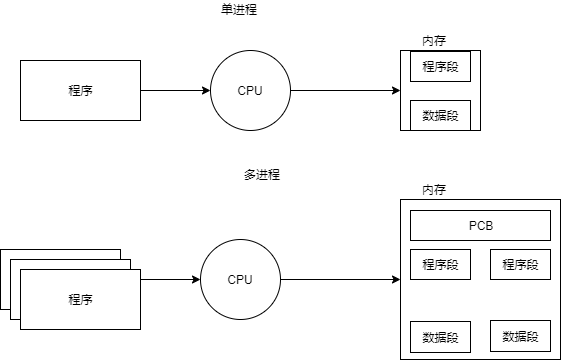
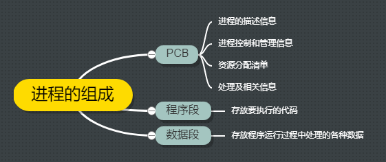
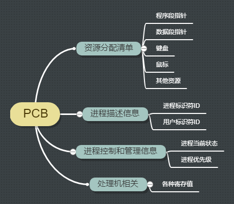
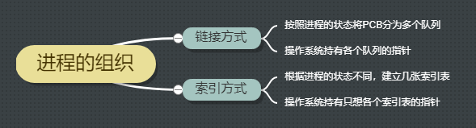

## 一、进程的定义

如上图所示，在内存中有：**程序段、数据段和PCB（process controller block）进程控制块**这三部分就组成了**进程实体**。一般情况下，我们把进程实体简称为进程，例如，所谓创建进程，实质上就是在内存中创建实体中的PCB，加载程序段和数据段。而撤销进程，实际上是撤销进程实体中的PCB。
:::warning 注意
PCB是进程存在的唯一标识
:::

从不同的角度，进程有不同的定义，比较传统的定义有：
- 进程是程序的一次执行过程
- 进程是一个程序及其数据在处理机上顺序执行时所发生的活动
- 进程是具有独立功能的程序在数据集合上运行的过程，它是系统进行资源分配和调度的一个独立单位

引入进程实体的概念后，可以把进程定义为：  
进程是进程实体的运行过程，是系统进行**资源分配**和**调度**的一个独立单位

::: warning 注意
严格来说，进程和进程实体并不一样，进程实体是静态的，进程是动态的。
:::

## 二、进程的组成

进程的组成如下：

PCB包括的内容如下：

## 三、进程的组织

进程的组织如下

## 四、进程的特征

进程和程序是两个截然不同的概念，相比于程序，进程拥有以下特征：

- 动态性  进程是程序执行的一次执行过程
- 并发性  内存中有多个进程实体，各进程可并发执行
- 独立性  进程是能独立运行、独立获取资源、独立接受调度的基本单位
- 异步性  进程各自独立，操作系统需要提供进程的同步机制来解决异步问题
- 结构性  每个进程都会配置一个PCB。

