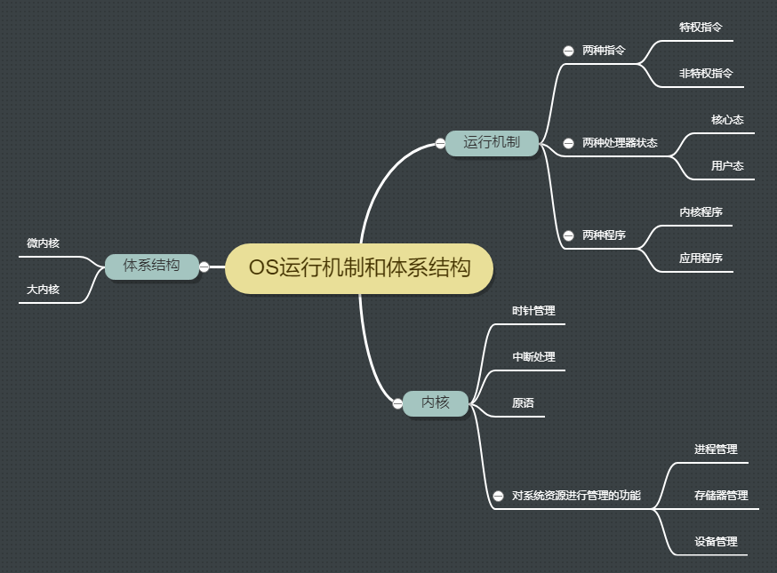
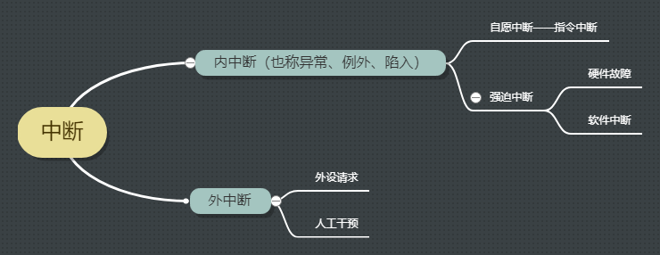

## 一、OS的运行机制和体系结构

## 二、运行机制

### 2.1 两种指令
- 非特权指令  
比如一些逻辑运算或者数学运算指令
- 特权指令  
比如对内存的操作指令，如果用户程序可以使用这个指令，就意味着一个用户可以将其他用户的内存随意清除，这样显然是很危险的

### 2.2 两种处理器状态
- 用户态（目态）  
此时CPU只能处理非特权指令
- 核心态（管态）  
此时CPU能处理特权指令与非特权指令

:::tip 
用程序状态寄存器的某标志位来保存当前处理器处于什么状态（如0为用户态，1为核心态）
:::
### 2.3 两种程序
- 用户程序   
为了保证系统的安全运行，普通应用程序只能执行非特权指令，运行在用户态
- 内核程序  
操作系统的内核程序是系统的管理者，即可以执行特权指令也可以执行非特权指令，运行在用户态

## 三、内核
在操作系统中，并不是所有的软件都是核心的，比如windows上的记事本，linux上的yum，即使没有这些仍然可以使用计算机
内核是计算机配置的底层软件，是操作系统最基本、最核心的部分。
操作系统分为内核程序和非内核功能
内核程序中包括时钟管理、中断处理、原语、资源管理
### 3.1 时钟管理
实现计算机的计时功能，所有的进程切换和调度管理工作都需要计时管理
### 3.2 原语
原语是一种特殊的程序，它负责设备驱动、CPU切换等工作，是最接近硬件的部分，这种程序的运行据有原子性

### 3.3 中断功能

#### **中断机制的诞生**
早期的计算机中，计算机只能串行的运行程序，当需要调用IO等操作时，cpu会等待IO操作完成后再进行运算移出程序，再运行其他程序。所以在计算机中同一时刻只有一个程序在运行，这样就会导致系统资源的利用率特别低。于是，人们发明了操作系统（作为计算机的管理者），引入中断机制，实现多道程序并发执行。**只要发生中断操作就意味着需要操作系统介入，开展管理工作。**

#### **中断机制概念**
当多个进程在计算机种运行时，运行在用户态中，当CPU收到计时部件发出的中断信号，切换为**核心态**对中断进行处理。然后把CPU的使用权限交给操作系统，操作系统内核对中断信号进行处理。

如果操作系统发现中断信号是提示当前程序时间片已用完，那么就会切换别的进程运行。此时操作系统会将CPU权限交给用户进程，切换为用户态。

如果操作系统发现中断信号为发出系统调用（内中断信号），CPU切换为核心态，操作系统对中断进行处理，然后暂停当前进程，等待该进程请求资源完成，切换进程运行。

当之前进程请求资源完成后，该资源会向CPU发出中断信号。CPU切换为核心态让操作系统进行处理，确认之前进程资源请求完成，让其恢复运行，完成后续操作。

- 当中断发生时，CPU立即进入核心态
- 当中断发生后，当前运行的进程暂停运行，并由操作系统内核对中断进行处理
- 对于不同的中断信号，会进行不同的处理

:::tip
发生了中断就意味着需要操作系统介入，开展管理工作，由于操作系统的管理工作（比如进程切换、分配资源等）需要使用特权指令，因此CPU需要从用户态转为核心态。中断可以从用户态切换为核心态，让操作系统获得计算机的控制权。实现多道程序的并发执行。
:::

#### **中断的分类**

- 内中断  
信号来源：CPU内部，与当前执行的指令有关
- 外中断
信号来源: CPU外部，与当前执行的指令无关

### 3.4 资源管理
- 进程管理
- 存储器管理
- 设备管理

## 四、体系结构
### 4.1 大内核
即是包括内核程序中的资源管理称为大内核，运行在核心态。
高性能，但是内核代码庞大、结构不好维护。
### 4.2 微内核
只把内核程序最基本的功能保留在内核，即没有资源管理部分。
这种优点是内核功能少、结构清晰、方便维护。但是需要频繁从核心态与用户态之间的转换，性能低

