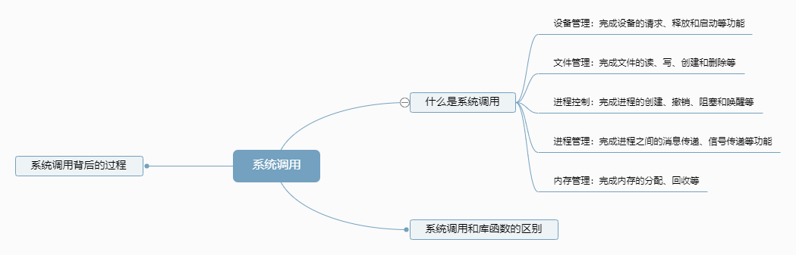

## 概述
系统调用作为用户和计算机硬件之间的接口，需要面向用户提供一些简单易用的服务。主要包括命令接口和程序接口。其中程序接口是由一组**系统调用**组成的。
**系统调用** 是操作系统提供给应用程序（程序员、编程人员）使用的接口，可以理解为一种可供应用程序调用的特殊函数，应用程序可以发出系统调用请求来获得操作系统服务。
操作系统提供**系统调用**的功能，用户进程想要使用打印机这种共享资源时，只能通过系统调用向操作系统发出请求。操作系统会对各个请求进行协调管理，保证系统的稳定性和安全性，防止用户进行非法操作。
因此系统调用涉及到对系统资源管理、对进程的控制，这些功能需要执行一些[特权指令](./runtime)才能完成，所以**系统调用需要在核心态进行**

### 1.1 命令接口
允许用户直接使用，联机命令接口：一句一句执行；脱机命令接口：一堆一堆执行
### 1.2 程序接口
允许用户通过程序间接使用，由一组系统调用组成

## 系统调用和库函数的区别
- 操作系统————>提供系统调用   
- 编程语言————>提供库函数，有些库会将系统调用封装成库函数，以隐藏系统调用的一些细节，使开发人员调用变得简单  
- 应用程序————>可直接进行系统调用，也可直接使用库函数

## 系统调用背后的过程
首先，高级语言层面对应的是用户程序，经过编译后成为汇编语言指令，运行在用户态，当发生调用系统资源时，切换核心态然后处理相关代码

1. 传递系统调用参数
2. 执行陷入指令
3. 执行系统调用相应的服务
4. 返回用户程序