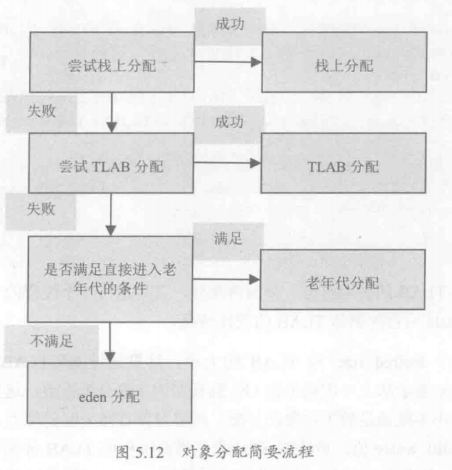

## 一、禁用System.gc()
默认情况下，System.gc()会显示直接出发FullGC，同时对老年代和新生代进行回收。而再一般情况下，垃圾回收应该时自动进行的，无需手工触发。如果过于频繁地触发垃圾回收对系统性能是没有好处的。因此虚拟机提供了一个参数`-XX:+DisableExplicitGC`禁用显示GC，使得System.gc()等价于一个空函数调用。

## 二、对象何时进入老年代
- 初创对象进入eden区
- 老年对象进入老年代，使用`MaxTenuringThreshold`设定，默认情况下为15
- 大对象直接进入老年代，如果新生代from和to区小于创建的对象内存大小，则直接进入老年代

## 三、TLAB分配对象
TLAB(Thread Local Allocation Buffer)，线程本地分配缓存。为了加速对象分配，由于对象一般会分配在堆上，而堆是全局共享的。因此，在同一时间，可能会有多个线程在堆上申请空间。因此，每一次对象分配都必须要进行同步，而在竞争激烈的场合分配的效率又会进一步下降。考虑到对象分配几乎是Java最常用的操作，因此使用TLAB来避免多线程冲突，提高对象分配效率。TLAB本身占用了eden区的空间。在TLAB启动的情况下，虚拟机会为每一个java线程分配一块TLAB空间。

## 四 JIT即时编译器

[深入浅出JIT编译器](https://developer.ibm.com/zh/articles/j-lo-just-in-time/)

