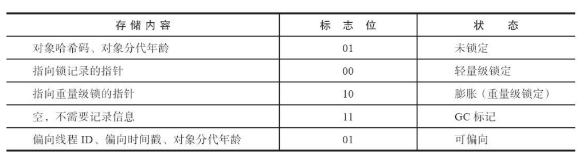

## 一、禁用System.gc()
默认情况下，System.gc()会显示直接出发FullGC，同时对老年代和新生代进行回收。而再一般情况下，垃圾回收应该时自动进行的，无需手工触发。如果过于频繁地触发垃圾回收对系统性能是没有好处的。因此虚拟机提供了一个参数`-XX:+DisableExplicitGC`禁用显示GC，使得System.gc()等价于一个空函数调用。

## 二、对象何时进入老年代
- 初创对象进入eden区
- 老年对象进入老年代，使用`MaxTenuringThreshold`设定，默认情况下为15
- 大对象直接进入老年代，如果新生代from和to区小于创建的对象内存大小，则直接进入老年代

## 三、TLAB分配对象
TLAB(Thread Local Allocation Buffer)，线程本地分配缓存。为了加速对象分配，由于对象一般会分配在堆上，而堆是全局共享的。因此，在同一时间，可能会有多个线程在堆上申请空间。因此，每一次对象分配都必须要进行同步，而在竞争激烈的场合分配的效率又会进一步下降。考虑到对象分配几乎是Java最常用的操作，因此使用TLAB来避免多线程冲突，提高对象分配效率。TLAB本身占用了eden区的空间。在TLAB启动的情况下，虚拟机会为每一个java线程分配一块TLAB空间。

## 四 JIT即时编译器

[深入浅出JIT编译器](https://developer.ibm.com/zh/articles/j-lo-just-in-time/)

## 五 HotSpot虚拟机对象

### 5.1 对象的创建
假设Java堆中的内存是绝对规整的，所有使用过的内存放一边，未使用的内存放另外一边，中间放着一个指针作为分界点的指示器，那分配内存的时候就是把对象需要的内存计算出来后把指针向空闲方向移动等值的大小，这种方式就叫做`指针碰撞`  

但如果java堆中的内存是不规整断点，即是已使用的内存和空闲的内存交错在一起，虚拟机就会维护一个列表，记录上哪些块是可以使用的，这种分配方式叫做`空闲列表`

以上俩种方式需要配合不同的收集器做区分，比如是带有空间压缩整理的收集器就会使用指针碰撞，像标记清除的收集器就只能使用空间列表。

### 5.2 对象的布局

在HotSpot虚拟机里，对象的存储布局可以划分为三个区域：对象头、实例数据和对齐填充

对象头的数据有两类，一类是下图中的`MarkWord`,另一类是类型指针，即是对象的类型指针，用这个指针来确认是哪个类的实例。

实例数据就是对象真正存储的信息，无论是从父类继承下来的，还是在子类中定义的字段都必须记录起来。这部分的存储顺序会
受到虚拟机分配策略参数（-XX：FieldsAllocationStyle参数）和字段在Java源码中定义顺序的影响。
HotSpot虚拟机默认的分配顺序为longs/doubles、ints、shorts/chars、bytes/booleans、oops（Ordinary
Object Pointers，OOPs），从以上默认的分配策略中可以看到，相同宽度的字段总是被分配到一起存
放，在满足这个前提条件的情况下，在父类中定义的变量会出现在子类之前。如果HotSpot虚拟机的
+XX：CompactFields参数值为true（默认就为true），那子类之中较窄的变量也允许插入父类变量的空
隙之中，以节省出一点点空间。

对象的第三部分是对齐填充，这并不是必然存在的，也没有特别的含义，它仅仅起着占位符的作
用。

