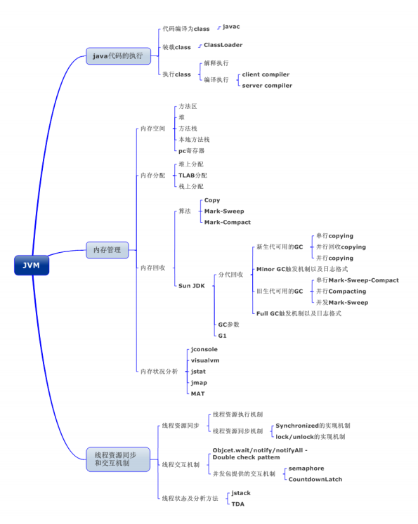
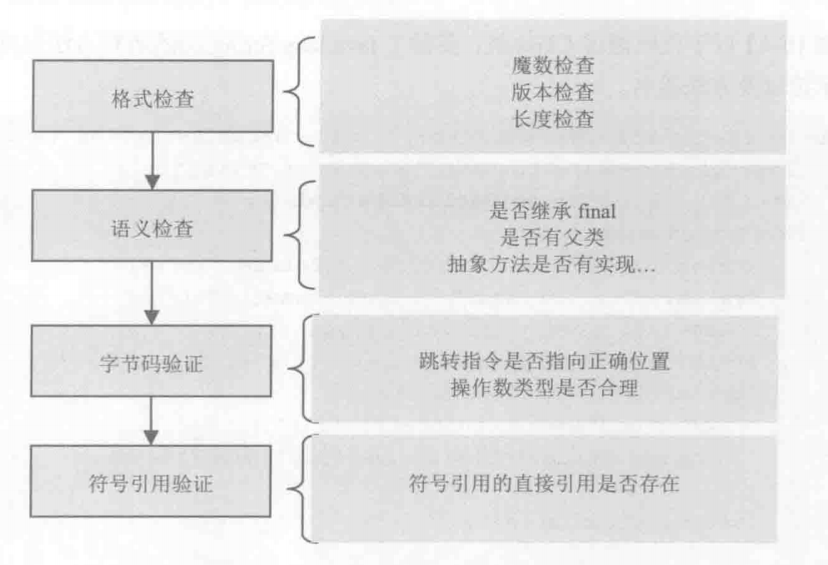
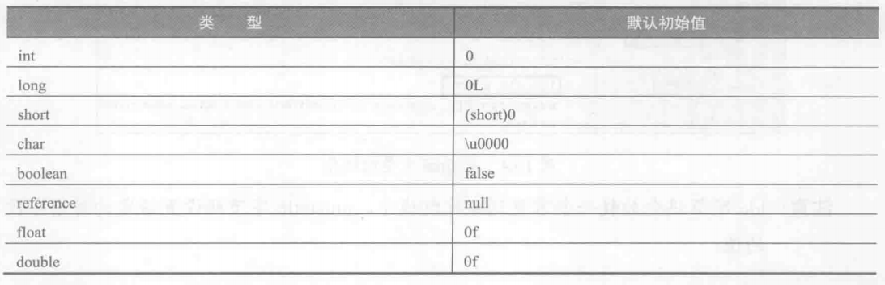

## 一、JVM基本概念
&nbsp;JVM *（Java Virtual Machine）* 是可运行java代码的假想计算机，包括一套字节码指令集、一组寄存器、一个栈、一个垃圾回收、堆和一个存储方法域。JVM试运行在操作系统上的，它与硬件没有直接的交互。

<center>



</center>

## 二、代码执行
### 2.1 类加载过程
类的加载过程有：加载-->验证-->准备-->解析-->初始化,其中，验证、准备和解析并称为连接

#### 2.1.1 加载类的条件
&nbsp; Class只有在必须要使用的时候才会被装载，JVM不会无条件去装载Class类型。以下几种情况发生时可以触发JVM加载：  
- 创建实例，比如：new、反射、克隆、序列化。
- 调用类的静态方法
- 使用类的静态变量（final常量除外）
- 初始化子类时，要求先初始化父类
- main()方法存在的类

```java
  static class Father{
      static{
          System.out.println("I am Father");
      }
  }
  static class Child extends Father{
      static{
          System.out.println("I am children");
      }
  }
  public static void main(String[] args) {
      new Child();
  }
```
输出：
```
I am Father
I am children
```
由输出可知，系统首先会加载父类，然后再装载子类，符合主动装载的两个条件：new的时候会装载类、在初始化子类的时候会先初始化父类

被动引用不会导致类的装载
```java
    static class Father{
        static{
            System.out.println("I am Father");
        }
        public static String value = "123";
    }
    static class Child extends Father{
        static{
            System.out.println("I am children");
        }
    }
    public static void main(String[] args) {
        System.out.println(Child.value);
    }
```
输出
```
I am Father
123
```
使用子类去调用父类中的变量，但是子类并没有被初始化，只有父类被初始化。所以在引用一个静态变量时，只有直接定义该变量的类会被初始化。
:::tip
**注：虽然Child类没有被初始化，但是此时的Child类是已经被系统加载了，只是没有进入到初始化阶段**
:::
使用 `-XX:+TraceClassLoading`参数运行这段代码，就会得到下面的日志：
```
[0.822s][info   ][class,load] com.learn.jvm.classload.ClassLoadTest$Father source: file:/E:/learn/demo/target/classes/
[0.822s][info   ][class,load] com.learn.jvm.classload.ClassLoadTest$Child source: file:/E:/learn/demo/target/classes/
I am Father
123
```
可以明确的看出类是已经被加载了，只是没有被初始化。
```java
    static class Father{
        static{
            System.out.println("I am Father");
        }
        public static final String value = "123";
    }
    static class Child extends Father{
        static{
            System.out.println("I am children");
        }
    }
    public static void main(String[] args) {
        System.out.println(Child.value);
    }
```
输出：
```
[0.561s][info   ][class,load] com.learn.jvm.classload.ClassLoadTest source: file:/E:/learn/demo/target/classes/
123
```
由以上代码可以看出：当调用类的静态常量的时候，是不会装载这个类的，但这个类是会被加载，只是没到初始化阶段

### 2.2 加载
加载类处于类装载的第一个阶段。在加载类的时候，JVM必须完成以下工作：
  - 通过类的全名，获取类的二进制数据流
  - 解析类的二进制数据流为方法区内的数据结构
  - 创建加载类的java.lang.Class类实例，表示为该类型
在获取到类的二进制信息后，JVM就会处理这些数据并生成该类的java.lang.Class类实例，可以使用反射获取该数据，例：
```java
  Class<?> aClass = Class.forName("java.lang.String");
  Method[] declaredMethods = aClass.getDeclaredMethods();
  Stream.of(declaredMethods).forEach(System.out::println);
```

### 2.3 验证
这一步是保证加载的字节码是合理、合法并符合规范的，如下：

<center>



</center>

### 2.4 准备
在这个阶段，JVM会为这个类分配相应的内存空间，设置初始值。
如果存在常量，那么常量也会在准备阶段赋值，这个属于变量的初始化。

<center>



</center>

:::tip
**注：java并不支持boolean类型，对于boolean类型，内部实现其实是int，由于int的默认值是0，boolean的默认值也就变成了false**
:::

### 2.5 解析
解析阶段就是将类、接口、属性和方法的符号引用转换成直接引用。  
  - 符号引用：  
    一些字面量的引用，也就是一些类、接口、方法的直接信息，但是并不能通过该信息去获取直接地址（也就是直接引用）。
  - 直接引用：  
    通过解析操作，得到类、接口、方法等在内存中的指针或偏移量。
直接引用存在的话，系统中肯定存在该类，但是自由符号引用时，不一定存在该对象

:::tip
**计算机汇编语言中的偏移量定义为：把存储单元的实际地址与其所在段的段地址之间的距离称为段内偏移，也称为“有效地址或偏移量”。**
:::

### 2.6 初始化
如果前面的步骤没有出错，那么类可以顺利的装载到系统中。初始化的重要工作是执行类的初始化方法`client`，该方法是由编译器自动生成的，由类的静态成员变量赋值语句以及static语句块合并产生

## 三、类加载器
Java中所有的类都是由ClassLoader进行加载的，它负责通过各种方式将Class文件的二进制数据读入系统中，然后交给JVM进行连接和初始化。
### 3.1 ClassLoader分类
- 启动类加载器 （Bootstrap ClassLoader）完全由C代码完成，在java中没有对象与之对应。负责加载$JAVA_HOME中jre/lib/rt.jar里所有的class
- 拓展类加载器 （Extension ClassLoader）负责加载JRE的扩展目录，lib/ext或者由java.ext.dirs系统属性指定的目录中的JAR包的类。由Java语言实现，父类加载器为null。
- 应用类/系统类加载器 （Appliction ClassLoader）负责在JVM启动时加载来自Java命令的-classpath选项、java.class.path系统属性，或者CLASSPATH换将变量所指定的JAR包和类路径。
类加载器加载Class大致要经过如下8个步骤：

  1. 检测此Class是否载入过，即在缓冲区中是否有此Class，如果有直接进入第8步，否则进入第2步。
  2. 如果没有父类加载器，则要么Parent是根类加载器，要么本身就是根类加载器，则跳到第4步，如果父类加载器存在，则进入第3步。
  3. 请求使用父类加载器去载入目标类，如果载入成功则跳至第8步，否则接着执行第5步。
  4. 请求使用根类加载器去载入目标类，如果载入成功则跳至第8步，否则跳至第7步。
  5. 当前类加载器尝试寻找Class文件，如果找到则执行第6步，如果找不到则执行第7步。
  6. 从文件中载入Class，成功后跳至第8步。
  7. 抛出ClassNotFountException异常。
  8. 返回对应的java.lang.Class对象。

- 自定义类加载器

### 3.2 类加载机制

- 全盘负责：所谓全盘负责，就是当一个类加载器负责加载某个Class时，该Class所依赖和引用其他Class也将由该类加载器负责载入，除非显示使用另外一个类加载器来载入。
- 双亲委派：所谓的双亲委派，则是先让父类加载器试图加载该Class，只有在父类加载器无法加载该类时才尝试从自己的类路径中加载该类。通俗的讲，就是某个特定的类加载器在接到加载类的请求时，首先将加载任务委托给父加载器，依次递归，如果父加载器可以完成类加载任务，就成功返回；只有父加载器无法完成此加载任务时，才自己去加载。
- 缓存机制。缓存机制将会保证所有加载过的Class都会被缓存，当程序中需要使用某个Class时，类加载器先从缓存区中搜寻该Class，只有当缓存区中不存在该Class对象时，系统才会读取该类对应的二进制数据，并将其转换成Class对象，存入缓冲区中。这就是为很么修改了Class后，必须重新启动JVM，程序所做的修改才会生效的原因。
