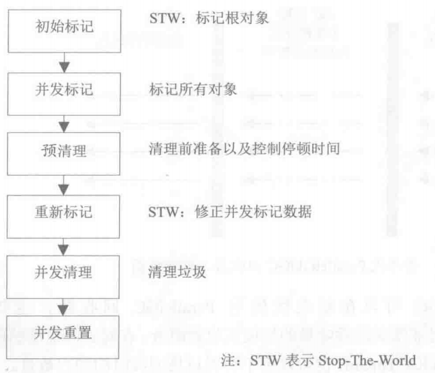

## 一、串行回收器
串行回收器指使用单线程进行垃圾回收的回收器。每次回收时，串行回收器只有一个工作线程，对于并行能力较弱的计算机来说，串行回收器专注性和独占性往往有更好的性能表现。串行回收器可以在新生代和老年代使用，根据不同的作用域，分为新生代串行回收器和老年代串行回收器。
### 1.1 新生代串行回收器
串行收集器是所有垃圾回收器中最古老的一种，它有两个特点：
- 使用单线程进行垃圾回收
- 独占式的垃圾回收
在串行收集器进行垃圾回收时，java应用程序中的线程都需要暂停，等待垃圾回收的完成。使用`-XX:+UseSerialGC`参数可以指定新生代和老年代串行收集器。新生代串行处理器使用复制算法。当虚拟机在Client模式下运行时，它是默认的垃圾回收器。
:::tip
串行垃圾回收器虽然古老，但是久经考验。在大多数情况下，其性能表现是相当不错的。
:::
### 1.2 老年代串行回收器
老年代串行收集器使用的是标记压缩算法。和新生代串行收集器一样它也是一个串行的、独占式的垃圾回收器。由于老年代垃圾回收通常会使用比新生代回收更长的时间，因此，在堆空间较大的应用程序中，一旦老年代串行收集器启动，应用程序可能会因此挺短较长的时间。
可以使用：
- `-XX:+UseSerialGC`:新生代、老年代都使用串行回收器
- `-XX:+UseParNewGC`:新生代使用ParNew回收器，老年代使用串行回收器
- `-XX:+UseParallelGC`:新生代使用ParallelGC回收器，老年代使用串行回收器

## 二、并行回收器
使用多个线程同时进行垃圾回收。
### 2.1 新生代PerNew回收器
PerNew回收器是工作在新生代的垃圾回收器。简单地将串行回收器多线程化，回收策略、算法以及参数和新生代串行回收器一样。PerNew回收器也是独占式回收器，在收集过程中，应用程序会全部暂停。在多CPU的计算机上使用的话，它的停顿时间要短于串行回收器，而在单CPU或者并发能力较差的系统中，并行回收器的效果不会比串行回收器好，由于多线程的压力，它的实际表现很可能比串行回收器差。
开启PerNew回收器可以使用以下参数：
- `-XX:+UseParNewGC`:新生代使用ParNew回收器，老年代使用串行回收器
- `-XX:+UseConcMarkSweepGC`:新生代使用ParNew回收器，老年代使用CMS

ParNew回收器工作时的线程数量可以使用`-XX:ParallelGCThreads`参数指定，一般，最好与CPU数量相当，避免过多的线程数，影响垃圾回收性能。在默认情况下，当CPU数量小于8个时，ParallelGCThreads 的值等于CPU数量，大于8个时，ParallelGCThreads的值等于3+((5*CPU_COUNT)/8)

### 2.2 新生代ParallelGC回收器
和ParNew回收器类似，但是又一个重要特点是该回收器非常关注系统的吞吐量
- `+XX:+UseParallelGC`:新生代使用ParallelGC回收器，老年代使用串行回收器
- `+XX:+UseParallelOldGC`:新生代使用ParallelGC回收器，老年代使用ParallelOldGC回收器

ParallelGC提供了两个重要参数用于控制系统的吞吐量：
- `-XX:MaxGCPauseMillis`:设置最大垃圾回收停顿时间。如果这个值设置很小，为了达到预期的停顿时间，虚拟机会使用较小的堆（小堆比大堆回收快），而将导致垃圾回收变得很频繁，从而增加了垃圾回收总时间，降低吞吐量。
- `-XX:GCTimeRatio`:设置吞吐量大小。它的值是0-100之间的整数。GCTimeRatio默认值为19，则系统用于垃圾回收的时间不超过1/（1+19） = 5%。默认情况下，它的取值是99，即不超过1%的时间用于垃圾回收。  
:::tip
这两个参数是相互矛盾的，如果减少回收的最大停顿时间，就会减少系统的吞吐量，增加系统吞吐量又可能增加回收的最大停顿时间
:::
还可以使用`-XX:+UseAdaptiveSizePolicy`开启自适应GC策略。在这种情况下，新生代的大小、eden和survivior比例、晋升老年代的对象年龄参数会被自动调整，以达到在堆大小、吞吐量和停顿时间之间的平衡点。

### 2.3 老年代ParallelOldGC回收器
一种多线程并发的回收器。和新生代ParallelGC回收器一样，也是关注吞吐量的收集器。使用`+XX:+UseParallelOldGC`开启老年代使用ParallelOldGC回收器，也可以使用`-XX:ParallelGCThreads`参数指定垃圾回收的线程数量

## 三、CMS回收器
CMS（Concurrent Mark Sweep）回收器主要关注于系统停顿时间。使用的是标记清除算法，也是一个多线程并行回收的垃圾回收器。

其中初始标记和重新标记是独占系统资源的，而预清理、并发标记、并发清除和并发重置是可以和用户线程一起执行的。标记操作都是为了标记出需要回收的对象。并发清理则是在标记完成后，正式回收垃圾对象，并发重置则是在垃圾回收完成后，重新初始化CMS数据结构和数据，为下一次垃圾回收做好准备。并发标记、并发清理和并发重置都是可以和应用程序线程一起执行的。  
在默认情况下，并发标记后，会有一个预清理的操作（可以使用`-XX:-CMSPrecleaningEnabled`关闭预清理）。

启用CMS回收器的参数是`-XX:+UseConcMarkSweepGC`。CMS默认启动的并发线程数是（ParallelGCThreads+3）/4。
并发线程数可以通过`-XX:ConcGCThreads`或者`-XX:ParallelCMSThreads`参数手工设定
:::tip
并发是指收集器和应用程序交替执行，并行是指应用程序停止，同时由多个线程一起执行GC。因此并行回收器并不是和应用程序并发的。因为并行回收器执行时，应用程序完全挂起，不存在交替执行的步骤
:::

由于CMS回收器不是独占式的回收器，在CMS回收过程中，应用程序仍然在不停的工作。在应用程序工作过程中，又会不断地产生垃圾。这些新生成的垃圾在当前CMS回收过程中是无法清除的。同时，因为应用程序没有中断，所以在CMS回收过程中，还应该确保应用程序由足够的内存够用。因此，CMS回收器不会等待堆内存饱和时才进行垃圾回收，而是当堆内存使用率大道某一个阈值时便开始进行回收，以确保应用程序在CMS工作过程中，仍然有足够的空间支持应用程序运行。

这个回收阈值可以使用`-XX:CMSInitiatingOccupancyFraction`来指定，默认是68。即当老年代的空间使用率达到68%时，会执行一次CMS回收。如果应用程序的内存使用率增长很快，在CMS执行的过程中，已经出现内存不足的情况，此时，CMS回收就会失败，虚拟机将启动老年代串行收集器进行垃圾回收。如果这样的情况发生，应用程序将完全中断，知道垃圾回收完成，这时的应用程序停顿时间可能会比较长。  
由于CMS是一个基于标记清除算法的回收器。那么这种方法将会造成大量的内存碎片，离散的可用空间无法分配较大的对象。为了解决这个问题，CMS回收器还提供了几个用于内存压缩整理的参数。
`-XX:+UseCMSCompactAtFullCollection`可以使CMS在垃圾收集完成后，进行一次碎片整理，内存碎片整理不是并发进行的。
`-XX:CMSFullGCsBeforeCompaction`可以用于设定进行多少次CMS回收后，进行一次内存压缩

如果希望CMS回收MetaSpace区，则必须要打开`-XX:+CMSClassUnloadingEnabled`。开启后，如果条件允许，那么系统会使用CMS的机制回收Class数据

## 四、G1回收器

G1是一款面向服务端的垃圾回收器，它是作用是替换到JDK1.5中发布的CMS收集器，与其他收集器相比，G1具有以下优点：
- 并行与并发
利用多核CPU来缩短Stop the world停顿的时间，G1收集器可以通过并发的方式让Java程序与GC并发执行。
- 分代收集
G1收集器任然保留分代收集的方式；
G1收集器可以不需要其他收集器配合就能单独管理整个堆，它可以采用不同的方式处理新创建的对象和已经存活了一段时间、熬过多次GC的旧对象从而获得更好的收集效果。
- 空间整理
与GMS的“标记-清除”算法不同，G1收集器从整理上看是“标记-整理”算法实现的收集器，从局部看（两个Region之间）上看是基于“复制”算法实现的，从这两种算法来看那G1运行期间不会产生内存空间碎片，收集器能提供规整的可用空间，这种特性有利于程序长时间运行，分配大对象时不会因为无法分配到连续的内存空间而提前触发下一次GC。
- 可预测的停顿
G1相比于CMS的另一大优势，降低停顿时间是G1和CMS共同的关注点，但G1除了追求低停顿外，还能建立可预测的停顿时间模型：能让使用者明确指出在一个长度为M毫秒的时间片段内，消耗在垃圾收集上的时间不超过N毫秒。
 
G1之前的其他收集器进行收集的范围都是整个新生代或者老年代，但是G1是将整个堆划分为多个大小相等的独立区域（region），虽然也保留了新生代和老年代的概念，但是新生代和老年代不再是物理上隔离的，它们都是一部分region（不需要连续）的集合。
G1收集器之所以能够实现可预测的停顿时间，是因为它可以有计划的避免在整个Java堆中进行全区域的垃圾回收。G1跟踪每个region里的垃圾堆积的大小（回收所获得的空间大小以及回收所需要时间的经验值），在后台维护一个优先列表，每次根据允许的收集时间，优先收集价值最大的region，这种使用region划分空间以及有优先级的区域回收方式，保证了G1收集器在有限的时间内可以获得尽可能高的收集率。
需要注意的是Region不可能是孤立，一个对象分配在某个region中，它并非只能被本region中的其他对象引用，而是可以与整个Java堆任何的对象发生引用关系，那么在做可达性分析算法时，岂不是要扫描整个Java堆？
G1收集器解决上面问题的办法是G1在每个region都有一个与之对应的remembered Set，虚拟机发现程序对reference类型的数据进行写操作时，会产生一个Write Barrier暂时中断写操作，检查reference引用的对象是否处于不同的region中（老年代的对象引用了新生代的对象），如果是，变通过CardTable把相关引用信息记录到被引用对象所属的region的remembered Set中，当进行内存回收时，在GC枚举根节点时，可以对加入remembered Set，即保证不对全堆扫面也不会遗漏。  

在不维护remembered set的操作情况下，G1操作分为以下几个步骤：
- 初始标记
标记GC Roots能直接关联的对象，并且修改TAMS（next top at mark Start）的值，让下一阶段用户程序并发运行，这段时间需要停顿线程，但是耗时很短。
- 并发标记
从GC Roots开始对堆中对象进行可达性分析，找出存货对象，这阶段耗时较长，但是可以用户程序并发执行。
- 最终标记
为了修正在并发标记过程中由于用户线程运行导致标记产生变动的那一部分标记记录，虚拟机将这段时间对象记录在线程remembered Set logs里。同时需要把remembered Set logs的数据合并到Remembered set中，这阶段将停止线程，但是可并行执行。
- 筛选回收
首先对region的回收价值和成本进行排序，根据用户所期望的GC停顿时间来制定回收计划。这个步骤也需要停止用户线程。

使用参数`-XX:+UseG1GC`打开G1收集器。最重要的参数是`-XX:MaxGCPauseMillis`，它用于指定目标最大停顿时间。如果任何一次停顿时间超过这个设置值时，G1就会尝试调整新生代和老年代的比例、堆的大小、晋升年龄等手段来达到预设的目标。此外，`-XX:InitiatingHeapOccupancyPercent`参数设定当前堆使用率达到多少时，出发并发标记周期的执行。默认为45，即当整个堆占用率达到45%时，执行并发标记周期。而且这个值一旦设置，始终都不会被G1收集器修改，这意味着G1收集器不会试图改变这个值来满足MaxGCPauseMillis的目标。

