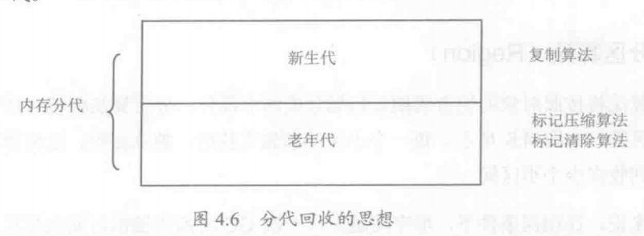

## 一、垃圾回收算法

### 1.1 垃圾收集算法
1. 标记-清除算法 如1.2
2. 标记-复制算法 将内存分为两个区域，将已存在对象的一个区域收集，复制留存的对象到另外一个区域，这样避免了标记-清除算法的内存空间不连续问题
3. 标记-整理算法

### 1.2 标记-清除法(Mark-Sweep)
将垃圾回收分为两个阶段：标记阶段和清除阶段。
在标记阶段，首先通过根节点，标记所有从根节点开始的可达对象。因此，未标记的对象就是未被引用的垃圾对象。
然后执行清除阶段将垃圾对象回收。
标记清除法可能产生的最大问题就是空间碎片，空间不连续的问题。

GC Root 对象有哪些
- 虚拟机（JVM）栈中引用对象  
- 方法区中的类静态属性引用对象  
- 方法区中常量引用的对象（final 的常量值）  
- 本地方法栈JNI的引用对象 
- Java虚拟机内部的引用，如基本数据类型对应的Class对象、异常对象和系统类加载器
- 被同步锁持有的对象  

### 1.3 标记-复制算法(Copying)
将原有的内存空间分为两块，每次只是使用其中一块，在垃圾回收时，将正在使用的内存中的存活对象复制到未使用的内存块中，之后，清除正在使用的内存块中的所有对象，交换两个内存的角色，完成垃圾回收。这种算法应用于新生代中的ServivorFrom和ServivorTo这两个区中
如果系统中的垃圾对象很多，复制算法需要复制的存活对象数量就会相对比较少。因此，在真正需要垃圾回收的时候，复制算法的效率是很高的。又由于对象是在垃圾回收过程中，统一复制到另一片新的内存空间中，所以回收后的内存空间是没有碎片的。

### 1.4 标记-压缩法(Mark-Compact)
复制算法的高效性是建立在存活对象少、垃圾对象多的前提下。而在老年代中，更多的是大部分对象都是存活的对象。不适用复制算法。
标记压缩法是一种老年代的回收算法。它在标记清除法的基础上做出了一些优化。和标记清除法一样，标记压缩法也是从根节点开始，对所有的可达对象进行标记动作。但之后的动作不是简单的清除垃圾对象，而是将所有存活的对象压缩到内存的一端。之后，清理边界外的所有的空间。这种方法既避免了碎片的产生，又不需要相同的两块内存空间。

### 1.5 分代算法(Generational Collecting)
根据内存根据对象的特点和不同堆区的特性，使用不同的回收算法，提高垃圾回收的效率

<center>



</center>

虚拟机可能存在一种叫做卡表(Card Table)的数据结构。卡表作为一个比特位的集合，每个比特位可以用来表示老年代某一区域的所有对象是否持有新生代对象的引用。这样在新生代GC时，可以不用花大量时间扫描老年代对象来确定每一个对象的引用关系，而可以先扫描卡表，只有当卡表的标记位为1时，才需要扫描给定区域的老年代对象，而卡表位为0的所在区域的老年对象，一定不含有新生代对象的应用。

### 1.6 分区算法 (Region)
分代算法按照对象的生命周期长短分为两个部分，分区算法将整个堆空间划分为连续的不同小区间，每个小区间都独立使用、独立回收。这种算法的好处是可以控制一次回收多少个小区间。
一般来说，在相同条件下，堆空间越大，一次GC的时间就越长，从而产生的停顿也就越长。为了控制GC产生的停顿时间，将一块大的内存空间分割成为多个小块，根据目标的停顿时间，每次合理地回收若干个小区间，而不是整个堆空间，从而减少一次GC所产生的停顿。

## 二、判断可触及性
- **可触及的**:从根节点开始，可以到达这个对象。
- **可复活的**：对象的所有应用都被释放，但是对象有可能在`finalize()`函数中复活
- **不可触及的**：对象的`finalize()`函数被调用，并且没有复活，那么就进入不可触及状态，不可触及的对象不可能被复活，因为`finalize()`函数只会被调用一次。
```java
    public static CanReliveObj obj;

    @Override
    protected void finalize() throws Throwable {
        super.finalize();
        System.out.println("CanReliveObj finalize Called");
        obj=this;
    }

    @Override
    public String toString() {
        return "I am CanReliveObj";
    }

    public static void main(String[] args) throws InterruptedException {
        obj = new CanReliveObj();
        obj=null;
        System.gc();
        Thread.sleep(1000);
        if(obj==null){
            System.out.println("obj is null");
        }else{
            System.out.println("obj is usable");
        }
        System.out.println(" Second Gc");
        obj = null;
        System.gc();
        Thread.sleep(1000);
        if(obj==null){
            System.out.println("obj is null");
        }else{
            System.out.println("obj is usable");
        }
    }
```

输出
```
CanReliveObj finalize Called
obj is usable
 Second Gc
obj is null
```

可以看到在第一次设置obj为null时，进行GC，对象被复活了，再次释放对象并进行GC后发现obj对象才真正被回收。  
这是因为在第一次GC时，在finalize()函数调用之前，虽然系统中的应用被清除，但是作为实例方法finalize()，对象的this引用依然会被传入方法内部，引用外泄，对象就会复活，此时，对象又变为不可触及状态。而finalize()函数只会被调用一次，因此，在第二次清除对象时，对象就无法再复活，会被回收。

:::warning
不推荐使用finalize()函数释放资源，因为使用该函数可能发送引用外泄，在无意中复活对象；并且该函数是由系统调用的，调用时间是不明确的，最好使用try-catch-finally或try-resource释放资源
:::

### 2.1根节点枚举
迄今位置，所有的收集器在根节点枚举时，都必须暂停用户线程。因此，毫无疑问会STW（Stop The World）。
目前主流的java虚拟机使用的都是准确式垃圾收集，所以当用户线程停顿下来之后，其实并不需要一个不漏得完成检查完所有执行上下文和全局引用变量位置，
虚拟机有办法直接得到对象引用的，这个就是OopMap。

OopMap：一旦某个类加载动作完成时，HotSpot就会将对象的偏移量及类型的数据计算出来，这样收集器在扫描的时候能直接得到栈和寄存器的一些引用。

### 2.2 安全点

在OopMap的协助下，HotSpot能快速准确地完成对GC roots枚举，但随之有个问题是，当引用关系变化时，导致OopMap的内容变化指令比较多的时候，每次都会向OopMap新增节点数据，这样将需要大量的额外空间。所以，在特定位置记录OopMap这些位置就是安全点。
安全点的选取一般是指能让程序具有长时间执行的特征点，例如：方法调用，循环跳转，异常等都属于长时间执行的，也称“指令序列复用”，只有具有这些功能的指令才会产生安全点。

那如何能让线程执行到安全点就停顿呢？

1. 抢先式中断，系统先把所有用户线程中断，判断是否存在并不在安全点的线程，如果存在不在安全点的线程，让它继续执行，知道位于安全点。
2. 主动式中断，当立即收集需要中断线程的时候，不直接对线程操作，仅仅设置一个标志位，各个线程不断轮询这个标志位，一旦发现中断标志，则在最近的安全点上主动中断当前线程并挂起。（一般的hotSpot就是用主动式中断）
   
### 2.3 安全区域
使用安全点的时候看似已经解决了用户线程停顿问题，但是实际情况用户线程可能存在sleep和blocked状态，那这种时候线程是无法响应虚拟机中的中断请求的，也就是不能走到安全点后中断自己，这种情况衍生出安全区域。安全区域指的是能够确保在某一段代码区域内，引用关系不会发生变化，因此，在这个区域之间的任意地方开始收集都是安全的。

### 2.4 记忆集与卡表
为了解决跨代引用带来的问题，垃圾收集器在新生代范围内建立名为记忆集（Remember Set）的数据结构。
记忆集用于记录从非收集区域指向收集区域的指针集合的抽象数据结构。如果不考虑效率和成本的话，最简单的实现可以用非收集区域中所有含跨代引用的对象数组来实现这个数据结构。
当然，在垃圾收集的场景中，收集器只需要通过记忆集判断出某一块非收集区域是否存在有指向回收区域的指针就可以，并不需要了解这些跨代指针的实现细节。
常见的记忆集精度有：

   1.  字长精度：每个记录精确到一个机器字长，该字包含了跨代指针
   2.  对象精度： 每个记录精确到一个对象，该对象里有字段包含了跨代指针
   3.  卡精度： 每个记录精确到一块内存区域，该区域内对象含有跨代指针
常见的第三种卡精度就是常说的卡表的方式去实现记忆集

字节数组CARD_TABLE的每一个元素都对应着其标识的内存区域中一块特定大小的内存块，这个内存块被称作“卡页”（Card Page）

一个卡页的内存中通常包含不止一个对象，只要卡页内有一个（或更多）对象的字段存在着跨代指针，那就将对应卡表的数组元素的值标识为1，称为这个元素变脏（Dirty），没有则标识为0。在垃圾收集发生时，只要筛选出卡表中变脏的元素，就能轻易得出哪些卡页内存块中包含跨代指针，把它们加入GC Roots中一并扫描。
卡表元素何时变脏的答案是很明确的——有其他分代区域中对象引用了本区域对象时，其对应的卡表元素就应该变脏，变脏时间点原则上应该发生在引用类型字段赋值的那一刻

### 2.5 写屏障

在HotSpot虚拟机里是通过写屏障（Write Barrier）技术维护卡表状态的。
写屏障可以看作在虚拟机层面对“引用类型字段赋值”这个动作的AOP切面，在引用对象赋值时会产生一个环形（Around）通知，供程序执行额外的动作，也就是说赋值的前后都在写屏障的覆盖范畴内。在赋值前的部分的写屏障叫作写前屏障（Pre-Write Barrier），在赋值后的则叫作写后屏障（Post-Write Barrier）。HotSpot虚拟机的许多收集器中都有使用到写屏障，但直至G1收集器出现之前，其他收集器都只用到了写后屏障。

当然，应用了写屏障之后，那么所有的赋值都会增加新增更新卡表的操作，会产生额外的开销。但代价相对使用MinorGC去扫描老年代的代价是要低的。

并且，卡表在高并发场景下还面临着“伪共享”（False Sharing）问题。伪共享是处理并发底层细节时一种经常需要考虑的问题，现代中央处理器的缓存系统中是以缓存行（Cache Line）为单位存储的，当多线程修改互相独立的变量时，如果这些变量恰好共享同一个缓存行，就会彼此影响（写回、无效化或者同步）而导致性能降低，这就是伪共享问题。

## 三、引用
java中提供了四个级别的引用：强引用、软引用、弱引用和虚引用。
除了强引用外，其他3种引用均可以在`java.lang.ref`包中找到它们的身影。
### 3.1 强引用
new的对象就是强引用，强引用具备以下特点：
- 强引用可以直接访问目标对象。
- 强引用所指向的对象在任何时候都不会被系统回收，虚拟机宁愿抛出OOM异常，也不会回收强引用所指向对象。
- 强引用可能导致内存泄漏。

### 3.2 软引用-可被回收的引用
一个对象只持有软引用，那么当堆空间不足时，就会被回收。软引用使用`java.lang.ref.SoftReference`类实现。
```java
User u = new User(3,"张三");
SoftReference<User> userSoftReference = new SoftReference<>(u);
u = null;
System.out.println(userSoftReference.get());
System.gc();
System.out.println("After GC:");
System.out.println(userSoftReference.get());
byte[] bytes = new byte[1024 * 1023 * 8];
Thread.sleep(10000);
System.gc();
System.out.println(userSoftReference.get());
```

每一个软引用都可以附带一个引用队列，当对象的可达性状态发生改变时（由可达变为不可达），软引用对象就会进入引用队列。通过这个引用队列，可以跟踪对象的回收情况。

```java
private static ReferenceQueue<User> userReferenceQueue;

public static class UserSoftReference extends SoftReference<User> {
    int uid;
    public UserSoftReference(User referent, ReferenceQueue<? super User> queue){
        super(referent,queue);
        uid = referent.id;
    }
}

public static void main(String[] args) throws InterruptedException {
    Thread t =new Thread(()->{
        while (true){
            if(userReferenceQueue != null){
                UserSoftReference obj = null;
                try{
                    obj = (UserSoftReference) userReferenceQueue.remove();
                }catch (InterruptedException e){
                    e.printStackTrace();
                }
                if(obj!=null){
                    System.out.println("User id "+obj.uid + " is delete");
                }
            }
        }
    });
    t.setDaemon(true);
    t.start();
    User user = new User(12,"张三");
    userReferenceQueue = new ReferenceQueue<>();
    UserSoftReference userSoftReference = new UserSoftReference(user,userReferenceQueue);
    user = null;
    System.out.println(userSoftReference.get());
    System.gc();
    //内存足够，不会被回收
    System.out.println("After GC:");
    System.out.println(userSoftReference.get());
    System.out.println("try to create byte array and GC");
    byte[] bytes= new byte[1024*925*7];
    System.gc();
    System.out.println(userSoftReference.get());
    Thread.sleep(1000);
}
```

在创建软引用时，指定一个软引用队列，当给定的软引用对象实例被回收时，就会被加入这个引用队列，通过访问该队列可以跟踪对象的回收情况。

### 3.3 弱引用-发现即回收

在系统GC时，只要发现弱引用，不管系统堆空间使用情况如何，都会将对象进行回收。但是，由于垃圾回收器的线程通常优先级很低，因此，并不一定能很快发现持有弱引用的对象。在这种情况下，弱引用对象可以存在较长的时间。一旦一个弱引用对象被垃圾回收器回收，便会加入到一个注册的引用队列中。使用`java.lang.ref.WeakReference`类实现
```java
  User u = new User(3,"张三");
  WeakReference<User> weakReference = new WeakReference<>(u);
  u = null;
  System.out.println(weakReference.get());
  System.gc();
  System.out.println("After GC");
  System.out.println(weakReference.get());
```

:::tip
软引用、弱引用都非常适合来保存那些可有可无的缓存数据。如果这么做，当系统内存不足时，这些缓存的数据会被回收，不会导致内存溢出。而当内存资源充足时，这些缓存数据又可以存在相当长的时间，从而起到加速系统的作用。
:::

### 3.4 虚引用-对象回收跟踪
一个持有虚引用的对象，和没有引用几乎是一样的，随时都可能被垃圾回收器回收。当试图通过虚引用的get()方法取得强引用时，总是会失败。并且，虚引用必须和引用队列一起使用，它的作用在于跟踪垃圾回收过程。
当垃圾回收器准备回收一个对象时，如果发现它还有虚引用，就会在回收对象后，将这个虚引用加入引用队列，以通知应用程序对象的回收情况。`java.lang.ref.PhantomReference`