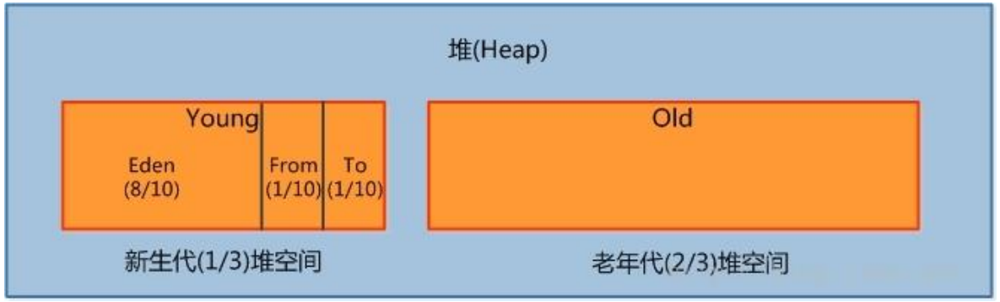

## 一、运行时数据区

<center>


</center>

### 1.1 程序计数器（线程私有）
 也叫PC寄存器，JVM会为每个java线程创建PC寄存器。在任意时刻，一个java线程总是在执行一个方法，这个正在被执行的方法称为当前方法。如果当前方法不是本地方法，PC寄存器就会指向当前正在被执行的指令。如果当前方法是本地方法，那么PC寄存器的值就是undifined。这个内存区域是唯一一个在虚拟机中没有规定任何OutOfMemoryError情况的区域。
### 1.2 方法区（线程共享）
在类加载器加载完类后，会将加载的类信息存放在方法区中。该区除了类信息外，还可能会存放运行时常量池信息，包括字符串字面量和数字常量（这部分常量信息是Class文件中常量池部分的内存映射）
### 1.3 虚拟机栈（线程私有）
描述java方法执行的内存模型，每个方法在执行的同时会创建一个栈帧，用于存储局部变量表、操作数栈、动态链接、方法出口等信息。每个方法从调用直至执行完成的过程，就对应着一个栈帧在虚拟机栈中入栈到出栈的过程。
### 1.4 堆（线程共享）
是被线程共享的一块内存区域，创建的对象和数组都保存在 Java 堆内存中，也是垃圾收集器进行垃圾收集的最重要的内存区域。由于现代 VM 采用分代收集算法, 因此 Java 堆从 GC 的角度还可以
细分为: 新生代(Eden 区、From Survivor 区和 To Survivor 区)和老年代。
### 1.5 本地方法栈（线程私有）
与虚拟机栈类似，调用的是native方法服务。
:::tip
注：HotSpot VM直接就把本地方法栈和虚拟机栈合二为一
:::

## 二、栈
每次函数调用都会生成对应的栈帧，从而占用一定的栈空间，因此，如果栈空间不足，那么函数调用就无法继续下去。当请求栈的深度大于最大可用栈深度时，系统就会抛出StackOverflowError栈溢出错误。
可用`-Xss`来指定线程最大栈空间，这个参数也直接决定了函数调用的最大深度如：`-Xms20m -Xss512k`

### 2.1 局部变量表
它用于保存函数的参数以及局部变量。局部变量表中的变量旨在当前函数调用中有效，当函数调用结束后，随着函数栈帧的销毁，局部变量表也会随之销毁。
### 2.2 操作数栈
主要用于保存计算过程的中间结果，同时作为计算过程中变量临时的存储空间。操作数栈也是一个先进先出的数据结构，只支持入栈和出战两种操作。
### 2.3 帧数据区
该区支持常量池解析、正常方法返回和异常处理等。

### 2.4 栈上分配
栈上分配时JVM提供的一种优化技术，它的基本思想是，对于那些线程私有的对象，可以将它们打散分配在栈上，而不是分配在堆上。分配在栈上的好处是可以在函数调用结束后自行销毁，而不需要垃圾回收器的介入，提高系统的性能。
栈上分配的一个技术基础是进行逃逸分析。逃逸分析的目的是判断对象的作用域是否有可能逃逸出函数体。如下代码显示了一个逃逸的对象：
```
//逃逸对象
private  static User u;
public static void alloc(){
    u = new User();
}
//非逃逸对象
public static void alloc1(){
    User cc = new User();
}
```
上述代码的cc是以局部变量的形式存在，并且该对象并没有被方法返回，或者出现任何形式的公开，因此，它并未发生逃逸，所以对于这种情况，虚拟机就有可能将cc分配在栈上，而不是在堆上。

```
public static class User{
    public int id;
    public String name;
}
public static void alloc(){
    User user = new User();
    user.id=5;
    user.name="zhangsan ";
}

public static void main(String[] args) {
    long l = System.currentTimeMillis();
    for (int i = 0; i < 100000; i++) {
        alloc();
    }
    System.out.println(System.currentTimeMillis()-l);
}
```
参数：
```
-server
-Xmx10m
-Xms10m
-XX:+DoEscapeAnalysis
-Xlog:gc
-XX:-UseTLAB
-XX:+EliminateAllocations
```
使用-server执行程序，只有在server模式下，才可以启用逃逸分析。
程序执行完后，没有任何形式的GC输出，程序执行就完毕了。说明在执行过程中，User对象的分配被优化。

## 三、方法区
用于保存系统类信息，比如类的字段、方法、常量池等。方法区的大小决定了系统可以保存多少个类，如果系统定义了太多的类，会抛出内存溢出的错误。
在JDK8之前，方法区可以理解为永久代，使用参数`-XX:PermSize`和`-XX:MaxPermSize`指定，默认情况下，MaxPermSize为64MB JDK8之后，改为元空间，可以使用参数`-XX:MaxMetaspaceSize`指定，这是一块堆外内存。和永久代不同，如果不指定大小虚拟机会耗尽所有可用的系统内存。
## 四、堆
Java堆和Java应用程序是关系最为密切的内存空间，几乎所有的对象都存放在堆中。并且Java堆是完全自动化管理的，通过垃圾回收机制，垃圾对象会被自动清理。

<center>



</center>

### 4.1 新生代
用来存放新生的对象，一般占用堆的1/3空间。由于频繁的创建对象，所以新生代会频繁触发MinorGC进行垃圾回收。
新生代又分为Eden区、ServivorFrom、ServivorTo三个区
#### 4.1.1 Eden区
java新对象的出生地(如果新创建的对象占用内存很大，则直接分配到老年代)。当Eden区内存不够的时候就会出发MinorGC，对新生代进行垃圾回收
#### 4.1.2 ServivorForm
上一次 GC 的幸存者，作为这一次 GC 的被扫描者。
#### 4.1.3 ServivorTo
保留了一次 MinorGC 过程中的幸存者。

### 4.2 老年代
主要存放应用程序中生命周期长的内存对象。
老年代的对象比较稳定，所以MajorGC不会频繁执行。在进行MajorGC前一般都会先进行MinorGC，使得新生代的对象晋升为老年代对象导致空间不够时才会触发。当无法找到足够大的连续空间给新创建的大对象时也会提前出发MajorGC进行垃圾回收腾出空间。
### 4.3 永久代
主要存放Class和元数据信息，主要为方法区里面的内容。

