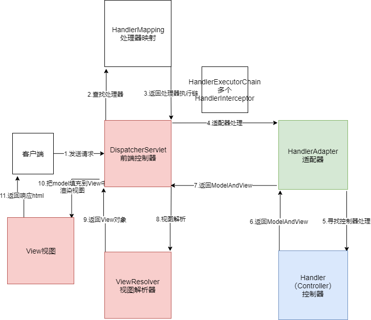

## 一、SpringMVC执行流程
 
在传统的SpringMVC中，执行的流程如下图:

请求从客户端出发，发送至前端控制器，DispatchServlet

## 二、SpringMVC中重要的类和组件

### 2.1 FrameworkServlet
### 2.2 DispatcherServlet
### 2.3 HandlerInterceptor
### 2.4 HandlerInterceptorAdapter
### 2.5 HandlerMapping
### 2.6 HandlerMethod
### 2.7 HandlerAdapter
### 2.8 MethodParameter
### 2.9 HandlerMethodArgumentResolver
### 2.10 HandlerMethodArgumentRedolverComposite
### 2.11 RequestResponseBodyMethodProcessor