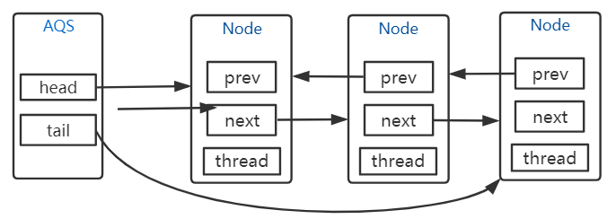

## 简介
AbstractQueuedSynchronizer是Java并发包java.util.concurrent的核心基础组件，是实现Lock的基础。
AQS实现了对同步状态的管理，以及对阻塞线程进行排队、等待通知等

## 节点
AQS通过内置的FIFO同步队列来完成资源获取线程的排队工作。 
如果当前线程获取锁失败时，AQS会将当前线程以及等待状态等信息构造成一个节点（Node）并将其加入同步队列，同时会park当前线程；当同步状态释放时，则会把节点中的线程唤醒，使其再次尝试获取同步状态。

<center>



</center>

其节点如下：
```java
static final class Node {
    volatile Node prev;// 当前节点/线程的前驱节点
    volatile Node next;// 当前节点/线程的后继节点
    volatile Thread thread;// 每一个节点对应一个线程
    
    volatile int waitStatus;// 节点状态
    static final int CANCELLED =  1;// 节点状态：此线程取消了争抢这个锁
    static final int SIGNAL = -1;// 节点状态：当前node的后继节点对应的线程需要被唤醒(表示后继节点的状态)
    static final int CONDITION = -2;// 节点状态：当前节点进入等待队列中
    static final int PROPAGATE = -3;// 节点状态：表示下一次共享式同步状态获取将会无条件传播下去

    Node nextWaiter;// 共享模式/独占模式
    static final Node SHARED = new Node();// 共享模式
    static final Node EXCLUSIVE = null;// 独占模式
}
```

## 主要方法
### 入队
```java
/**
 * 1.线程抢锁失败后，封装成node加入队列
 * 2.队列有tail，可直接入队。
 *   2.1入队时CAS操作，通过CAS自旋将node置为tail。
 * 3.队列没有tail，说明队列是空的，node通过enq()方法入队，enq()会初始化head和tail。
 */
private Node addWaiter(Node mode) {
    Node node = new Node(mode);

    for (;;) {// 自旋：循环入列，直到成功
        Node oldTail = tail;
        if (oldTail != null) {
            node.setPrevRelaxed(oldTail);//设置前节点为尾节点
            if (compareAndSetTail(oldTail, node)) {
                oldTail.next = node;
                return node;
            }
        } else {
            initializeSyncQueue();
        }
    }
}
```
### 获取锁
**独占锁概念**
独占锁也叫排他锁，是指该锁一次只能被一个线程所持有。如果线程T对数据A加上排他锁后，则其他线程不能再对A加任何类型的锁。获得排它锁的线程即能读数据又能修改数据。JDK中的synchronized和 JUC中Lock的实现类就是互斥锁。

**共享锁概念**
共享锁是指该锁可被多个线程所持有。如果线程T对数据A加上共享锁后，则其他线程只能对A再加共享锁，不能加排它锁。获得共享锁的线程只能读数据，不能修改数据。 

独占锁获取
```java
/**
 * 1.当前线程通过tryAcquire()方法抢锁。
 * 2.线程抢到锁，tryAcquire()返回true，结束。
 * 3.线程没有抢到锁，addWaiter()方法将当前线程封装成node加入同步队列，并将node交由acquireQueued()处理。
 */
public final void acquire(int arg) {
    if (!tryAcquire(arg) && // 子类的抢锁操作，下文有解释
        acquireQueued(addWaiter(Node.EXCLUSIVE), arg))// 子类抢锁失败进入队列中，重点方法，下文详细讲解
        selfInterrupt();
}

/**
 * 需要子类实现的抢锁的方法
 * 目前可以理解为通过CAS修改state的值，成功即为抢到锁，返回true；否则返回false。
 * 之后重入锁ReentrantLock、读写锁ReentrantReadWriteLock中会详细讲解。
 */
protected boolean tryAcquire(int arg) {
    thrownew UnsupportedOperationException();
}

/**
 * 上文介绍过的入队操作，线程抢锁失败，将当前线程封装成node加入同步队列，并返回node
 * Node.EXCLUSIVE-表示独占锁，先不用关注
 */
addWaiter(Node.EXCLUSIVE)

/**
 * 重点方法！！
 * 1.只有head的后继节点能去抢锁，一旦抢到锁旧head节点从队列中删除，next被置为新head节点。
 * 2.如果node线程没有获取到锁，将node线程挂起。
 * 3.锁释放时head节点的后继节点唤醒，唤醒之后继续for循环抢锁。
 */
final boolean acquireQueued(final Node node, int arg) {
    boolean failed = true;
    try {
        boolean interrupted = false;
        for (;;) {// 注意这里是循环
            /*
             * 1.node的前置节点是head时，可以调用tryAcquire()尝试去获取锁，获取锁成功则将node置为head
             * 注意：只有head的后继节点能去抢锁，一旦抢到锁旧head节点从队列中删除，next被置为新head节点
             * 2.node线程没有获取到锁，继续执行下面另一个if的代码
             *  此时有两种情况：1)node不是head的后继节点，没有资格抢锁；2)node是head的后继节点但抢锁没成功
             */
            final Node p = node.predecessor();
            if (p == head && tryAcquire(arg)) {
                setHead(node);
                p.next = null; // help GC
                failed = false;
                return interrupted;
            }
            
            /*
             * shouldParkAfterFailedAcquire(p, node)：通过前置节点pred的状态waitStatus 来判断是否可以将node节点线程挂起
             * parkAndCheckInterrupt()：将当前线程挂起
             * 1.如果node前置节点p.waitStatus==Node.SIGNAL(-1)，直接将当前线程挂起，等待唤醒。
             *      锁释放时会将head节点的后继节点唤醒，唤醒之后继续for循环抢锁。
             * 2.如果node前置节点p.waitStatus<=0但是不等于-1，
             *      1)shouldParkAfterFailedAcquire(p, node)会将p.waitStatus置为-1，并返回false；
             *      2)进入一下次for循环，先尝试抢锁，没获取到锁则又到这里，此时p.waitStatus==-1，就会挂起当前线程。
             *  3.如果node前置节点p.waitStatus>0，
             *      1)shouldParkAfterFailedAcquire(p, node)为node找一个waitStatus<=0的前置节点，并返回false；
             *      2)继续for循环
             */
            if (shouldParkAfterFailedAcquire(p, node) &&
                parkAndCheckInterrupt())
                interrupted = true;
        }
    } finally {
        if (failed)
            cancelAcquire(node);
    }
}

/**
 * 通过前置节点pred的状态waitStatus 来判断是否可以将node节点线程挂起
 * pred.waitStatus==Node.SIGNAL(-1)时，返回true表示可以挂起node线程，否则返回false
 * @param pred node的前置节点
 * @param node 当前线程节点
 */
private static boolean shouldParkAfterFailedAcquire(Node pred, Node node) {
    int ws = pred.waitStatus;
    if (ws == Node.SIGNAL)
        returntrue;
    if (ws > 0) {
        /*
         * waitStatus>0 ，表示节点取消了排队
         * 这里检测一下，将不需要排队的线程从队列中删除（因为同步队列中保存的是等锁的线程）
         * 为node找一个waitStatus<=0的前置节点pred
         */
        do {
            node.prev = pred = pred.prev;
        } while (pred.waitStatus > 0);
        pred.next = node;
    } else {
        // 此时pred.waitStatus<=0但是不等于-1，那么将pred.waitStatus置为Node.SIGNAL(-1)
        compareAndSetWaitStatus(pred, ws, Node.SIGNAL);
    }
    returnfalse;
}

/**
 * 将当前线程挂起
 * LockSupport.park()挂起当前线程；LockSupport.unpark(thread)唤醒线程thread
 */
private final boolean parkAndCheckInterrupt() {
    LockSupport.park(this);// 将当前线程挂起
    return Thread.interrupted();
}
```

### 释放锁
```java
/**
 * 释放锁之后，唤醒head的后继节点next。
 * 回顾上文讲的acquireQueued()方法，next节点会进入for循环的下一次循环去抢锁
 */
public final boolean release(int arg) {
    if (tryRelease(arg)) {// 子类实现的释放锁的方法，下文有讲解
        Node h = head;
        if (h != null && h.waitStatus != 0)
            unparkSuccessor(h);// 唤醒node节点（也就是head）的后继节点，下文有讲解
        returntrue;
    }
    returnfalse;
}

/**
 * 需要子类实现的释放锁的方法，对应于tryAcquire()
 * 目前可以理解为将state的值置为0。
 * 之后重入锁ReentrantLock、读写锁ReentrantReadWriteLock中会详细讲解。
 */
protected boolean tryRelease(int arg) {
    thrownew UnsupportedOperationException();
}

/**
 * 唤醒node节点（也就是head）的后继节点
 */
private void unparkSuccessor(Node node) {
    int ws = node.waitStatus;
    if (ws < 0)
        compareAndSetWaitStatus(node, ws, 0);

    Node s = node.next;// 正常情况，s就是head.next节点
    /*
     * 有可能head.next取消了等待（waitStatus==1）
     * 那么就从队尾往前找，找到waitStatus<=0的所有节点中排在最前面的去唤醒
     */
    if (s == null || s.waitStatus > 0) {
        s = null;
        for (Node t = tail; t != null && t != node; t = t.prev)
            if (t.waitStatus <= 0)
                s = t;
    }
    if (s != null)
        LockSupport.unpark(s.thread);// 唤醒s节点的线程去抢锁
}
```
## 整个过程
线程1来获取锁，此时没有竞争，直接获取到锁。AQS队列为空。

线程2来获取锁，因为线程1占用锁，线程2需要做两件事：

    1）线程2构造成Node到AQS的同步队列中排队。此时初始化同步队列。

    2）线程2阻塞，等待被唤醒之后再去抢锁。

线程3来获取锁，锁被占用，同样做两件事：排队并阻塞。

线程1执行完同步代码之后释放锁，唤醒head的后继节点（线程2），线程2获取锁，并把线程2对应的Node置为head。

线程2执行完同步代码之后释放锁，唤醒head的后继节点（线程3），线程3获取锁，并把线程3对应的Node置为head。

线程3执行完同步代码之后释放锁，同步队列中head之后没有节点了，将head置为null即可。