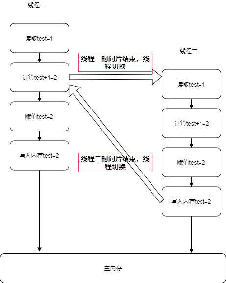
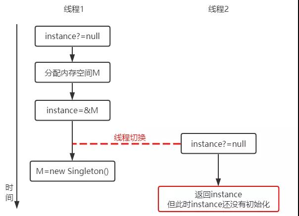
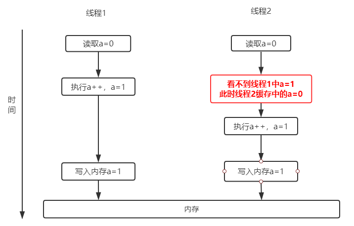

## 一、内存模型
'内存模型'，可以理解为在特定的操作协议下，对特定的内存或高速缓存进行读写访问的过程抽象。

<center>


</center>

由于计算机的存储设备于处理器的运算速度有数量级的差距，所以现代计算机系统都不得不加入一层读写速度尽可能接近处理器运算速度的告诉缓存来作为内存与处理器之间的缓冲。

## 二、java内存模型
java虚拟机规范中试图定义一种java内存模型（Java Memory Model，JMM）来屏蔽掉各种硬件和操作系统的内存访问差异，以实现让java程序在各种平台下都能达到一致的内存访问效果。
### 2.1 主内存与工作内存
java内存模型的主要目标是定义程序中各个变量的访问规则，即在虚拟机中将变量存储到内存和从内存中取出变量这样的底层细节。
java内存模型规定了所有的变量都存储在主内存（类比物理硬件的主内存）（包括实例字段、静态字段和构成数组的元素，但不包括局部变量和方法参数）。每个线程有自己的工作内存（类比处理器高速缓存），线程的工作内存中保存了被该线程使用到的变量的主内存副本拷贝，线程对变量的所有操作（读取、赋值等）都必须在工作内存中进行，而不能直接读写主内存中的变量。不同线程之间也无法直接访问对方工作内存中的变量，线程间变量值的传递需要通过主内存来完成，线程、工作内存、主内存工作关系如下：

<center>


</center>

### 2.2 内存间的交互操作
java内存模型定义了8种操作来完成主内存与工作内存之间具体的交互协议。即一个变量如何让从主内存拷贝到工作内存、如何从工作内存同步回主内存之类的实现细节。虚拟机在实现时必须保证下面提及的每一种操作都是原子的、不可再分的（long和double由于长度比较长，无法一次性操作，所以他们的操作都不是原子的，在并发环境下，可能会出现意想不到的错误）
操作|作用域|解释
-|-|-
lock(锁定)|作用于主内存的变量|把变量标识为一条线程独占状态
unlock(锁定)|作用于主内存的变量|把一个处于锁定状态的变量释放，只有释放后的变量才可以被其他线程锁定
read(读取)|作用于主内存的变量|把一个变量的值从主内存传输到线程的工作内存中，以便随后的load动作
load(载入)|作用于工作内存的变量|把read操作从主内存得到的变量值放入工作内存的变量副本中
use(使用)|作用于工作内存的变量|把工作内存中一个变量的值传递给执行引擎，每当虚拟机遇到一个需要使用到变量的值的字节码指令时将会执行这个操作
assign(赋值)|作用于工作内存的变量|把一个从执行引擎接收到的值赋给工作内存的变量，每当虚拟机遇到一个变量赋值的字节码指令时执行这个操作
store(存储)|作用于工作内存的变量|把工作内存中一个变量的值传送到主内存中，以便随后的write操作使用
wirte(写入)|作用于主内存的变量|把store操作从工作内存中得到的变量的值放入主内存变量中

如果要把一个变量从主内存复制到工作内存，那么就要顺序执行read和load操作，如果要把一个变量从工作内存同步回主内存，那么就需要顺序执行store和write操作。java内存模型只需要以上两个操作必须顺序执行，并没有说需要连续执行。
当然上述操作必须满足以下规则：
- 不允许read和load、store和write操作单一出现，即不允许一个变量从主内存读取但工作内存不接受，从工作内存发起写回操作但主内存不接受的情况
- 不允许一个线程丢弃它的最近assign操作，即变量在工作内存中改变之后必须把该变化同步回主内存
- 不允许一个线程无缘无故（没有发生任何assign操作）把数据从线程的工作内存同步回主内存中
- 一个新的变量只能在主内存中'诞生'，不允许在工作内存中直接使用一个未被初始化load和assign的变量，也就是对一个变量use、store操作之前必须先执行过assign和load操作
- 一个变量在同一时刻只允许一条线程对其进行lock操作，但lock操作可以被同一条线程重复执行多次，多次执行lock后，只有执行相同次数的unlock操作变量才会被解锁
- 如果对一个变量执行lock操作，那么将会清空工作内存中此变量的值，在执行引擎使用这个变量前，需要重新执行load或assign操作初始化变量的值。
- 如果一个变量实现没有被lock操作锁定，那就不允许对它执行unlock操作，也不允许去unlock一个被其他线程锁定住的变量
- 在对一个变量执行unlock操作之前，必须先把此变量同步回主内存中。

## 三、原子性
原子性中的原子代表不可分割的意思。原子操作是不可中断的，也不能被多线程干扰。在多线程及多操作的情况下，非原子性的操作可能被其他线程干扰。
由于线程的切换，导致多线程同时执行同一段代码，带来原子性问题
```java
public static int test= 0;

public static void main(String[] args) throws InterruptedException {
    for (int i = 0; i < 500; i++) {
        new Thread(()->{
            test++;//非原子性操作，包含获取、增加、赋值操作
        }).start();
    }
    Thread.yield();
    Thread.sleep(200);
    System.out.println(test);
}
```
对于同一段代码，一个线程还没执行完这段代码但是时间片耗尽，在等待CPU分配时间片时，其他线程可以获取执行这段代码的时间片来执行这段代码，导致多线程同时执行同一段代码。
以上输出会出现小于500的情况，因为test++不是原子性的，它包含读取、计算和写入三个操作。使用volatile可保证基本的原子性。
实际执行时序如下：

<center>



</center>

线程一由于运行的非原子操作代码，在计算操作时，时钟管理提示CPU执行线程时间片已到，操作系统进行线程切换。由于线程一的test值并未写入主内存中，这样线程二读取的时候test值为1，进行操作后写入主内存。该线程进入终止状态，系统切换CPU时间片让线程一继续，这样在线程一计算后也将test=2写入主内存，这样就导致线程原子性问题。

:::tip 总结
原子性问题是由于多线程的情况下，执行非原子操作代码时，由于存在CPU时间片轮换的情况，导致不同线程对值进行重复的操作。
:::

## 四、有序性
程序执行的顺序一般情况下时按照代码先后顺序执行的。java编译器为了优化性能，有时候会改变程序中语句执行的先后顺序。例如程序中：`a=6;b=7;`编译器优化后可能变成`b=7;a=6;`。当然，在变量有关前后顺序的操作及有关联性时，不能进行重排。如果在本线程内观察，所有的操作都是有序的；如果在一个线程观察另一个线程，所有的操作都是无序的。
```java
public class Singleton {
  static Singleton instance;
  static Singleton getInstance(){
    if (instance == null) {
      synchronized(Singleton.class) {
        if (instance == null)
          instance = new Singleton();
        }
    }
    return instance;
  }
}
``` 
`instance = new Singleton();`这条语句实际上包含了三个操作：
1. 分配对象的内存空间；
2. 初始化对象；
3. 设置instance指向刚分配的内存地址。


但由于存在重排序的问题，可能有以下的执行顺序：

1. 分配对象的内存空间；
2. 设置instance指向刚分配的内存地址；
3. 初始化对象。

<center>



</center>

## 五、可见性
可见性是指当一个线程修改了共享变量后，其他线程能够立即得知这个修改。
这是由于如今多核处理器的情况下，每颗CPU都有自己的缓存，而缓存仅仅对它所在的处理器可见，CPU缓存与内存的数据不容易保持一致性。

为了避免处理器停顿下来等待向内存写入数据而产生的延迟，处理器使用写缓冲区来临时保存向内存写入的数据。写缓冲区合并对同一内存地址的多次写，并以批处理的方式刷新，也就是说写缓冲区不会即时将数据刷新到主内存中。

缓存不能及时刷新导致了可见性问题。
```java
public static int a= 0;

public static void main(String[] args) throws InterruptedException {
    for (int i = 0; i < 500; i++) {
        new Thread(()->{
            a++;//非原子性操作，包含获取、增加、赋值操作
        }).start();
    }
    Thread.yield();
    Thread.sleep(200);
    System.out.println(test);
}
```
假设线程1和线程2同时开始执行，那么第一次都会将a=0 读到各自的CPU缓存里，线程1执行a++之后a=1，但是此时线程2是看不到线程1中a的值的，所以线程2里a=0，执行a++后a=1。
线程1和线程2各自CPU缓存里的值都是1，之后线程1和线程2都会将自己缓存中的a=1写入内存，导致内存中a=1，而不是我们期望的2。所以导致最终 a 的值都是小于 500 的。这就是缓存的可见性问题。

<center>



</center>

## 六、重排序
一个好的内存模型实际上会放松对处理器和编译器规则的束缚，也就是说软件技术和硬件技术都为同一个目标而进行奋斗：在不改变程序执行结果的前提下，尽可能提高并行度。JMM对底层尽量减少约束，使其能够发挥自身优势。因此，在执行程序时，为了提高性能，编译器和处理器常常会对指令进行重排序。一般重排序可以分为如下三种：

<center>


</center>

- **编译器优化的重排序。** 编译器在不改变单线程程序语义的前提下，可以重新安排语句的执行顺序。
- **指令级并行的重排序。** 处理器将多条指令重叠执行。如果不存在数据依赖性，处理器可以改变语句对应机器指令的执行顺序。
- **内存系统的重排序。** 处理器使用缓存和读/写缓冲区，使得加载和存储操作看上去可能是在乱序执行。

重排序需要遵守一定规则，以保证程序正确执行。
**重排序遵守数据依赖性**

数据依赖性：如果两个操作访问同一个变量，且这两个操作中有一个为写操作，此时这两个操作之间就存在数据依赖性。
存在数据依赖性的三种情况：
```
① 写后读：a = 1;b = a; 写一个变量之后，再读这个位置。
② 写后写：a = 1;a = 2; 写一个变量之后，再写这个变量。
③ 读后写：a = b;b = 1;读一个变量之后，再写这个变量。
```
存在数据依赖关系的两个操作，不可以重排序。
数据依赖性只针对单个处理器中执行的指令序列和单个线程中执行的操作。
举例：
同一个线程中执行a=1;b=1; 不存在数据依赖性，可能重排序。
同一个线程中执行a=1;b=a; 存在数据依赖性，不可以重排序。

### 重排序遵守as-if-serial 语义
as-if-serial 语义：不管怎么重排序（编译器和处理器为了提高并行度），（单线程）程序的执行结果不能被改变。
举例，以计算圆的面积为例：
```java
double pi = 3.14; // A
double r  = 1.0;  // B
double area = pi * r * r; // C
```

A和B重排序之后，程序的执行结果不会改变，所以允许A、B重排序。A和C重排序之后，程序的执行结果会改变，所以不允许A、C重排序。