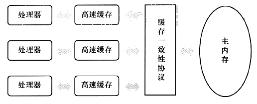
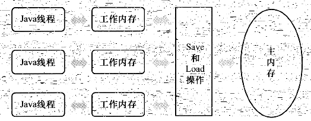

## 一、内存模型
'内存模型'，可以理解为在特定的操作协议下，对特定的内存或高速缓存进行读写访问的过程抽象。

<center>



</center>

由于计算机的存储设备于处理器的运算速度有数量级的差距，所以现代计算机系统都不得不加入一层读写速度尽可能接近处理器运算速度的告诉缓存来作为内存与处理器之间的缓冲。

## 二、java内存模型
java虚拟机规范中试图定义一种java内存模型（Java Memory Model，JMM）来屏蔽掉各种硬件和操作系统的内存访问差异，以实现让java程序在各种平台下都能达到一致的内存访问效果。
### 2.1 主内存与工作内存
java内存模型的主要目标是定义程序中各个变量的访问规则，即在虚拟机中将变量存储到内存和从内存中取出变量这样的底层细节。
java内存模型规定了所有的变量都存储在主内存（类比物理硬件的主内存）（包括实例字段、静态字段和构成数组的元素，但不包括局部变量和方法参数）。每个线程有自己的工作内存（类比处理器高速缓存），线程的工作内存中保存了被该线程使用到的变量的主内存副本拷贝，线程对变量的所有操作（读取、赋值等）都必须在工作内存中进行，而不能直接读写主内存中的变量。不同线程之间也无法直接访问对方工作内存中的变量，线程间变量值的传递需要通过主内存来完成，线程、工作内存、主内存工作关系如下：

<center>



</center>

### 2.2 内存间的交互操作
java内存模型定义了8种操作来完成主内存与工作内存之间具体的交互协议。即一个变量如何让从主内存拷贝到工作内存、如何从工作内存同步回主内存之类的实现细节。虚拟机在实现时必须保证下面提及的每一种操作都是原子的、不可再分的（long和double由于长度比较长，无法一次性操作，所以他们的操作都不是原子的，在并发环境下，可能会出现意想不到的错误）
操作|作用域|解释
-|-|-
lock(锁定)|作用于主内存的变量|把变量标识为一条线程独占状态
unlock(锁定)|作用于主内存的变量|把一个处于锁定状态的变量释放，只有释放后的变量才可以被其他线程锁定
read(读取)|作用于主内存的变量|把一个变量的值从主内存传输到线程的工作内存中，以便随后的load动作
load(载入)|作用于工作内存的变量|把read操作从主内存得到的变量值放入工作内存的变量副本中
use(使用)|作用于工作内存的变量|把工作内存中一个变量的值传递给执行引擎，每当虚拟机遇到一个需要使用到变量的值的字节码指令时将会执行这个操作
assign(赋值)|作用于工作内存的变量|把一个从执行引擎接收到的值赋给工作内存的变量，每当虚拟机遇到一个变量赋值的字节码指令时执行这个操作
store(存储)|作用于工作内存的变量|把工作内存中一个变量的值传送到主内存中，以便随后的write操作使用
wirte(写入)|作用于主内存的变量|把store操作从工作内存中得到的变量的值放入主内存变量中

如果要把一个变量从主内存复制到工作内存，那么就要顺序执行read和load操作，如果要把一个变量从工作内存同步回主内存，那么就需要顺序执行store和write操作。java内存模型只需要以上两个操作必须顺序执行，并没有说需要连续执行。
当然上述操作必须满足以下规则：
- 不允许read和load、store和write操作单一出现，即不允许一个变量从主内存读取但工作内存不接受，从工作内存发起写回操作但主内存不接受的情况
- 不允许一个线程丢弃它的最近assign操作，即变量在工作内存中改变之后必须把该变化同步回主内存
- 不允许一个线程无缘无故（没有发生任何assign操作）把数据从线程的工作内存同步回主内存中
- 一个新的变量只能在主内存中'诞生'，不允许在工作内存中直接使用一个未被初始化load和assign的变量，也就是对一个变量use、store操作之前必须先执行过assign和load操作
- 一个变量在同一时刻只允许一条线程对其进行lock操作，但lock操作可以被同一条线程重复执行多次，多次执行lock后，只有执行相同次数的unlock操作变量才会被解锁
- 如果对一个变量执行lock操作，那么将会清空工作内存中此变量的值，在执行引擎使用这个变量前，需要重新执行load或assign操作初始化变量的值。
- 如果一个变量实现没有被lock操作锁定，那就不允许对它执行unlock操作，也不允许去unlock一个被其他线程锁定住的变量
- 在对一个变量执行unlock操作之前，必须先把此变量同步回主内存中。

## 三、原子性
原子性中的原子代表不可分割的意思。原子操作是不可中断的，也不能被多线程干扰。在多线程及多操作的情况下，非原子性的操作可能被其他线程干扰。
```
public static int test= 0;

public static void main(String[] args) throws InterruptedException {
    for (int i = 0; i < 500; i++) {
        new Thread(()->{
            test++;
        }).start();
    }
    Thread.yield();
    Thread.sleep(200);
    System.out.println(test);
}
```

以上输出会出现小于500的情况，因为test++不是原子性的，它包含读取、计算和写入三个操作。使用volatile可保证基本的原子性。

## 四、有序性
现代cpu为了保证流水线的顺畅执行，在指令执行时，有可能会对目标指令进行重排。重排不会导致单线程中的语义修改，但会导致多线程中的语义出现不一致。当然，在变量有关前后顺序的操作及有关联性时，不能进行重排。 
