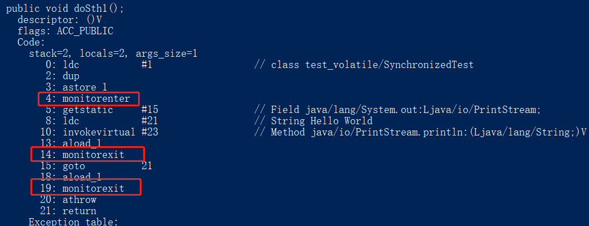
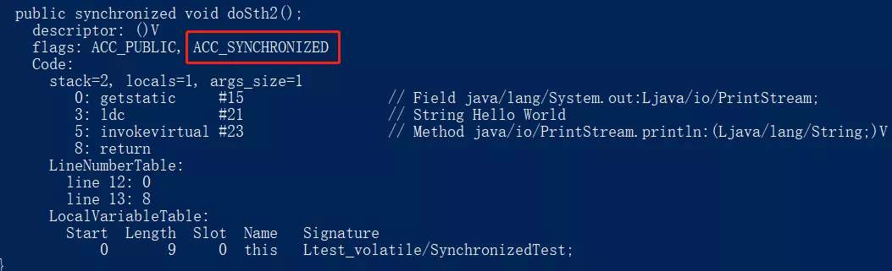
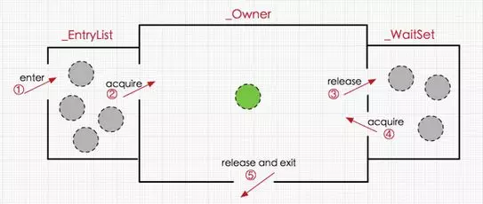

## 一、volatile

### 1.1 实现原理
**volatile保证有序性原理**  
JMM通过插入内存屏障指令来禁止特定类型的重排序。  
java编译器在生成字节码时，在volatile变量操作前后的指令序列中插入内存屏障来特定类型的重排序

volatile内存屏障插入策略：
- 在每个volatile写操作的前面插入一个StoreStore屏障。
- 在每个volatile写操作的后面插入一个StoreLoad屏障。
- 在每个volatile读操作的后面插入一个LoadLoad屏障。
- 在每个volatile读操作的后面插入一个LoadStore屏障。

:::tip 
Store：数据对其他处理器可见（即：刷新到内存中）
Load：让缓存中的数据失效，重新从主内存加载数据
:::

**volatile保证可见性原理**

volatile内存屏障插入策略中有一条，“在每个volatile写操作的后面插入一个StoreLoad屏障”。

StoreLoad屏障会生成一个Lock前缀的指令，Lock前缀的指令在多核处理器下会引发了两件事：
1. 将当前处理器缓存行的数据写回到系统内存。
2. 这个写回内存的操作会使在其他CPU里缓存了该内存地址的数据无效。


volatile内存可见的写-读过程：

- volatile修饰的变量进行写操作。

- 由于编译期间JMM插入一个StoreLoad内存屏障，JVM就会向处理器发送一条Lock前缀的指令。

- Lock前缀的指令将该变量所在缓存行的数据写回到主内存中，并使其他处理器中缓存了该变量内存地址的数据失效。

- 当其他线程读取volatile修饰的变量时，本地内存中的缓存失效，就会到到主内存中读取最新的数据。

### 1.2 保证可见性
volatile保证了不同线程对volatile修饰变量进行操作时的可见性。
由原理可知，对于一个volatile变量的读，总是能看到对这个volatile变量最后的写入。
```java
public void testVolatile(){
    int i = 0 ;
    new Thread(()->{
        while (flag){
            System.out.println("Running "+ i + " times");
        }
    }).start();
    new Thread(()->{
        flag = false;
        System.out.println("set flag = false");
    }).start();
}
```

### 1.3 保证有序性
volatile关键字能禁止指令重排序，保证了程序会严格按照代码的先后顺序执行，即保证了有序性。

volatile的禁止重排序规则：

1. 当第二个操作是volatile写时，不管第一个操作是什么，都不能重排序。这个规则确保volatile写之前的操作不会被编译器重排序到volatile写之后。
2. 当第一个操作是volatile读时，不管第二个操作是什么，都不能重排序。这个规则确保volatile读之后的操作不会被编译器重排序到volatile读之前。
3. 当第一个操作是volatile写，第二个操作是volatile读时，不能重排序。

:::warning 总结
并发编程中，常用volatile修饰变量以保证变量的修改对其他线程可见。

volatile可以保证可见性和有序性，不能保证原子性。

volatile是通过插入内存屏障禁止重排序来保证可见性和有序性的。
:::


## 二、final
### 2.1 final变量
只能被赋值一次，赋值后值不再改变。（final要求地址值不能改变）
当final修饰一个基本数据类型时，表示该基本数据类型的值一旦在初始化后便不能发生变化；  
如果final修饰一个引用类型时，则在对其初始化之后便不能再让其指向其他对象了，但该引用所指向的对象的内容是可以发生变化的。
本质上是一回事，因为引用的值是一个地址，final要求地址值不发生变化。
当final修饰一个基本数据类型时，表示该基本数据类型的值一旦在初始化后便不能发生变化；如果final修饰一个引用类型时，则在对其初始化之后便不能再让其指向其他对象了，但**该引用所指向的对象的内容是可以发生变化的**。本质上是一回事，因为引用的值是一个地址，final要求地址值不发生变化。
final成员变量：两种初始化方式，一种是在变量声明的时候初始化；第二种是在声明变量的时候不赋初值，但是要在这个变量所在的类的所有的构造函数中对这个变量赋初值。
### 2.2 final方法
final修饰的方法在编译阶段被静态绑定(static binding)，不能被重写。

final方法比非final方法要快，因为在编译的时候已经静态绑定了，不需要在运行时再动态绑定。（注：类的private方法会隐式地被指定为final方法）

### 2.3 final类
final修饰的类不能被继承。

final类中的成员变量可以根据需要设为final，但是要注意final类中的所有成员方法都会被隐式地指定为final方法。

在使用final修饰类的时候，要注意谨慎选择，除非这个类真的在以后不会用来继承或者出于安全的考虑，尽量不要将类设计为final类。

:::tip 关于final的几个重要知识点
final关键字可以提高性能，JVM和Java应用都会缓存final变量，JVM会对方法、变量及类进行优化。  
在匿名类中所有变量都必须是final变量。  
接口中声明的所有变量本身是final的。  
final和abstract这两个关键字是反相关的，final类就不可能是abstract的。  
按照Java代码惯例，final变量就是常量，而且通常常量名要大写。  
final变量可以安全的在多线程环境下进行共享，而不需要额外的同步开销。  
:::

### 2.4 写final域
在构造函数内对一个final域的写入，与随后把这个被构造对象的引用赋值给一个引用变量，这两个操作之间不能重排序。

编译器会在final域的写之后，插入一个StoreStore屏障，这个屏障可以禁止处理器把final域的写重排序到构造函数之外。

:::tip
解释：保证先写入对象的final变量，后调用该对象引用。
:::


### 2.5 读final域
初次读一个包含final域的对象的引用，与随后初次读这个final域，这两个操作之间不能重排序。

编译器会在读final域操作的前面插入一个LoadLoad屏障，这个屏障可以禁止读对象引用和读该对象final域重排序。
:::tip
解释：先读对象的引用，后读该对象的final变量。
:::

### 2.6 final域为引用类型
对于引用类型，写final域的重排序规则对编译器和处理器增加了如下约束：在构造函数内对一个final引用的对象的成员域的写入，与随后在构造函数外把这个被构造对象的引用赋值给一个引用变量，这两个操作之间不能重排序。

:::tip 解释
注意是增加了一条约束，所以以上两条约束都还生效。  
保证先写入对象的final变量的成员变量，后调用该对象引用。
:::


:::warning 总结
final基础应用

- final修饰的变量地址值不能改变。

- final修饰的方法不能被重写。

- final修饰的类不能被继承。

并发编程中final可以禁止特定的重排序。

- final保证先写入对象的final变量，后调用该对象引用。

- final保证先读对象的引用，后读该对象的final变量。

- final保证先写入对象的final变量的成员变量，后调用该对象引用。
:::

## 三、synchronized
### 3.1 线程安全问题
并发编程中，当多个线程同时访问同一个资源的时候，就会存在线程安全问题。

由于每个线程执行的过程是不可控的，所以很可能导致最终的结果与实际期望的结果相违背或者直接导致程序出错。
:::tip
基本上所有的并发模式在解决线程安全问题时，都采用“序列化访问临界资源”的方案，即在同一时刻，只能有一个线程访问临界资源，也称作同步互斥访问。  
通常来说，是在访问临界资源的代码前面加上一个锁，当访问完临界资源后释放锁，让其他线程继续访问。  
在Java中，提供了两种方式来实现同步互斥访问：synchronized和Lock。
:::

Java中用synchronized标记同步块。
- 同步块在Java中是同步在某个对象上（监视器对象）。
- 所有同步在一个对象上的同步块在同一时间只能被一个线程进入并执行操作。
- 所有其他等待进入该同步块的线程将被阻塞，直到执行该同步块中的线程退出。

### 3.2 synchronized用法
- 普通同步方法，锁是当前实例对象

- 静态同步方法，锁是当前类的class对象

- 同步方法块，锁是括号里面的对象

```java
publicclass MyClass{
    int count;
   
    // 1.实例方法
    public synchronized void add(int value){
        count += value;
    }
   
    // 2.实例方法中的同步块 (等价于1)
    public void add(int value){
        synchronized(this){
            count += value;
        }
    }
   
    // 3.静态方法
    public static synchronized void add(intvalue){
         count += value;
    }
   
    // 4.静态方法中的同步块 (等价于3)
    public static void add(int value){
        synchronized(MyClass.class){
            count += value;
        }
    }
}
```

如下代码，利用javap工具查看生成的class文件信息来分析Synchronize的实现。

代码：
```java
publicclass synchronized Test {
    // 同步代码块
    public void doSth1(){
       synchronized (synchronizedTest.class){
           System.out.println("HelloWorld");
       }
    }
    // 同步方法
    public synchronized void doSth2(){
        System.out.println("HelloWorld");
    }
}
```
使用javap对class文件进行反编译后结果：

javap命令：
`D:\install\java\jdk8\bin\javap.exe -v .\synchronizedTest.class`

同步方法块：

<center>



</center>

同步方法：

<center>



</center>

从反编译后的结果中可以看到：对于同步方法，JVM采用ACC_synchronized标记符来实现同步。对于同步代码块。JVM采用monitorenter、monitorexit两个指令来实现同步。

### 3.3 同步代码块
JVM采用monitorenter、monitorexit两个指令来实现同步。
大致内容如下：

- 可以把执行monitorenter指令理解为加锁，执行monitorexit理解为释放锁。

- 每个对象维护着一个记录着被锁次数的计数器。

- 未被锁定的对象的该计数器为0，当一个线程获得锁（执行monitorenter）后，该计数器自增变为1，当同一个线程再次获得该对象的锁的时候，计数器再次自增。当同一个线程释放锁（执行monitorexit指令）的时候，计数器再自减。

- 当计数器为0的时候。锁将被释放，其他线程便可以获得锁。

### 3.4 同步方法
JVM采用ACC_synchronized标记符来实现同步。
大致内容如下：

- 方法级的同步是隐式的。同步方法的常量池中会有一个ACC_synchronized标志。

- 当某个线程要访问某个方法的时候，会检查是否有ACC_synchronized，如果有设置，则需要先获得监视器锁（monitor），然后开始执行方法，方法执行之后再释放监视器锁。这时如果其他线程来请求执行方法，会因为无法获得监视器锁而被阻断住。

- 值得注意的是，如果在方法执行过程中，发生了异常，并且方法内部并没有处理该异常，那么在异常被抛到方法外面之前监视器锁会被自动释放。

### 3.5 Monitor
无论是同步方法还是同步代码块都是基于监视器Monitor实现的。

#### Monitor是什么？
所有的Java对象是天生的Monitor，每一个Java对象都有成为Monitor的潜质，因为在Java的设计中，每一个Java对象自打娘胎里出来就带了一把看不见的锁，它叫做内部锁或者Monitor锁。

每个对象都存在着一个Monitor与之关联，对象与其Monitor之间的关系有存在多种实现方式，如Monitor可以与对象一起创建销毁。

#### Moniter如何实现线程的同步？
在Java虚拟机(HotSpot)中，monitor是由ObjectMonitor实现的（位于HotSpot虚拟机源码ObjectMonitor.hpp文件，C++实现的）。

ObjectMonitor中有几个关键属性：

- _owner：指向持有ObjectMonitor对象的线程
- _WaitSet：存放处于wait状态的线程队列
- _EntryList：存放处于等待锁block状态的线程队列
- _recursions：锁的重入次数
- _count：用来记录该线程获取锁的次数

<center>



</center>


### 3.6解决三大问题
#### 3.6.1 保证原子性
在并发编程中的原子性：一段代码，或者一个变量的操作，在一个线程没有执行完之前，不能被其他线程执行。

synchronized修饰的代码在同一时间只能被一个线程访问，在锁未释放之前，无法被其他线程访问到。

即使在执行过程中，CPU时间片用完，线程放弃了CPU，但并没有进行解锁。而由于synchronized的锁是可重入的，下一个时间片还是只能被他自己获取到，还是会由同一个线程继续执行代码，直到所有代码执行完。从而保证synchronized修饰的代码块在同一时间只能被一个线程访问。

#### 3.6.2 保证有序性
如果在本线程内观察，所有操作都是天然有序的。
——《深入理解Java虚拟机》

单线程重排序要遵守as-if-serial语义，不管怎么重排序，单线程程序的执行结果都不能被改变。因为不会改变执行结果，所以无须关心这种重排的干扰，可以认为单线程程序是按照顺序执行的。

synchronized修饰的代码，同一时间只能被同一线程访问。那么也就是单线程执行的。所以，可以保证其有序性。

#### 3.6.3 保证可见性
加锁的含义不仅仅局限于互斥行为，还包括可见性。
——《Java并发编程实战》

JMM关于synchronized的两条语义规定保证了可见性：

线程解锁前，必须把共享变量的最新值刷新到主内存中。

线程加锁前，将清空工作内存中共享变量的值，从而使用共享变量时需要从主内存中重新读取最新的值。

:::warning 总结
多并发编程中通过同步互斥访问临界资源来解决线程安全问题，Java中常用synchronized标记同步块达到加锁的目的。

synchronized用法有两种，修饰方法和修饰同步代码块。

synchronized的实现原理：每一个Java对象都会关联一个Monitor，通过Monitor对线程的操作实现synchronized对象锁。

并发编程中synchronized可以保证原子性、可见性、有序性。
:::