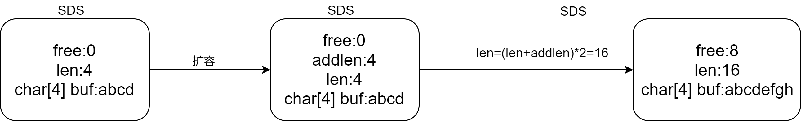

## 一简介
- 非关系型的键值对数据库，可以根据键以O(1)的时间复杂度去除或插入关联值
- Redis的数据是存储在内存中的
- 键值对中的键的类型可以是字符串、整型、浮点型等基本数据类型，且键是唯一的
- 键值对中的值的类型可以是string、hash、list、set、sorted set等
- Redis内置了复制、磁盘持久化、LUA脚本、事务、SSL、ACLS、客户端代理等功能
- 通过Redis哨兵和自动分区提供高可用性

## 二 应用场景
- 缓存，减低db的负载  
- 计数器   
可以对String进行自增自减的运算，从而实现计数器的功能。Redis这种内存型数据库的读写性能非常高，很适合存储频繁读写的计数量
- 分布式ID生成    
利用自增特性，一次请求一个大一点的步长，比如incr 2000,然后缓存在本地使用，用完在请求。
- 海量数据统计  
位图（bitmap）:存储是否参与过某次活动，如：是否阅读某文章，用户是否注册会员，日活统计等。
- 会话缓存  
可以使用Redis来统一存储多台应用服务器的绘画信息。当应用服务器不再存储用户的会话信息，也就不再具有状态，一个用户可以请求任意一个应用服务器，从而更容易实现高可用性以及可伸缩性  
- 分布式队列/阻塞队列  
List是一个双向链表，可以通过lpush/rpush和lpop/rpop写入和读取信息，可以通过使用brpop/blpop来实现阻塞队列
- 分布式锁
在分布式场景下，无法使用基于进程的锁来对多个节点上的进程进行同步，可以使用redis自带的SETNX命令实现分布式锁
- 热点数据存储
最新评论，最新文章列表，使用list存储，ltrim取出热点数据，删除老数据
- 社交类需求
set可以实现交集，从而实现共同好友等功能，set通过求差集，可以进行好友推荐、文章推荐等功能
- 排行榜
zset 可以实现有序性操作，从而实现排行榜等功能
- 延迟队列
使用sorted set，使用【当前时间戳+需要延迟的时长】做score，消息内容作为元素，调用zadd来生产消息，消费者使用zrangebyscore获取当前时间之前的数据做轮询处理。消费完再删除任务rem key member

## 三 实现
### 3.1 string实现
Redis是使用C语言编写的中间件，它使用自己定义的数据类型SDS（simple dynamic string 简单动态字符串）来实现对string类型的存储，所有的键都为string类型
:::tip 为什么要重新自定义一个类型？
由于c语言中的string类型是由char数组实现，c语言中判断字符串结尾是用`\0`来实现的，那如果在key中存在比如`hello\0world`，如果使用c语言原生的字符串，world这些后面的字符将不会被获取到，那就很容易造成冲突。
:::
其中，SDS中由free、len和char数组组成，free表示char数组的空余字节，len表示数据所占字节数，char数组表示真实数据，这样就将c语言中字符串的问题给解决了。

<center>



</center>

这种方式存在什么问题？  
int类型数据在64位操作系统下c语言存储需要2的32次方-1bit，也即是40多亿bit，这样回造成很严重的浪费，所以在3.2之后，redis团队优化了string的处理，他们将free参数去除，替换成alloc参数记录分配的内存有多大，然后再由alloc-len就等于当前数值大小。

```c
//redis 3.2以前
struct sdshdr{
    int len;
    int free;
    char buf[];
}
//redis 3.2 之后
struct _attribute_ ({_packed_}) sdshdr5{
    unsigned char flag;
    char buf[];
}


struct _attribute_ ({_packed_}) sdshdr8{
    uint8_t len;
    uint8_t alloc;
    unsigned char flag;
    char buf[];
}

struct _attribute_ ({_packed_}) sdshdr16{
    uint16_t len;
    uint16_t alloc;
    unsigned char flag;
    char buf[];
}

//uint8_t是用1个字节表示的；uint16_t是用2个字节表示的；uint32_t是用4个字节表示的。
//其中flag表示的位内存标志位，占一个字节，也即是8bit，前三位表示SDS类型（比如0 就是TYPE 5，1就是TYPE 8，类推），后几位表示数据长度，当数据格式位sdshdr8时这端数据就不再使用，转而使用len和alloc。
```


总结：
- 二进制安全（SDS 存储特性）
- 内存预分配机制（SDS 扩容特性） 避免频繁内存分配

key的存储
类似hashmap，数组存储key，以key的hash为下标存储键值对，当发生哈希冲突时以链表的形式用头插法插入数据。

当读取内存时，cpu发起IO然后根据cache line 读取地址，一个cache line 64byte 大小，而一个redisObject只有16byte，redis为了不浪费剩下的48byte，将读取的变成[redisObject:16byte][4 sds][data:44bytes],这就是embstr结构。