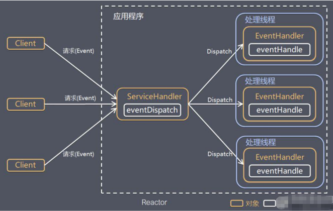
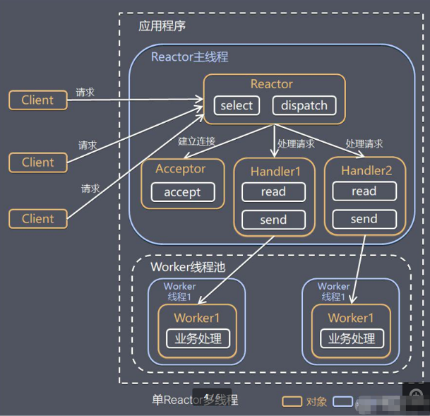
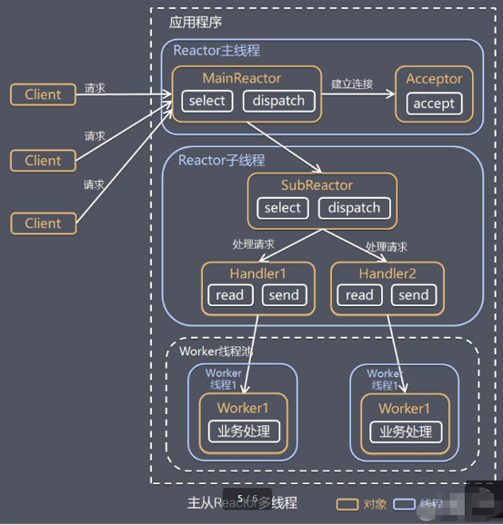
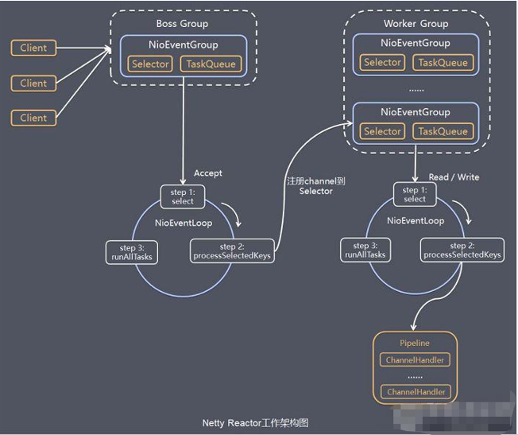

## 架构演变

### 原生NIO存在的问题
NIO 的类库和 API 繁杂，使用麻烦：需要熟练掌握 Selector、ServerSocketChannel、SocketChannel、ByteBuffer 等。

需要具备其他的额外技能：要熟悉 Java 多线程编程，因为 NIO 编程涉及到 Reactor 模式，你必须对多线程和网络编程非常熟悉，才能编写出高质量的 NIO 程序。

开发工作量和难度都非常大：例如客户端面临断连重连、网络闪断、半包读写、失败缓存、网络拥塞和异常流的处理等等。

JDK NIO 的 Bug：例如臭名昭著的 Epoll Bug，它会导致 Selector 空轮询，最终导致 CPU 100%。直到 JDK 1.7 版本该问题仍旧存在，没有被根本解决。

### I/O线程模型
目前存在的线程模型主要有：
- 传统阻塞I/O服务模型
- Reactor模式

根据Reactor的数量和处理资源池线程的数量不同，有如下3种典型的实现
- 单Reactor单线程
- 单Reactor多线程
- 主从Reactor多线程

Netty线程模型主要基于主从Reactor多线程模型做了一定的改进，其中主从Reactor多线程模型有多个Reactor。

## 单Reactor单线程

- Select 是前面 I/O 复用模型介绍的标准网络编程 API，可以实现应用程序通过一个阻塞对象监听多路连接请求
- Reactor 对象通过 Select 监控客户端请求事件，收到事件后通过 Dispatch 进行分发
- 如果是建立连接请求事件，则由 Acceptor 通过 Accept 处理连接请求，然后创建一个 Handler 对象处理连接完成后的后续业务处理
- 如果不是建立连接事件，则 Reactor 会分发调用连接对应的 Handler 来响应
- Handler 会完成 Read→业务处理→Send 的完整业务流程

## 单Reactor多线程

- Reactor 对象通过select 监控客户端请求事件, 收到事件后，通过dispatch进行分发
- 如果建立连接请求, 则右Acceptor 通过accept 处理连接请求, 然后创建一个Handler对象处理完成连接后的各种事件
- 如果不是连接请求，则由reactor分发调用连接对应的handler 来处理
- handler 只负责响应事件，不做具体的业务处理, 通过read 读取数据后，会分发给后面的worker线程池的某个线程处理业务
- worker 线程池会分配独立线程完成真正的业务，并将结果返回给handler
- handler收到响应后，通过send 将结果返回给client

## 主从Reactor多线程

- Reactor主线程 MainReactor 对象通过select 监听连接事件, 收到事件后，通过Acceptor 处理连接事件
- 当 Acceptor  处理连接事件后，MainReactor 将连接分配给SubReactor 
- subreactor 将连接加入到连接队列进行监听,并创建handler进行各种事件处理
- 当有新事件发生时， subreactor 就会调用对应的handler处理
- handler 通过read 读取数据，分发给后面的worker 线程处理
- worker 线程池分配独立的worker 线程进行业务处理，并返回结果
- handler 收到响应的结果后，再通过send 将结果返回给client
- Reactor 主线程可以对应多个Reactor 子线程, 即MainRecator 可以关联多个SubReactor

## Netty 架构

- Netty抽象出两组线程池 BossGroup 专门负责接收客户端的连接, WorkerGroup 专门负责网络的读写
- BossGroup 和 WorkerGroup 类型都是 NioEventLoopGroup
- NioEventLoopGroup 相当于一个事件循环组, 这个组中含有多个事件循环 ，每一个事件循环是 NioEventLoop
- NioEventLoop 表示一个不断循环的执行处理任务的线程， 每个NioEventLoop 都有一个selector , 用于监听绑定在其上的socket的网络通讯
- NioEventLoopGroup 可以有多个线程, 即可以含有多个NioEventLoop
- 每个Boss NioEventLoop 循环执行的步骤有3步
    1. 轮询accept 事件
    2. 处理accept 事件 , 与client建立连接 , 生成NioScocketChannel , 并将其注册到某个worker NIOEventLoop 上的 selector 
    3. 处理任务队列的任务 ， 即 runAllTasks
- 每个 Worker NIOEventLoop 循环执行的步骤
    1. 轮询read, write 事件
    2. 处理i/o事件， 即read , write 事件，在对应NioScocketChannel 处理任务队列的任务 ， 即 runAllTasks
- 每个Worker NIOEventLoop  处理业务时，会使用pipeline(管道), pipeline 中包含了 channel , 即通过pipeline 可以获取到对应通道, 管道中维护了很多的 处理器
