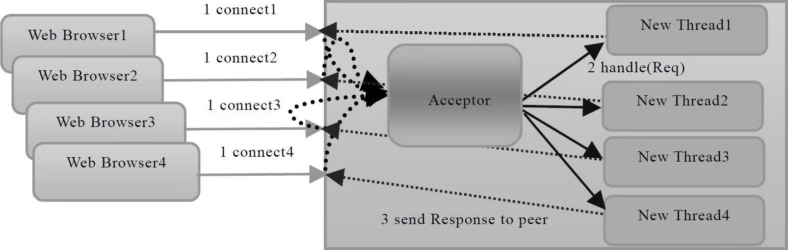

## BIO 工作机制

网络编程的基本模型是Client/Server模型，也就是两个进程之间进行相互通信，其中服务端提供位置信息（绑定的IP地址和监听端口），客户端通过连接操作向服务端监听的地址发起连接请求，通过三次握手建立连接，如果连接建立成功，双方就可以通过网络套接字（Socket）进行通信。在基于传统同步阻塞模型开发中，ServerSocket负责绑定IP地址，启动监听端口；Socket负责发起连接操作。连接成功之后，双方通过输入和输出流进行同步阻塞式通信。


<center>



</center>

如上图所示：通常由一个独立的Acceptor线程负责监听客户端的连接，它接收到客户端连接请求之后为每个客户端创建一个新的线程进行链路处理，处理完成之后，通过输出流返回应答给客户端，线程销毁。这就是典型的一请求一应答通信模型。

该模型最大的问题就是缺乏弹性伸缩能力，当客户端并发访问量增加后，服务端的线程个数和客户端并发访问数呈1：1的正比关系，由于线程是Java虚拟机非常宝贵的系统资源，当线程数膨胀之后，系统的性能将急剧下降，随着并发访问量的继续增大，系统会发生线程堆栈溢出、创建新线程失败等问题，并最终导致进程宕机或者僵死，不能对外提供服务。

```java
package com.whistle.code.day.netty.day08;

import java.io.IOException;
import java.io.InputStream;
import java.io.OutputStream;
import java.net.InetSocketAddress;
import java.net.ServerSocket;
import java.net.Socket;
import java.util.concurrent.ExecutorService;
import java.util.concurrent.Executors;

/**
 * @author Gentvel
 * @version 1.0.0
 */
public class BIOServer {
    public void initialize(Integer port) {
        ServerSocket serverSocket = null;
        ExecutorService executorService = Executors.newCachedThreadPool();
        try {
            serverSocket = new ServerSocket();
            serverSocket.bind(new InetSocketAddress(port));
            System.out.println("服务端启动成功");
            while (true){
                Socket accept = serverSocket.accept();
                System.out.println("一个客户端已连接："+ accept.getInetAddress()+" "+accept.getPort());
                executorService.execute(()->{
                    try {
                        InputStream inputStream = accept.getInputStream();
                        byte[] buffer = new byte[1024];
                        while (inputStream.read(buffer)!=-1){
                            System.out.println("接收到客户端："+new String(buffer).trim());
                        }
                    } catch (IOException e) {
                        System.out.println("一个客户端断开连接");
                    }
                });
            }
        } catch (IOException e) {
            e.printStackTrace();
        }finally {
            try {
                serverSocket.close();
                executorService.shutdown();
            } catch (IOException e) {
                e.printStackTrace();
            }
        }
    }
}
```

## BIO 问题分析

每个请求都需要创建独立的线程，与对应的客户端进行数据 Read，业务处理，数据 Write 。

当并发数较大时，需要创建大量线程来处理连接，系统资源占用较大。

连接建立后，如果当前线程暂时没有数据可读，则线程就阻塞在 Read 操作上，造成线程资源浪费

:::warning
服务端主线程会阻塞在 `serverSocket.accept()` 这个方法处，当有新的客户端发起请求时，主线程通过线程池调用新线程与其通信，每个通信线程会阻塞在 `socket.getInputStream()` 这个方法处。这就是阻塞这两个字的含义所在
:::

处于`socket.getInputStream()`阻塞时，无非有三种状态：
- 有数据可读
- 可用数据读取完毕
- 发生空指针或者I/O异常  


这意味着当对方发送请求或者应答消息比较缓慢、或者网络传输较慢时， 读取输入流一方的通信线程将被长时间阻塞， 如果对方要60s 才能够将数据发送完成， 读取一方的I/O线程也将会被同步阻塞60s ， 在此期间， 其他接入消息只能在消息队列中排队。

总而言之，当调用OutputStream 的wri te 方法写输出流的时候， 它将会被阻塞， 直到所有要发送的字节全部写入完毕， 或者发生异常。根据TCP/IP 相关知识， 当消息的接收方处理缓慢的时候， 将不能及时地从TCP 缓冲区读取数据， 这将会导致发送方的TCP window size 不断减小， 直到为0 ， 双方处Keep-Alive 状态， 消息发送方将不能再向TCP缓冲区写入消息， 这时如果采用的是同步阻塞I / 0 ， write 操作将会被无限期阻塞， 直到TCP window size 大于0 或者发生I/O 异常。

所以这就引出NIO(non-blocking I/O)
